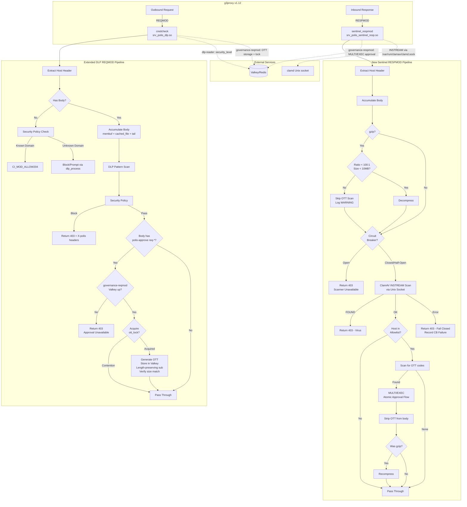

# Design Document: ICAP Module Merge

## Overview

This design extends the existing DLP REQMOD module with OTT approval rewriting and creates a new unified RESPMOD module that combines ClamAV scanning with OTT approval detection. This approach works within g3proxy v1.12's single-ICAP-service-per-direction constraint:

- **REQMOD**: Extend `srv_polis_dlp.c` in-place with OTT rewriting logic. DLP credential scanning runs first; if the request passes, the module scans for `/polis-approve req-*` and performs OTT substitution. No new module — the existing `credcheck` service alias continues to work.
- **RESPMOD**: New `srv_polis_sentinel_resp.c` that replaces squidclamav with a clamd TCP client (INSTREAM protocol) and adds OTT detection + approval flow. ClamAV runs first; OTT scan only executes if the body is clean and the host is allowlisted.

The REQMOD approach is cleaner because the DLP module already accumulates the full body, has Valkey connectivity, and handles the block/pass decision — OTT rewriting is a natural second pass on the same data. The standalone `srv_polis_approval_rewrite.c` becomes unused but is preserved for reference.

## Architecture



## Components and Interfaces

### Extended DLP REQMOD Module (`srv_polis_dlp.c`)

The existing module keeps its service registration unchanged — `polis_dlp` with alias `credcheck`. The g3proxy REQMOD URL stays the same. The changes are purely additive:

**New static state added to `srv_polis_dlp.c`:**

```c
/* --- OTT rewrite additions --- */
static regex_t approve_pattern;           /* /polis-approve req-* regex */
static int time_gate_secs = 15;           /* Time-gate delay (seconds) */
static int ott_ttl_secs = 600;            /* OTT key TTL in Valkey */
static redisContext *valkey_gov_ctx = NULL;/* governance-reqmod connection */
static pthread_mutex_t gov_valkey_mutex = PTHREAD_MUTEX_INITIALIZER;
```

**New field in `dlp_req_data_t`:**

```c
typedef struct {
    /* ... existing DLP fields unchanged ... */
    int ott_rewritten;    /* NEW: OTT substitution was performed */
} dlp_req_data_t;
```

**Modified callbacks:**

1. `dlp_init_service()` — Add after existing init:
   - Compile approve regex `/polis-approve[[:space:]]+(req-[a-f0-9]{8})`
   - Load `POLIS_APPROVAL_TIME_GATE_SECS` env (default 15)
   - Connect to Valkey as `governance-reqmod` via TLS (reads `/run/secrets/valkey_reqmod_password`)
   - This is a second Valkey connection alongside the existing `dlp-reader`

2. `dlp_process()` — Add after the security policy block:
   - After the existing `if (data->blocked == 1) { ... return 403 ... }` block
   - Scan membuf for `/polis-approve req-*` pattern
   - If matched: validate request_id format, check `polis:blocked:{req_id}` exists, generate OTT, store with `SET NX EX`, log to `polis:log:events`, perform length-preserving substitution in membuf
   - Set `data->ott_rewritten = 1` flag
   - When `ott_rewritten` is set, `dlp_io()` streams from the modified membuf instead of the cached file

3. `dlp_io()` — Add OTT rewrite streaming path:
   - When `data->ott_rewritten && data->eof`: stream from `data->body` (modified membuf) instead of `data->ring` (cached file with original body)

4. `dlp_close_service()` — Add cleanup:
   - `regfree(&approve_pattern)`
   - Free `valkey_gov_ctx` under `gov_valkey_mutex`
   - Destroy `gov_valkey_mutex`

**New functions added to `srv_polis_dlp.c`:**

```c
/* OTT generation — ported from srv_polis_approval_rewrite.c */
static int generate_ott(char *buf, size_t buf_len);

/* Lazy reconnect for governance-reqmod Valkey connection */
static int ensure_gov_valkey_connected(void);

/* Connect to Valkey as governance-reqmod (called from dlp_init_service) */
static int gov_valkey_init(void);
```

**OTT rewrite flow inside `dlp_process()`:**

```c
/* --- After existing block/pass decision --- */
if (data->blocked == 1) {
    /* ... existing 403 response logic ... */
    return CI_MOD_DONE;
}

/* --- NEW: OTT rewrite pass --- */
/* Only scan for approve pattern if body passed DLP + security policy */
{
    regmatch_t matches[2];
    char *body_raw = (char *)ci_membuf_raw(data->body);

    if (body_raw &&
        regexec(&approve_pattern, body_raw, 2, matches, 0) == 0) {
        /* Extract req_id, validate format, check blocked key exists,
         * generate OTT, store in Valkey, length-preserving sub */
        /* ... (see detailed implementation in tasks) ... */
        data->ott_rewritten = 1;
    }
}

/* Pass through — dlp_io() checks ott_rewritten to decide source */
data->eof = 1;
ci_req_unlock_data(req);
return CI_MOD_DONE;
```

**Modified `dlp_io()` write path:**

```c
/* Only send data back AFTER dlp_process() has run (eof is set) */
if (wbuf && wlen) {
    if (!data || !data->eof) {
        *wlen = 0;
    } else if (data->blocked && data->error_page) {
        /* Stream error page body for blocked response */
        /* ... existing error page streaming ... */
    } else if (data->ott_rewritten && data->body) {
        /* NEW: Stream from modified membuf (OTT-rewritten body) */
        /* The membuf contains the body with req-id replaced by OTT.
         * We can't use the cached file because it has the original
         * unmodified body. */
        int avail = ci_membuf_size(data->body) - data->ott_body_sent;
        if (avail > 0) {
            int to_send = (avail < *wlen) ? avail : *wlen;
            memcpy(wbuf, ci_membuf_raw(data->body) + data->ott_body_sent,
                   to_send);
            data->ott_body_sent += to_send;
            *wlen = to_send;
        } else {
            *wlen = CI_EOF;
        }
    } else if (data->ring) {
        /* Normal pass-through from cached file */
        /* ... existing cached file streaming ... */
    } else {
        *wlen = CI_EOF;
    }
}
```

This requires one more field in `dlp_req_data_t`:

```c
size_t ott_body_sent;   /* Bytes of OTT-rewritten body already sent */
```

### New Sentinel RESPMOD Module (`srv_polis_sentinel_resp.c`)

This is a new file at `polis/services/sentinel/modules/merged/srv_polis_sentinel_resp.c`. It replaces squidclamav as the active RESPMOD service.

```c
CI_DECLARE_MOD_DATA ci_service_module_t service = {
    "polis_sentinel_resp",                       /* mod_name */
    "polis sentinel ClamAV + approval (RESPMOD)",/* mod_short_descr */
    ICAP_RESPMOD,                                /* mod_type */
    sentinel_resp_init_service,
    NULL,
    sentinel_resp_close_service,
    sentinel_resp_init_request_data,
    sentinel_resp_release_request_data,
    sentinel_resp_check_preview,
    sentinel_resp_process,
    sentinel_resp_io,
    NULL,
    NULL
};
```

**Callback flow:**

1. `sentinel_resp_init_service()` — Called once at c-ICAP startup:
   - Compile OTT regex `ott-[a-zA-Z0-9]{8}`
   - Load domain allowlist from `POLIS_APPROVAL_DOMAINS` env or defaults
   - Load clamd socket path from `POLIS_CLAMD_SOCKET` (default `/var/run/clamav/clamd.sock`)
   - Load decompression limits from `POLIS_MAX_DECOMPRESS_SIZE` (default 10MB)
   - Connect to Valkey as `governance-respmod` (TLS)
   - Initialize `valkey_mutex` and `clamd_cb` circuit breaker

2. `sentinel_resp_check_preview()` — Called for each response:
   - Extract Host header
   - Detect `Content-Encoding: gzip`
   - Return `CI_MOD_CONTINUE` to receive body

3. `sentinel_resp_io()` — Called repeatedly to transfer body data:
   - Read body chunks into `ci_membuf_t` (up to 2MB)
   - Write all chunks to `ci_cached_file_t` for pass-through
   - On EOF: set `eof` flag

4. `sentinel_resp_process()` — Called after all body data received:
   - **ClamAV scan** (all responses, regardless of domain):
     - Check circuit breaker state — if open, return 403 immediately
     - Call `clamd_scan_buffer()` with accumulated body via Unix socket
     - If `FOUND` → return 403 (virus blocked), record CB success
     - If connection fails → return 403 (fail-closed), record CB failure
     - If OK → record CB success
   - **OTT scan** (only if ClamAV passed AND host in allowlist):
     - If `is_gzip` → decompress body with `decompress_gzip()` (bomb defense: 10MB cap, 100:1 ratio)
     - If decompression bomb detected → skip OTT scan, pass original compressed body, log WARNING
     - Scan for `ott-[a-zA-Z0-9]{8}` regex
     - For each match → `process_ott_approval(ott_code, resp_host)` (MULTI/EXEC atomic)
     - Strip OTT codes from body (replace with asterisks)
     - If was gzip → recompress
   - Return `CI_MOD_DONE`

5. `sentinel_resp_release_request_data()` — Free per-request allocations

### ClamAV INSTREAM Protocol Implementation

```c
#define CLAMD_CHUNK_SIZE    16384   /* 16KB chunks (matches squidclamav) */
#define CLAMD_TIMEOUT_SECS  30      /* Socket read/write timeout */
#define CLAMD_MAX_RESPONSE  1024    /* Max response line length */
#define CLAMD_SOCKET_PATH   "/var/run/clamav/clamd.sock"

static int clamd_scan_buffer(const char *buf, size_t len,
                             char *result, size_t result_len)
{
    /* 0. Check circuit breaker */
    if (!clamd_cb_allow_request()) {
        ci_debug_printf(1, "sentinel_resp: clamd circuit breaker OPEN\n");
        return -1;  /* Caller returns 403 */
    }
    /* 1. Connect via Unix domain socket to CLAMD_SOCKET_PATH */
    /* 2. Send "zINSTREAM\0" (10 bytes) */
    /* 3. For each chunk of CLAMD_CHUNK_SIZE: */
    /*    - Send 4-byte big-endian length */
    /*    - Send chunk data */
    /* 4. Send 4-byte zero terminator (0x00000000) */
    /* 5. Read response line into result */
    /* 6. Close socket */
    /* 7. On success: clamd_cb_record_success() */
    /*    On failure: clamd_cb_record_failure() */
    /* Returns: 0 = clean, 1 = virus found, -1 = error */
}
```

### Functions Ported to Each Module

**Added to `srv_polis_dlp.c` (from `srv_polis_approval_rewrite.c`):**

| Function | Purpose |
|----------|---------|
| `generate_ott()` | `/dev/urandom` OTT generation, fail-closed |
| `ensure_gov_valkey_connected()` | Lazy reconnect for governance-reqmod |
| `gov_valkey_init()` | TLS + ACL connection as governance-reqmod |

**Ported to `srv_polis_sentinel_resp.c` (from `srv_polis_approval.c`):**

| Function | Source | Purpose |
|----------|--------|---------|
| `is_allowed_domain()` | `srv_polis_approval.c` | Dot-boundary domain matching |
| `process_ott_approval()` | `srv_polis_approval.c` | Atomic approval flow (MULTI/EXEC) |
| `ensure_valkey_connected()` | `srv_polis_approval.c` | Lazy reconnect for governance-respmod |
| `clamd_scan_buffer()` | New (replaces squidclamav) | clamd INSTREAM via Unix socket |
| `decompress_gzip()` | New | Gzip decompression with bomb defense |
| `clamd_cb_allow_request()` | New | Circuit breaker check |
| `clamd_cb_record_success()` | New | Circuit breaker success recording |
| `clamd_cb_record_failure()` | New | Circuit breaker failure recording |

## Data Models

### Extended DLP Per-Request Data

Two new fields added to the existing `dlp_req_data_t`:

```c
typedef struct {
    /* --- Existing DLP fields (unchanged) --- */
    ci_membuf_t      *body;
    ci_cached_file_t *ring;
    ci_membuf_t      *error_page;
    char              tail[TAIL_SCAN_SIZE];
    size_t            tail_len;
    size_t            total_body_len;
    char              host[256];
    int               blocked;
    char              matched_pattern[64];
    int               eof;
    size_t            error_page_sent;

    /* --- NEW: OTT rewrite fields --- */
    int               ott_rewritten;    /* OTT substitution was performed */
    size_t            ott_body_sent;    /* Bytes of modified body sent */
} dlp_req_data_t;
```

### Sentinel RESPMOD Per-Request Data

```c
typedef struct {
    /* --- Body accumulation --- */
    ci_membuf_t      *body;             /* Accumulated response body */
    ci_cached_file_t *cached;           /* Cached file for pass-through */
    size_t            total_body_len;   /* Total body length */
    char              host[256];        /* Response Host header */
    int               is_gzip;          /* Content-Encoding is gzip */
    int               eof;              /* End of data received */

    /* --- ClamAV scan state --- */
    int               virus_found;      /* ClamAV detected a virus */
    char              virus_name[256];  /* Virus name from clamd response */

    /* --- OTT scan state --- */
    int               ott_found;        /* OTT code was found and processed */
    ci_membuf_t      *error_page;       /* Error page for virus block */
    size_t            error_page_sent;  /* Error page bytes sent */
} sentinel_resp_data_t;
```

### Valkey Key Patterns

No changes to existing key patterns. The extended DLP module accesses the same keys via two connections:

| Key Pattern | Connection | User | Operations |
|-------------|-----------|------|------------|
| `polis:config:security_level` | `valkey_level_ctx` (existing) | `dlp-reader` | GET, PING |
| `polis:ott:{ott_code}` | `valkey_gov_ctx` (new) | `governance-reqmod` | SET NX EX |
| `polis:blocked:{request_id}` | `valkey_gov_ctx` (new) | `governance-reqmod` | EXISTS, GET |
| `polis:log:events` | `valkey_gov_ctx` (new) | `governance-reqmod` | ZADD |
| `polis:ott:{ott_code}` | RESPMOD `valkey_ctx` | `governance-respmod` | GET, DEL |
| `polis:blocked:{request_id}` | RESPMOD `valkey_ctx` | `governance-respmod` | EXISTS, GET, DEL |
| `polis:approved:{request_id}` | RESPMOD `valkey_ctx` | `governance-respmod` | SETEX |
| `polis:log:events` | RESPMOD `valkey_ctx` | `governance-respmod` | ZADD |

## Configuration Changes

### g3proxy.yaml

Only the RESPMOD URL changes. REQMOD stays the same:

```yaml
# REQMOD: unchanged — credcheck is the extended DLP module
icap_reqmod_service:
  url: icap://sentinel:1344/credcheck
  no_preview: true

# RESPMOD: new merged module replaces squidclamav
icap_respmod_service:
  url: icap://sentinel:1344/sentinel_respmod
  # Old: url: icap://sentinel:1344/squidclamav
  no_preview: true
```

### c-icap.conf

Add the new RESPMOD module. Existing modules stay loaded:

```ini
# Existing modules (unchanged)
Service polis_dlp srv_polis_dlp.so
ServiceAlias credcheck polis_dlp?allow204=on&allow206=on
Service squidclamav squidclamav.so

# New merged RESPMOD module
Service polis_sentinel_resp /usr/lib/c_icap/srv_polis_sentinel_resp.so
ServiceAlias sentinel_respmod polis_sentinel_resp?allow204=on&allow206=on

# Original approval modules (kept for reference, still loaded)
Service polis_approval_rewrite /usr/lib/c_icap/srv_polis_approval_rewrite.so
Service polis_approval /usr/lib/c_icap/srv_polis_approval.so
ServiceAlias approval_rewrite polis_approval_rewrite?allow204=on&allow206=on
ServiceAlias approvalcheck polis_approval?allow204=on&allow206=on
```

### Dockerfile

Add compilation of the new RESPMOD module. The DLP module compilation is unchanged (same source file, just extended):

```dockerfile
# Existing DLP module compilation (source file is extended in-place)
RUN gcc -shared -fPIC -Wall -Werror -o /build/srv_polis_dlp.so \
    /build/srv_polis_dlp.c \
    -I/build/c-icap-server-C_ICAP_0.6.4 \
    -I/build/c-icap-server-C_ICAP_0.6.4/include \
    -L/usr/lib -licapapi -lhiredis -lhiredis_ssl -lssl -lcrypto -lpthread

# NEW: Merged RESPMOD module (includes zlib for gzip decompression)
COPY services/sentinel/modules/merged/srv_polis_sentinel_resp.c /build/
RUN gcc -shared -fPIC -Wall -Werror \
    -o /build/srv_polis_sentinel_resp.so \
    /build/srv_polis_sentinel_resp.c \
    -I/build/c-icap-server-C_ICAP_0.6.4 \
    -I/build/c-icap-server-C_ICAP_0.6.4/include \
    -L/usr/lib -licapapi -lhiredis -lhiredis_ssl -lssl -lcrypto -lpthread -lz
```

Runtime image adds the new `.so` and shared socket volume:

```dockerfile
COPY --from=builder /build/srv_polis_sentinel_resp.so /usr/lib/c_icap/
```

### docker-compose.yml (clamd Unix socket)

```yaml
services:
  sentinel:
    volumes:
      - clamav-sock:/var/run/clamav
  scanner:
    volumes:
      - clamav-sock:/var/run/clamav
    # Remove TCPSocket, use LocalSocket instead
    # clamd.conf: LocalSocket /var/run/clamav/clamd.sock

volumes:
  clamav-sock:
```

### Valkey ACL

No changes needed. The existing ACL users are sufficient:
- `dlp-reader` — used by the existing DLP Valkey connection (unchanged)
- `governance-reqmod` — used by the new second Valkey connection in the DLP module
- `governance-respmod` — used by the new RESPMOD module

## Security Hardening

This section addresses findings from both security reviews. Changes are practical and avoid over-engineering.

### H1: Gzip Decompression Bomb Defense (CWE-409)

The RESPMOD `decompress_gzip()` function implements a three-layer defense:

```c
#define MAX_DECOMPRESS_SIZE   (10 * 1024 * 1024)  /* 10MB absolute cap */
#define MAX_DECOMPRESS_RATIO  100                   /* 100:1 max ratio */

static int decompress_gzip(const char *in, size_t in_len,
                           char **out, size_t *out_len) {
    z_stream strm = {0};
    if (inflateInit2(&strm, 16 + MAX_WBITS) != Z_OK) return -1;

    size_t alloc = in_len * 4;  /* initial estimate */
    if (alloc > MAX_DECOMPRESS_SIZE) alloc = MAX_DECOMPRESS_SIZE;
    char *buf = malloc(alloc);
    size_t total = 0;

    strm.next_in = (Bytef *)in;
    strm.avail_in = in_len;

    while (1) {
        strm.next_out = (Bytef *)(buf + total);
        strm.avail_out = alloc - total;
        int ret = inflate(&strm, Z_NO_FLUSH);

        total = alloc - strm.avail_out;

        /* Layer 1: Absolute size cap */
        if (total > MAX_DECOMPRESS_SIZE) {
            ci_debug_printf(1, "sentinel_resp: DECOMP_BOMB size=%zu > %d, "
                "aborting\n", total, MAX_DECOMPRESS_SIZE);
            inflateEnd(&strm); free(buf);
            return -2;  /* bomb detected */
        }
        /* Layer 2: Ratio check */
        if (in_len > 0 && total / in_len > MAX_DECOMPRESS_RATIO) {
            ci_debug_printf(1, "sentinel_resp: DECOMP_BOMB ratio=%zu:1 > %d:1, "
                "aborting\n", total / in_len, MAX_DECOMPRESS_RATIO);
            inflateEnd(&strm); free(buf);
            return -2;  /* bomb detected */
        }
        if (ret == Z_STREAM_END) break;
        if (ret != Z_OK) { inflateEnd(&strm); free(buf); return -1; }
        /* Grow buffer */
        alloc *= 2;
        if (alloc > MAX_DECOMPRESS_SIZE) alloc = MAX_DECOMPRESS_SIZE + 1;
        buf = realloc(buf, alloc);
    }
    inflateEnd(&strm);
    *out = buf; *out_len = total;
    return 0;
}
```

On decompression abort (`-2`): skip OTT scanning, pass the original compressed body through unmodified, log WARNING. ClamAV still scans the compressed body via INSTREAM (clamd handles its own decompression).

`MAX_DECOMPRESS_SIZE` is configurable via `POLIS_MAX_DECOMPRESS_SIZE` env var.

### H2: clamd Unix Domain Socket (CWE-319)

Replace TCP connection to `scanner:3310` with a Unix domain socket. This eliminates network exposure entirely.

**clamd.conf change:**
```ini
# Remove: TCPSocket 3310
# Remove: TCPAddr 0.0.0.0
LocalSocket /var/run/clamav/clamd.sock
LocalSocketMode 660
```

**docker-compose.yml change:**
```yaml
services:
  sentinel:
    volumes:
      - clamav-sock:/var/run/clamav
  scanner:
    volumes:
      - clamav-sock:/var/run/clamav

volumes:
  clamav-sock:
```

**Code change in `clamd_scan_buffer()`:**
```c
/* Connect via Unix socket instead of TCP */
struct sockaddr_un addr;
addr.sun_family = AF_UNIX;
strncpy(addr.sun_path, "/var/run/clamav/clamd.sock",
        sizeof(addr.sun_path) - 1);
int fd = socket(AF_UNIX, SOCK_STREAM, 0);
connect(fd, (struct sockaddr *)&addr, sizeof(addr));
```

### H3: Fail-Closed OTT Rewriting (CWE-209)

When governance-reqmod Valkey is unavailable and the body contains `/polis-approve req-*`, the module now returns 403 instead of passing through. This prevents leaking internal request IDs to external services.

**Modified behavior in `dlp_process()`:**
```c
/* After approve pattern match, if Valkey unavailable: */
if (!ensure_gov_valkey_connected()) {
    ci_debug_printf(0, "CRITICAL: governance-reqmod Valkey down, "
        "blocking /polis-approve to prevent request_id leak\n");
    /* Return 403 with retry message */
    ci_http_response_create(req, 1, 1);
    ci_http_response_add_header(req, "HTTP/1.1 403 Forbidden");
    ci_http_response_add_header(req,
        "X-polis-Block: approval_service_unavailable");
    return CI_MOD_DONE;
}
```

Note: When the body does NOT contain `/polis-approve`, Valkey failure still results in pass-through (DLP scanning continues independently).

### H4: Atomic Approval Flow — MULTI/EXEC (CWE-362)

The 8-step approval flow in `process_ott_approval()` is wrapped in a Valkey MULTI/EXEC transaction to ensure all-or-nothing semantics:

```c
static int process_ott_approval(const char *ott_code,
                                const char *resp_host) {
    /* Steps 1-4: validation (outside transaction) */
    /* ... GET OTT mapping, check time-gate, check context binding,
     *     check blocked key exists ... */

    /* Preserve audit data BEFORE transaction */
    redisReply *blocked_data = redisCommand(valkey_ctx,
        "GET polis:blocked:%s", request_id);

    /* Steps 5-8: state mutation (inside transaction) */
    redisCommand(valkey_ctx, "MULTI");
    redisCommand(valkey_ctx, "DEL polis:blocked:%s", request_id);
    redisCommand(valkey_ctx, "SETEX polis:approved:%s %d %s",
        request_id, APPROVAL_TTL_SECS, approval_json);
    redisCommand(valkey_ctx, "ZADD polis:log:events %ld %s",
        (long)time(NULL), audit_json);
    redisCommand(valkey_ctx, "DEL polis:ott:%s", ott_code);
    redisReply *exec_reply = redisCommand(valkey_ctx, "EXEC");

    if (!exec_reply || exec_reply->type == REDIS_REPLY_NIL) {
        /* Transaction failed — blocked key remains, user can retry */
        ci_debug_printf(0, "sentinel_resp: MULTI/EXEC failed for OTT %s\n",
            ott_code);
        if (exec_reply) freeReplyObject(exec_reply);
        if (blocked_data) freeReplyObject(blocked_data);
        return 0;
    }
    freeReplyObject(exec_reply);
    if (blocked_data) freeReplyObject(blocked_data);
    return 1;
}
```

If EXEC fails, the blocked key remains and the user can retry. No partial state.

### H5: OTT Generation Lock — TOCTOU Prevention (CWE-367)

Before generating an OTT, acquire a Valkey-side lock to prevent race conditions when two threads process the same request_id simultaneously:

```c
/* In dlp_process(), before OTT generation: */
redisReply *lock = redisCommand(valkey_gov_ctx,
    "SET polis:ott_lock:%s 1 NX EX 30", request_id);
if (!lock || lock->type == REDIS_REPLY_NIL) {
    /* Another thread is already processing this request_id */
    ci_debug_printf(2, "polis_dlp: OTT lock contention for %s, skipping\n",
        request_id);
    if (lock) freeReplyObject(lock);
    return CI_MOD_ALLOW204;  /* Pass through without rewrite */
}
freeReplyObject(lock);
/* Proceed with OTT generation and storage */
```

The lock auto-expires after 30 seconds.

### H6: Content-Length Verification (CWE-444)

After OTT substitution, verify that the modified membuf size matches the original body size:

```c
/* After length-preserving substitution: */
size_t modified_size = ci_membuf_size(data->body);
if (modified_size != data->total_body_len) {
    ci_debug_printf(0, "polis_dlp: OTT substitution size mismatch: "
        "original=%zu modified=%zu — falling back to cached file\n",
        data->total_body_len, modified_size);
    data->ott_rewritten = 0;  /* Fall back to unmodified body */
}
```

### H7: clamd Circuit Breaker

Implement a circuit breaker for clamd connections to prevent cascading failures when clamd is intermittently failing:

```c
#define CB_FAILURE_THRESHOLD  5    /* Open after 5 failures */
#define CB_RECOVERY_SECS      30   /* Try again after 30s */
#define CB_HALF_OPEN_PROBES   1    /* 1 trial request in half-open */

typedef struct {
    int failure_count;
    time_t last_failure;
    enum { CB_CLOSED, CB_OPEN, CB_HALF_OPEN } state;
    pthread_mutex_t mutex;
} circuit_breaker_t;

static circuit_breaker_t clamd_cb = {
    .failure_count = 0, .last_failure = 0,
    .state = CB_CLOSED,
    .mutex = PTHREAD_MUTEX_INITIALIZER
};

static int clamd_cb_allow_request(void) {
    pthread_mutex_lock(&clamd_cb.mutex);
    if (clamd_cb.state == CB_CLOSED) {
        pthread_mutex_unlock(&clamd_cb.mutex);
        return 1;
    }
    if (clamd_cb.state == CB_OPEN) {
        if (time(NULL) - clamd_cb.last_failure >= CB_RECOVERY_SECS) {
            clamd_cb.state = CB_HALF_OPEN;
            pthread_mutex_unlock(&clamd_cb.mutex);
            return 1;  /* Allow probe request */
        }
        pthread_mutex_unlock(&clamd_cb.mutex);
        return 0;  /* Circuit open — reject immediately */
    }
    /* CB_HALF_OPEN — allow probe */
    pthread_mutex_unlock(&clamd_cb.mutex);
    return 1;
}

static void clamd_cb_record_success(void) {
    pthread_mutex_lock(&clamd_cb.mutex);
    clamd_cb.failure_count = 0;
    clamd_cb.state = CB_CLOSED;
    pthread_mutex_unlock(&clamd_cb.mutex);
}

static void clamd_cb_record_failure(void) {
    pthread_mutex_lock(&clamd_cb.mutex);
    clamd_cb.failure_count++;
    clamd_cb.last_failure = time(NULL);
    if (clamd_cb.failure_count >= CB_FAILURE_THRESHOLD)
        clamd_cb.state = CB_OPEN;
    pthread_mutex_unlock(&clamd_cb.mutex);
}
```

During open-circuit state, return 403 immediately without attempting connection (saves 30s timeout per request).

### H8: Audit Logging for Skipped OTT Rewrites

When OTT rewriting is skipped for any reason, log to stderr at CRITICAL level:

```c
/* In dlp_process(), when OTT rewrite is skipped: */
ci_debug_printf(0, "CRITICAL: OTT rewrite skipped for %s — "
    "reason=%s, valkey=%s\n",
    request_id, skip_reason,
    ensure_gov_valkey_connected() ? "up" : "down");
```

### Future Hardening (Deferred)

These items from Review 2 are documented for future implementation. They add complexity that is not justified for the current deployment model:

1. **mTLS for ICAP callers (CWE-306):** The ICAP listener is on `0.0.0.0:1344` within the Docker bridge network. Adding mTLS between gateway and sentinel would prevent confused deputy attacks from compromised containers. Deferred because: current deployment uses a single-tenant Docker Compose stack where network isolation is the primary control. Revisit when multi-tenant or Kubernetes deployment is planned.

2. **Streaming multi-window DLP scan:** Current DLP scans first 1MB + last 10KB, leaving a middle-body blind spot. A sliding-window approach (64KB windows with 1KB overlap) would close this gap. Deferred because: the primary DLP defense is destination allowlisting, not pattern matching. The head+tail strategy catches the vast majority of credential placements.

3. **Canonical host verification:** The Host header used for OTT context binding is taken at face value. A canonicalization layer (punycode normalization, trailing dot removal) would prevent subtle bypass. Deferred because: g3proxy normalizes the Host header before ICAP, and the allowlist uses dot-prefix matching which is already robust.

4. **End-to-end request correlation IDs:** Adding a unique correlation ID across REQMOD/RESPMOD/audit would improve traceability. Deferred because: the OTT code itself serves as a correlation ID between REQMOD and RESPMOD, and the request_id links to the original blocked request.

5. **Data classification policy for audit logs:** The `polis:log:events` sorted set contains approval metadata. A formal retention and classification policy should be defined. Deferred because: audit logs are ephemeral (Valkey TTL) and do not contain user content.

## Error Handling

| Condition | Module | Behavior |
|-----------|--------|----------|
| `/dev/urandom` unavailable | REQMOD | Fail closed — no OTT rewrite, CRITICAL log |
| OTT collision (SETNX fails) | REQMOD | Retry once with new OTT, then fail closed |
| governance-reqmod Valkey down + body has `/polis-approve` | REQMOD | **Return 403** (fail-closed, prevents request_id leak) |
| governance-reqmod Valkey down + no `/polis-approve` | REQMOD | Pass through (DLP still works) |
| dlp-reader Valkey down | REQMOD | Keep current security level, exponential backoff |
| OTT lock contention (SETNX fails) | REQMOD | Skip OTT rewrite, pass through |
| clamd connection fails (circuit closed) | RESPMOD | Return 403 (fail-closed), record failure |
| clamd connection fails (circuit open) | RESPMOD | Return 403 immediately (no connection attempt) |
| clamd INSTREAM timeout | RESPMOD | Return 403 (fail-closed), record failure |
| clamd scan success | RESPMOD | Record success, reset circuit breaker |
| governance-respmod Valkey down | RESPMOD | No OTT processing, pass response through (ClamAV still works) |
| OTT time-gate not elapsed | RESPMOD | Ignore OTT (echo protection) |
| OTT origin_host mismatch | RESPMOD | Reject OTT (cross-channel replay prevention) |
| Response body > 2MB | RESPMOD | Skip OTT scan, ClamAV still scans |
| gzip decompression bomb detected | RESPMOD | Skip OTT scan, pass original compressed body, log WARNING |
| gzip decompression fails | RESPMOD | Skip OTT scan, pass through |
| MULTI/EXEC fails in approval flow | RESPMOD | Blocked key remains, user can retry |

## Testing Strategy

### Manual Integration Tests

1. **DLP still blocks credentials**: Send request with API key to wrong domain → verify 403
2. **Security policy still blocks new domains**: Send request to unknown domain → verify 403 with `new_domain_prompt`
3. **OTT rewrite works**: Agent sends `/polis-approve req-*` to Telegram → verify body contains `ott-*` instead
4. **ClamAV still scans**: Download EICAR test file → verify 403 from RESPMOD
5. **OTT approval flow**: User types OTT in Telegram → verify `polis:approved:*` key appears in Valkey
6. **Time-gate protection**: Check that OTT in sendMessage echo (< 15s) is ignored
7. **Context binding**: Generate OTT via Telegram, replay via Slack → verify rejected
8. **Fail-closed ClamAV**: Stop scanner container → verify all responses blocked
9. **Fail-open governance**: Stop Valkey → verify DLP still works, OTT rewrite disabled gracefully
10. **Fail-closed OTT rewrite**: Stop Valkey → send `/polis-approve req-*` → verify 403 (not pass-through)
11. **Decompression bomb defense**: Send gzip bomb response → verify OTT scan skipped, body passed through
12. **clamd circuit breaker**: Stop scanner, send 5+ requests → verify circuit opens, subsequent requests get 403 immediately (no 30s timeout)
13. **Atomic approval**: Kill sentinel mid-approval → verify blocked key still exists (no partial state)
14. **OTT lock**: Send two simultaneous `/polis-approve req-*` for same request_id → verify only one OTT generated
15. **Content-Length verification**: Verify OTT substitution preserves exact body size
