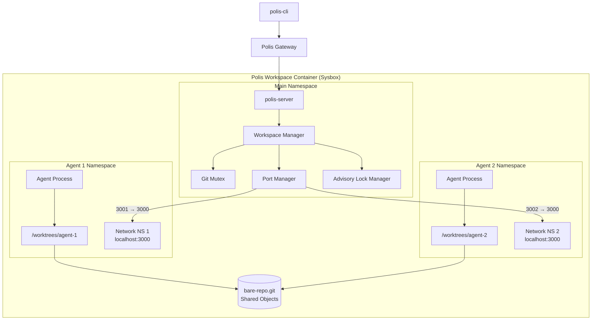
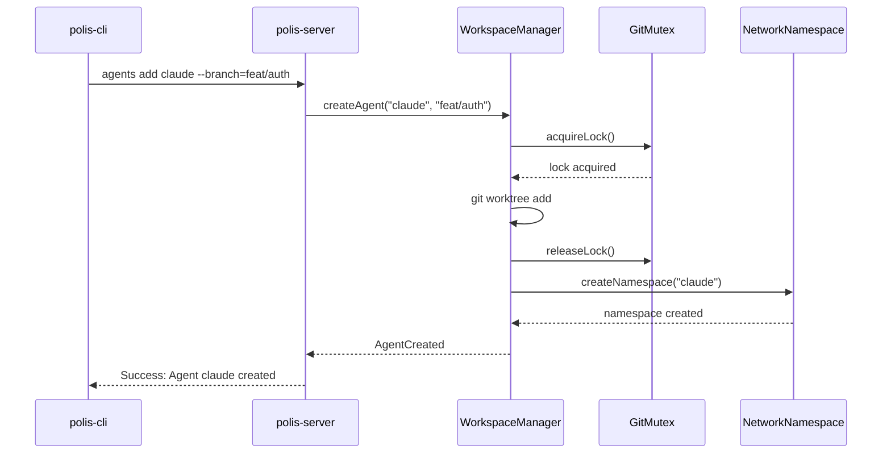
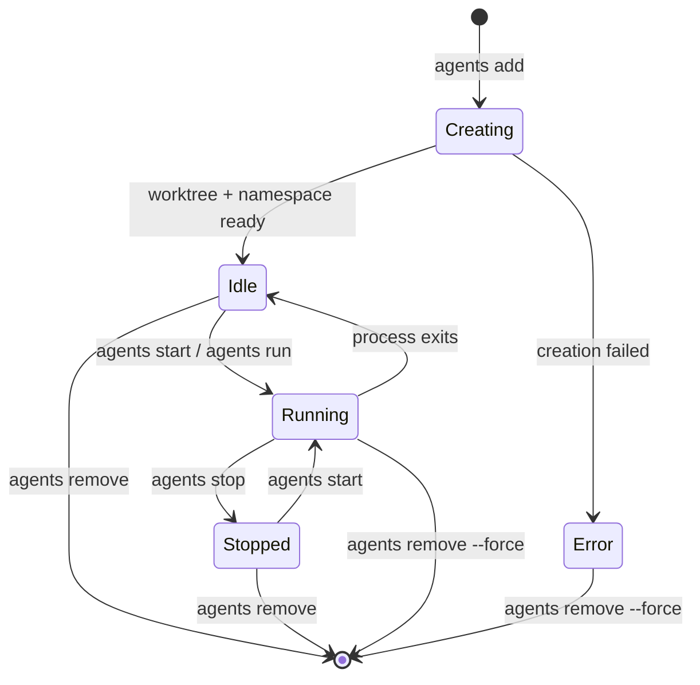

# Design Document: Multi-Agent Workspaces

## Overview

The Multi-Agent Workspaces feature enables 2-10 AI coding agents to work concurrently within a single Polis workspace container. This design implements the "Namespace-Isolated Worktree" architecture recommended by research, combining:

1. **Git Worktrees** - Each agent gets a dedicated directory and git index for parallel editing
2. **Linux Network Namespaces** - Each agent can bind to any port without conflicts
3. **Centralized Git Mutex** - Safe concurrent git operations via polis-server coordination
4. **pnpm** - Dependency deduplication across worktrees

This architecture was chosen over alternatives (separate containers, Linux users) due to:
- **Resource efficiency**: ~1GB total for 10 agents vs ~5GB+ for container-per-agent
- **Speed**: Worktree creation is near-instant vs container spin-up
- **Simplicity**: Single container with namespace isolation vs orchestrating multiple containers

### Isolation Modes

The system supports two isolation modes to handle environments where full namespace isolation is unavailable:

1. **Full Isolation Mode** (Sysbox/privileged): Network + Mount + PID namespaces per agent
2. **Degraded Mode** (standard Docker): Process groups with random port allocation, no filesystem isolation

The WorkspaceManager detects available capabilities at startup and selects the appropriate mode.

## Architecture



### Component Interactions



## Components and Interfaces

### 1. WorkspaceManager

The central coordinator for multi-agent operations, running within polis-server.

```rust
/// Manages agent worktrees, namespaces, and coordination
pub struct WorkspaceManager {
    /// Path to the bare repository
    bare_repo_path: PathBuf,
    /// Path to worktrees directory
    worktrees_path: PathBuf,
    /// Active agents indexed by name
    agents: HashMap<String, AgentState>,
    /// Git operation mutex
    git_mutex: Arc<GitMutex>,
    /// Port manager for namespace bridging
    port_manager: Arc<PortManager>,
    /// Advisory lock manager
    lock_manager: Arc<AdvisoryLockManager>,
}

impl WorkspaceManager {
    /// Initialize the multi-agent infrastructure
    pub async fn initialize(&mut self) -> Result<(), WorkspaceError>;
    
    /// Create a new agent with worktree and namespace
    pub async fn create_agent(&mut self, config: AgentConfig) -> Result<AgentState, WorkspaceError>;
    
    /// Remove an agent and clean up resources
    pub async fn remove_agent(&mut self, name: &str, force: bool) -> Result<(), WorkspaceError>;
    
    /// List all agents with their current status
    pub async fn list_agents(&self) -> Vec<AgentStatus>;
    
    /// Get agent by name
    pub fn get_agent(&self, name: &str) -> Option<&AgentState>;
    
    /// Persist agent configurations to disk
    pub async fn save_state(&self) -> Result<(), WorkspaceError>;
    
    /// Restore agents from persisted state
    pub async fn restore_state(&mut self) -> Result<(), WorkspaceError>;
}
```

### 2. GitMutex (Granular Read/Write Lock)

Coordinates git operations using granular locking to prevent repository corruption while maximizing concurrency.

**Design Rationale**: Git worktrees have independent indices and HEADs, so most operations can run concurrently. Only operations that update shared refs or the object database require serialization.

```rust
/// Operations categorized by lock requirements
pub enum GitOperation {
    // Read operations - can run concurrently
    Status,
    Diff,
    Log,
    Show,
    
    // Write operations - need write lock on specific ref
    Commit { branch: String },
    Checkout { branch: String },
    
    // Exclusive operations - need global exclusive lock
    Gc,
    Fetch,
    Push,
    Rebase { branch: String },
    Merge { branch: String },
}

/// Lock level for git operations
pub enum LockLevel {
    /// No lock needed (read-only operations)
    None,
    /// Read lock on specific ref (allows concurrent reads)
    RefRead(String),
    /// Write lock on specific ref (blocks other writes to same ref)
    RefWrite(String),
    /// Exclusive lock (blocks all other operations)
    Exclusive,
}

/// Granular git operation coordinator using RwLock pattern
pub struct GitMutex {
    /// File lock on .git/polis.lock for exclusive ops
    lock_file: PathBuf,
    /// Per-ref locks for branch operations
    ref_locks: RwLock<HashMap<String, RwLock<()>>>,
    /// Current exclusive lock holder (if any)
    exclusive_holder: RwLock<Option<String>>,
    /// Lock acquisition timeout (default 30s for fetch/gc, 5s for others)
    default_timeout: Duration,
    exclusive_timeout: Duration,
}

impl GitMutex {
    /// Determine lock level needed for an operation
    pub fn lock_level(op: &GitOperation) -> LockLevel;
    
    /// Acquire appropriate lock for a git operation
    /// - Commit/Checkout: Write lock on target branch only
    /// - Fetch/GC: Exclusive lock (with longer timeout)
    /// - Status/Diff/Log: No lock needed
    pub async fn acquire(&self, agent: &str, op: GitOperation) -> Result<GitLockGuard, LockError>;
    
    /// Check if operation can proceed without blocking
    pub fn can_proceed(&self, op: &GitOperation) -> bool;
    
    /// Force release all locks (for cleanup)
    pub async fn force_release(&self) -> Result<(), LockError>;
}

/// RAII guard that releases lock on drop
pub struct GitLockGuard<'a> {
    mutex: &'a GitMutex,
    agent: String,
    level: LockLevel,
}
```

### 3. PortManager

Manages port forwarding between agent namespaces and the main workspace.

```rust
/// Port mapping from internal namespace to external workspace port
pub struct PortMapping {
    pub agent_name: String,
    pub internal_port: u16,
    pub external_port: u16,
    pub protocol: Protocol,
}

pub enum Protocol {
    Tcp,
    Udp,
}

/// Manages port forwarding for agent namespaces
pub struct PortManager {
    /// Active port mappings
    mappings: RwLock<Vec<PortMapping>>,
    /// Next available external port
    next_port: AtomicU16,
    /// Port range for allocation (default 3001-9999)
    port_range: (u16, u16),
}

impl PortManager {
    /// Create a port mapping for an agent
    pub async fn create_mapping(
        &self,
        agent: &str,
        internal_port: u16,
    ) -> Result<PortMapping, PortError>;
    
    /// Remove all mappings for an agent
    pub async fn remove_agent_mappings(&self, agent: &str) -> Result<(), PortError>;
    
    /// List all active mappings
    pub fn list_mappings(&self) -> Vec<PortMapping>;
    
    /// Get external port for an agent's internal port
    pub fn get_external_port(&self, agent: &str, internal_port: u16) -> Option<u16>;
}
```

### 4. AdvisoryLockManager (Tool-Enforced)

Coordinates file access between agents to prevent edit conflicts. **Critical**: Locks are enforced at the Tool Layer, not advisory.

```rust
/// File lock information
pub struct FileLock {
    pub path: PathBuf,
    pub holder: String,
    pub acquired_at: SystemTime,
    pub lock_type: LockType,
}

pub enum LockType {
    Read,
    Write,
}

/// Manages file locks across agents - MUST be called by all file-editing tools
pub struct AdvisoryLockManager {
    /// Active locks indexed by file path
    locks: RwLock<HashMap<PathBuf, FileLock>>,
    /// Stale lock timeout (default 30s)
    stale_timeout: Duration,
}

impl AdvisoryLockManager {
    /// Acquire a lock on a file - MUST be called before any file write
    /// This is NOT advisory - tools MUST call this and respect the result
    pub async fn acquire(
        &self,
        path: &Path,
        agent: &str,
        lock_type: LockType,
    ) -> Result<LockHandle, LockError>;
    
    /// Release a specific lock
    pub async fn release(&self, path: &Path, agent: &str) -> Result<(), LockError>;
    
    /// Release all locks held by an agent
    pub async fn release_agent_locks(&self, agent: &str) -> Result<usize, LockError>;
    
    /// Check if a file is locked - tools MUST check before writing
    pub fn is_locked(&self, path: &Path) -> Option<&FileLock>;
    
    /// Clean up stale locks from crashed agents
    pub async fn cleanup_stale_locks(&self) -> Result<usize, LockError>;
    
    /// List all active locks
    pub fn list_locks(&self) -> Vec<FileLock>;
}

/// Tool integration - ALL file-editing tools MUST use this wrapper
pub struct ToolFileWriter {
    lock_manager: Arc<AdvisoryLockManager>,
    agent_name: String,
}

impl ToolFileWriter {
    /// Write to a file - automatically acquires lock, writes, releases
    /// Returns error if file is locked by another agent
    pub async fn write_file(&self, path: &Path, content: &[u8]) -> Result<(), ToolError>;
    
    /// Append to a file - automatically acquires lock
    pub async fn append_file(&self, path: &Path, content: &[u8]) -> Result<(), ToolError>;
}
```

### 5. AgentNamespaceManager (Full Isolation)

Creates and manages Linux namespaces for complete agent isolation including Network, Mount, and PID namespaces.

```rust
/// Complete namespace isolation for an agent
pub struct AgentNamespace {
    pub name: String,
    pub agent_name: String,
    pub created_at: SystemTime,
    /// Network namespace for port isolation
    pub network_ns: bool,
    /// Mount namespace for filesystem isolation
    pub mount_ns: bool,
    /// PID namespace for process isolation
    pub pid_ns: bool,
    /// Cgroup for resource limits and process reaping
    pub cgroup_path: PathBuf,
}

/// Isolation mode based on available capabilities
pub enum IsolationMode {
    /// Full isolation with all namespaces (Sysbox/privileged)
    Full,
    /// Degraded mode - process groups only (standard Docker)
    Degraded,
}

/// Manages complete namespace isolation for agents
pub struct AgentNamespaceManager {
    /// Active namespaces
    namespaces: RwLock<HashMap<String, AgentNamespace>>,
    /// Detected isolation mode
    mode: IsolationMode,
}

impl AgentNamespaceManager {
    /// Detect available isolation capabilities
    pub async fn detect_capabilities() -> IsolationMode;
    
    /// Create full namespace isolation for an agent
    /// In Full mode: unshare -n -m -p with cgroup
    /// In Degraded mode: process group with random ports
    pub async fn create(&self, agent_name: &str, worktree_path: &Path) -> Result<AgentNamespace, NamespaceError>;
    
    /// Delete namespace and reap all child processes via cgroup
    pub async fn delete(&self, agent_name: &str) -> Result<(), NamespaceError>;
    
    /// Execute a command within an agent's isolated environment
    /// Full mode: nsenter into all namespaces
    /// Degraded mode: setpgid and chdir
    pub async fn exec(&self, agent_name: &str, command: &[String]) -> Result<Output, NamespaceError>;
    
    /// Reap all processes in agent's cgroup (for cleanup)
    pub async fn reap_processes(&self, agent_name: &str) -> Result<u32, NamespaceError>;
    
    /// Check if namespace exists
    pub fn exists(&self, agent_name: &str) -> bool;
    
    /// Get current isolation mode
    pub fn isolation_mode(&self) -> IsolationMode;
}

/// Mount namespace setup for filesystem isolation
impl AgentNamespaceManager {
    /// Set up mount namespace with bind-mounted worktree as root
    /// Agent can only see /workspace/.polis/worktrees/<name>
    async fn setup_mount_namespace(&self, agent_name: &str, worktree_path: &Path) -> Result<(), NamespaceError>;
}
```

### 6. AgentState and Configuration

```rust
/// Agent configuration for creation
pub struct AgentConfig {
    pub name: String,
    pub base_type: AgentType,
    pub branch: Option<String>,
    pub memory_limit_mb: u32,
}

pub enum AgentType {
    Claude,
    Gemini,
    Kiro,
    Aider,
    Custom(String),
}

/// Runtime state of an agent
pub struct AgentState {
    pub config: AgentConfig,
    pub worktree_path: PathBuf,
    pub namespace: AgentNamespace,
    pub status: AgentStatus,
    pub port_mappings: Vec<PortMapping>,
    pub created_at: SystemTime,
    pub pid: Option<u32>,
    /// Cgroup path for process management
    pub cgroup_path: PathBuf,
}

pub enum AgentStatus {
    Creating,
    Running,
    Idle,
    Stopped,
    Error(String),
}

/// Persisted agent configuration
#[derive(Serialize, Deserialize)]
pub struct PersistedAgentConfig {
    pub name: String,
    pub base_type: String,
    pub branch: String,
    pub memory_limit_mb: u32,
    pub port_mappings: Vec<(u16, u16)>,
}
```

### 7. CLI Command Extensions

```rust
/// Extended agents subcommand
pub enum AgentsCommands {
    /// List all agents
    List,
    /// Add a new agent
    Add {
        name: String,
        #[arg(long)]
        base: AgentType,
        #[arg(long)]
        branch: Option<String>,
        #[arg(long, default_value = "512")]
        memory: u32,
    },
    /// Remove an agent
    Remove {
        name: String,
        #[arg(long)]
        force: bool,
    },
    /// Run a prompt on an agent
    Run {
        name: String,
        prompt: String,
    },
    /// Watch agent output
    Watch {
        name: String,
        #[arg(long, default_value = "50")]
        lines: usize,
    },
    /// Enter agent shell
    Shell {
        name: String,
    },
    /// Create PR from agent branch
    Pr {
        name: String,
        #[arg(long)]
        title: Option<String>,
    },
    /// List file locks
    Locks,
    /// Start an existing agent
    Start {
        name: Option<String>,
    },
    /// Stop a running agent
    Stop {
        name: Option<String>,
    },
}
```

## Data Models

### Directory Structure

```
/workspace/
├── project/                    # User's main project view (symlink or bind mount)
└── .polis/
    ├── bare-repo.git/          # Shared git object database
    │   ├── objects/
    │   ├── refs/
    │   ├── HEAD
    │   └── polis.lock          # Git mutex lock file
    ├── worktrees/
    │   ├── agent-1/            # Agent 1's worktree
    │   │   ├── .git            # Worktree-specific git file
    │   │   └── <project files>
    │   └── agent-2/            # Agent 2's worktree
    │       ├── .git
    │       └── <project files>
    ├── cgroups/                # Cgroup hierarchy for process management
    │   ├── agent-1/
    │   └── agent-2/
    └── state.json              # Single atomic state file (replaces multiple files)
```

### state.json Schema (Atomic State)

Single source of truth for all runtime state. On startup, reconcile against filesystem reality.

```json
{
  "version": 2,
  "last_modified": "2024-01-15T12:00:00Z",
  "isolation_mode": "full",
  "agents": [
    {
      "name": "claude",
      "base_type": "claude",
      "branch": "feat/auth",
      "memory_limit_mb": 512,
      "port_mappings": [[3000, 3001], [8080, 8081]],
      "created_at": "2024-01-15T10:30:00Z",
      "cgroup_path": "/workspace/.polis/cgroups/claude"
    }
  ],
  "locks": [
    {
      "path": "src/main.rs",
      "holder": "claude",
      "acquired_at": "2024-01-15T11:45:00Z",
      "lock_type": "write"
    }
  ],
  "port_allocations": {
    "next_port": 3003,
    "mappings": [
      {"agent": "claude", "internal": 3000, "external": 3001}
    ]
  }
}
```

### State Reconciliation on Startup

```rust
impl WorkspaceManager {
    /// Reconcile persisted state against filesystem reality
    /// Source of truth priority:
    /// 1. Filesystem worktrees (if worktree exists, agent should exist)
    /// 2. state.json (for configuration details)
    /// 3. Rebuild locks/ports from scratch if inconsistent
    pub async fn reconcile_state(&mut self) -> Result<ReconcileReport, WorkspaceError> {
        // 1. Scan /workspace/.polis/worktrees/ for existing worktrees
        // 2. Load state.json
        // 3. For each worktree found:
        //    - If in state.json: restore with saved config
        //    - If not in state.json: create minimal entry, log warning
        // 4. For each agent in state.json:
        //    - If worktree missing: remove from state, log error
        // 5. Clear all locks (stale after restart)
        // 6. Rebuild port mappings from agent configs
        // 7. Recreate namespaces and cgroups
    }
}
```

### State Transitions




## Correctness Properties

*A property is a characteristic or behavior that should hold true across all valid executions of a system—essentially, a formal statement about what the system should do. Properties serve as the bridge between human-readable specifications and machine-verifiable correctness guarantees.*

### Property 1: Agent Creation Completeness

*For any* valid agent name and base type, creating an agent SHALL result in:
- A git worktree existing at `/workspace/.polis/worktrees/<name>`
- A network namespace existing for that agent
- A branch named `agent/<name>` (if no branch specified) or the specified branch

**Validates: Requirements 1.1, 1.6, 1.8**

### Property 2: Agent Name Uniqueness

*For any* set of agent creation requests, if two requests use the same agent name, the second request SHALL fail with an error, and only one agent with that name SHALL exist.

**Validates: Requirements 1.3**

### Property 3: Agent Listing Completeness

*For any* set of N created agents, executing `polis agents list` SHALL return exactly N agents, and each returned agent SHALL include name, status, branch, and port information.

**Validates: Requirements 2.1, 2.2**

### Property 4: Agent Removal Cleanup

*For any* agent that is removed, after removal:
- The worktree directory SHALL NOT exist
- The network namespace SHALL NOT exist
- No advisory locks SHALL be held by that agent
- No port mappings SHALL exist for that agent
- No processes SHALL be running for that agent

**Validates: Requirements 4.1, 4.2, 4.3, 4.5, 9.5**

### Property 5: Non-Existent Agent Error

*For any* agent name that does not exist, operations targeting that agent (remove, run, watch, shell, pr) SHALL return an error indicating the agent was not found.

**Validates: Requirements 3.2, 4.6**

### Property 6: Advisory Lock Mutual Exclusion

*For any* file and any two agents, if agent A holds a write lock on the file, agent B's attempt to acquire a write lock on the same file SHALL be blocked or rejected with a notification.

**Validates: Requirements 6.1, 6.2**

### Property 7: Advisory Lock Release

*For any* file lock held by an agent, when the agent releases the file, the lock SHALL no longer exist, and other agents SHALL be able to acquire the lock.

**Validates: Requirements 6.3**

### Property 8: Stale Lock Cleanup

*For any* agent that crashes while holding locks, within 30 seconds all locks held by that agent SHALL be released.

**Validates: Requirements 6.4**

### Property 9: Port Mapping Uniqueness

*For any* set of agents with port mappings, no two agents SHALL have the same external port mapped, even if they have the same internal port.

**Validates: Requirements 9.2**

### Property 10: Port Range Validity

*For any* port mapping created by the Port_Manager, the external port SHALL be within the range 3000-9999.

**Validates: Requirements 9.4**

### Property 11: Git Mutex Granular Locking

*For any* set of concurrent git operations from multiple agents:
- Operations on different branches (commit, checkout) SHALL execute concurrently
- Operations on the same branch SHALL be serialized
- Exclusive operations (gc, fetch) SHALL block all other operations

**Validates: Requirements 10.1, 10.4**

### Property 12: Git Mutex Timeout

*For any* git mutex lock request:
- Branch-level locks SHALL timeout after 5 seconds
- Exclusive locks (fetch, gc) SHALL timeout after 30 seconds
- Timeout SHALL return an error, not block indefinitely

**Validates: Requirements 10.3**

### Property 13: Git Mutex Non-Blocking Operations

*For any* standard file operations (git add, git diff, git status), the Git_Mutex SHALL NOT acquire a lock.

**Validates: Requirements 10.5**

### Property 14: Memory Limit Application

*For any* agent created with a memory limit (default 512MB or custom), the agent's processes SHALL be constrained to that limit.

**Validates: Requirements 11.1, 11.2**

### Property 15: Memory Limit Enforcement

*For any* agent that exceeds its memory limit, the agent SHALL be terminated and an event SHALL be logged.

**Validates: Requirements 11.4**

### Property 16: Dependency Deduplication

*For any* two agents that install the same dependency version, the dependency files SHALL be hard-linked (same inode) rather than duplicated.

**Validates: Requirements 12.2**

### Property 17: npm to pnpm Interception

*For any* `npm install` command executed by an agent, the Cash_Shell SHALL intercept and execute `pnpm install` instead.

**Validates: Requirements 12.4**

### Property 18: Shell Context Consistency

*For any* agent shell session, the working directory SHALL be the agent's worktree, and the network namespace SHALL be the agent's namespace.

**Validates: Requirements 13.1, 13.2, 13.3**

### Property 19: Shell Exit Restoration

*For any* agent shell session, when the user exits, the context SHALL return to the main workspace (not the agent's worktree or namespace).

**Validates: Requirements 13.4**

### Property 20: Initialization Idempotence

*For any* repository, running `polis up` multiple times SHALL result in the same infrastructure state, and existing agent configurations SHALL be preserved.

**Validates: Requirements 14.1, 14.2, 14.3, 14.4**

### Property 21: Persistence Round-Trip

*For any* set of agents with configurations, stopping and starting the workspace SHALL restore all agents with the same name, base type, branch, port mappings, and memory limits.

**Validates: Requirements 15.1, 15.2, 15.3, 15.5**

### Property 22: Corrupted Worktree Handling

*For any* agent whose worktree is corrupted, restoration SHALL skip that agent, log an error, and continue restoring other agents.

**Validates: Requirements 15.4**

### Property 23: Broadcast Command Delivery

*For any* broadcast command sent via the TUI, all running agents SHALL receive the command.

**Validates: Requirements 8.6**

### Property 24: Agent Auto-Start on Task

*For any* stopped agent that receives a task via `polis agents run`, the agent SHALL be started before the task is delivered.

**Validates: Requirements 3.3**

### Property 25: Task Logging

*For any* task assigned to an agent, a log entry SHALL be created with the task content and timestamp.

**Validates: Requirements 3.5**

### Property 26: Mount Namespace Isolation (Full Mode)

*For any* agent in Full isolation mode, the agent's processes SHALL NOT be able to access files outside their worktree directory (e.g., `../../agent-2/` traversal SHALL fail).

**Validates: Requirements 9.1 (enhanced)**

### Property 27: PID Namespace Isolation (Full Mode)

*For any* agent in Full isolation mode, the agent's processes SHALL NOT be able to signal (kill, pkill) processes belonging to other agents.

**Validates: Requirements 9.1 (enhanced)**

### Property 28: Process Reaping on Removal

*For any* agent that is removed, ALL processes spawned by that agent (including detached/background processes) SHALL be terminated via cgroup cleanup.

**Validates: Requirements 4.1 (enhanced)**

### Property 29: Tool-Enforced File Locking

*For any* file write operation performed by an agent tool, the tool SHALL acquire a lock via AdvisoryLockManager BEFORE writing and SHALL fail if the file is locked by another agent.

**Validates: Requirements 6.1, 6.2 (enforced)**

### Property 30: Degraded Mode Port Allocation

*For any* agent in Degraded isolation mode, port allocation SHALL use random available ports in the configured range, and the CLI SHALL display the actual allocated ports.

**Validates: Requirements 9.2 (degraded mode)**

## Error Handling

### Agent Creation Errors

| Error Condition | Error Code | Recovery Action |
|----------------|------------|-----------------|
| Agent name already exists | `AGENT_EXISTS` | Return error with existing agent info |
| Invalid agent name (special chars) | `INVALID_NAME` | Return error with naming rules |
| Base agent type not available | `AGENT_TYPE_UNAVAILABLE` | Return error listing available types |
| Git worktree creation failed | `WORKTREE_FAILED` | Clean up partial state, return error |
| Namespace creation failed | `NAMESPACE_FAILED` | Remove worktree, return error |
| Maximum agents reached (10) | `MAX_AGENTS` | Return error with current count |
| Cgroup creation failed | `CGROUP_FAILED` | Clean up namespace/worktree, return error |

### Git Operation Errors

| Error Condition | Error Code | Recovery Action |
|----------------|------------|-----------------|
| Branch lock timeout (5s) | `BRANCH_LOCK_TIMEOUT` | Return error, suggest retry |
| Exclusive lock timeout (30s) | `EXCLUSIVE_LOCK_TIMEOUT` | Return error, check for stuck gc/fetch |
| Repository corruption detected | `REPO_CORRUPT` | Halt operations, notify user |
| Concurrent ref update conflict | `REF_CONFLICT` | Retry with backoff |

### Namespace Errors

| Error Condition | Error Code | Recovery Action |
|----------------|------------|-----------------|
| Network namespace creation failed | `NET_NS_FAILED` | Fall back to degraded mode |
| Mount namespace creation failed | `MOUNT_NS_FAILED` | Fall back to degraded mode |
| PID namespace creation failed | `PID_NS_FAILED` | Fall back to degraded mode |
| Sysbox not available | `SYSBOX_UNAVAILABLE` | Use degraded mode, warn user |
| Port already in use | `PORT_IN_USE` | Allocate next available port |
| Port range exhausted | `NO_PORTS` | Return error, suggest removing agents |
| socat bridge failed | `BRIDGE_FAILED` | Retry with different port |

### Advisory Lock Errors

| Error Condition | Error Code | Recovery Action |
|----------------|------------|-----------------|
| File locked by another agent | `FILE_LOCKED` | Return lock holder info, block write |
| Lock file corrupted | `LOCK_CORRUPT` | Force release, recreate |
| Stale lock detected | `STALE_LOCK` | Auto-release after timeout |

### Process Management Errors

| Error Condition | Error Code | Recovery Action |
|----------------|------------|-----------------|
| Cgroup reap failed | `REAP_FAILED` | Force kill via SIGKILL, log warning |
| Orphan processes detected | `ORPHAN_PROCS` | Kill via cgroup, log warning |
| Memory limit exceeded | `OOM_KILLED` | Log event, mark agent as Error |

### Persistence Errors

| Error Condition | Error Code | Recovery Action |
|----------------|------------|-----------------|
| state.json corrupted | `STATE_CORRUPT` | Rebuild from filesystem worktrees |
| Worktree missing on restore | `WORKTREE_MISSING` | Remove from state, log error |
| Namespace restore failed | `NS_RESTORE_FAILED` | Recreate namespace |
| State reconciliation conflict | `RECONCILE_CONFLICT` | Use filesystem as source of truth |

## Testing Strategy

### Property-Based Testing Framework

This feature will use **proptest** (Rust) for property-based testing, configured with:
- Minimum 100 iterations per property test
- Shrinking enabled for minimal failing examples
- Seed logging for reproducibility

### Test Categories

#### 1. Unit Tests (Specific Examples)

Unit tests will cover:
- CLI argument parsing for all `polis agents` subcommands
- Configuration file serialization/deserialization
- Port range boundary conditions
- Error message formatting

#### 2. Property-Based Tests

Each correctness property will have a corresponding property test:

```rust
// Example: Property 2 - Agent Name Uniqueness
// Feature: multi-agent-workspaces, Property 2: Agent Name Uniqueness
#[test]
fn prop_agent_name_uniqueness() {
    proptest!(|(name in "[a-z][a-z0-9-]{2,20}")| {
        let mut wm = WorkspaceManager::new_test();
        let config1 = AgentConfig { name: name.clone(), ..Default::default() };
        let config2 = AgentConfig { name: name.clone(), ..Default::default() };
        
        let result1 = wm.create_agent(config1);
        let result2 = wm.create_agent(config2);
        
        prop_assert!(result1.is_ok());
        prop_assert!(result2.is_err());
        prop_assert_eq!(wm.list_agents().len(), 1);
    });
}
```

#### 3. Integration Tests

Integration tests will verify:
- End-to-end agent lifecycle (create → run → remove)
- Multi-agent concurrent operations
- Workspace initialization and persistence
- TUI multi-agent view rendering

### Test Tagging Convention

All property tests must include a comment tag:
```
// Feature: multi-agent-workspaces, Property N: <property_title>
```

### Test Environment

Tests will run in:
- **Unit/Property tests**: Mock filesystem and namespace operations
- **Integration tests**: Docker container with Sysbox runtime
- **E2E tests**: Full Polis stack with real git operations

### Coverage Requirements

- All 30 correctness properties must have corresponding property tests
- Edge cases from error handling table must have unit tests
- Integration tests must cover the 3 implementation phases
- Degraded mode must have dedicated test suite
