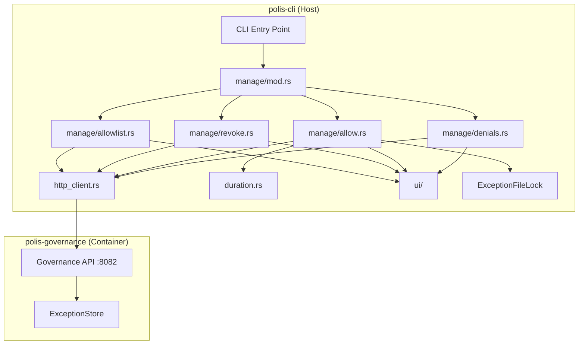
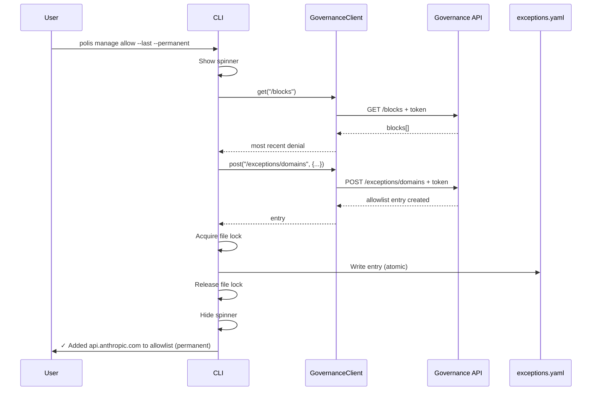
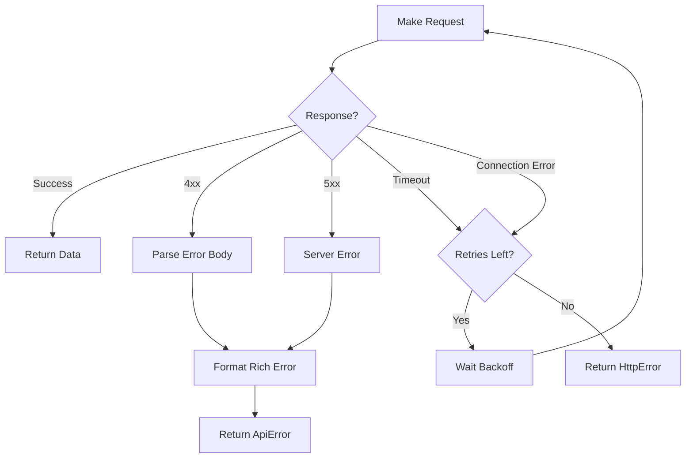

# Design Document: REA-003 CLI Commands

## Overview

This design document describes the implementation of CLI commands for the Runtime Exception API in polis-cli. The feature adds a `polis manage` subcommand group with four commands (`denials`, `allow`, `revoke`, `allowlist`) that interact with the Governance API (REA-002) to manage domain allowlisting.

**Design Reference:** RUNTIME-EXCEPTION-API-DESIGN-V2.md (v2.3)

### Command Naming (v2.3)

| Old Name | New Name | Purpose |
|----------|----------|---------|
| `blocks` | `denials` | View log of recently denied requests (activity) |
| `allow` | `allow` | Add a domain to the allowlist |
| `deny` | `revoke` | Remove a domain from the allowlist |
| `exceptions` | `allowlist` | View the list of active allowed domains |

The implementation follows the existing polis-cli patterns:
- Commands defined using clap derive macros in `src/commands/manage/`
- Error handling via `PolisError` enum with fix hints
- UI components in `src/ui/` using indicatif for progress indicators
- Async operations using tokio runtime

### Key Design Decisions

1. **HTTP Client as Separate Module**: The `GovernanceClient` is implemented in `src/http_client.rs` to encapsulate all API communication logic, including authentication, timeouts, and retry logic.

2. **Duration Parsing as Utility**: Duration parsing is isolated in `src/duration.rs` for reusability and testability.

3. **File Locking with fs2**: Uses the `fs2` crate for cross-platform flock() support to prevent race conditions when writing permanent exceptions.

4. **Atomic File Writes**: Permanent exceptions are written using temp file + rename pattern to prevent partial writes.

## Architecture



### Request Flow



## Components and Interfaces

### 1. HTTP Client (src/http_client.rs)

```rust
use reqwest::Client;
use std::time::Duration;
use crate::error::PolisError;

const BASE_URL: &str = "http://localhost:8082";
const REQUEST_TIMEOUT: Duration = Duration::from_secs(10);
const CONNECT_TIMEOUT: Duration = Duration::from_secs(5);
const MAX_RETRIES: u32 = 3;
const RETRY_DELAYS: [u64; 3] = [100, 200, 400]; // milliseconds

/// HTTP client for communicating with the Governance API.
pub struct GovernanceClient {
    client: Client,
    token: String,
}

impl GovernanceClient {
    /// Create a new client, reading the admin token from ~/.polis/session/admin-token.
    pub fn new() -> Result<Self, PolisError>;
    
    /// GET request with automatic retry on timeout/connection errors.
    pub async fn get<R: DeserializeOwned>(&self, path: &str) -> Result<R, PolisError>;
    
    /// POST request with JSON body and automatic retry.
    pub async fn post<T: Serialize, R: DeserializeOwned>(
        &self, 
        path: &str, 
        body: &T
    ) -> Result<R, PolisError>;
    
    /// DELETE request with automatic retry.
    pub async fn delete(&self, path: &str) -> Result<(), PolisError>;
}

/// Retry a request with exponential backoff.
/// Only retries on timeout/connection errors, NOT on 4xx responses.
async fn retry_request<F, Fut>(f: F) -> Result<reqwest::Response, PolisError>
where
    F: Fn() -> Fut,
    Fut: Future<Output = Result<reqwest::Response, reqwest::Error>>;
```

### 2. Duration Parser (src/duration.rs)

```rust
use thiserror::Error;

/// Allowed duration values in hours.
const ALLOWED_DURATIONS: [u32; 6] = [1, 2, 4, 8, 12, 24];

#[derive(Debug, Error)]
pub enum DurationParseError {
    #[error("Invalid format '{0}'. Use: 1h, 2h, 4h, 8h, 12h, or 24h")]
    InvalidFormat(String),
    
    #[error("Invalid number in '{0}'")]
    InvalidNumber(String),
    
    #[error("Invalid duration {0}h. Allowed: 1h, 2h, 4h, 8h, 12h, 24h")]
    InvalidDuration(u32),
}

/// Parse a duration string (e.g., "4h") into hours.
/// 
/// Accepts: 1h, 2h, 4h, 8h, 12h, 24h (case-insensitive, whitespace-trimmed)
pub fn parse_duration(input: &str) -> Result<u32, DurationParseError>;
```

### 3. UI Components (src/ui/)

#### Spinner (src/ui/spinner.rs)

```rust
use indicatif::{ProgressBar, ProgressStyle};
use std::time::Duration;

/// Spinner for showing progress during API calls.
pub struct Spinner {
    bar: ProgressBar,
}

impl Spinner {
    /// Create a new spinner with the given message.
    pub fn new(msg: &str) -> Self;
    
    /// Update the spinner message.
    pub fn set_message(&self, msg: &str);
    
    /// Finish with success indicator (✓).
    pub fn finish_success(&self, msg: &str);
    
    /// Finish with failure indicator (✗).
    pub fn finish_error(&self, msg: &str);
    
    /// Clear the spinner without a message.
    pub fn finish_clear(&self);
}
```

#### Error Formatting (src/ui/errors.rs)

```rust
use colored::Colorize;

/// API error details from response body.
pub struct ApiErrorDetails {
    pub reset_in_seconds: Option<u32>,
    pub existing_id: Option<String>,
    pub message: Option<String>,
}

/// Format an API error with rich context and suggestions.
pub fn format_api_error(status: u16, details: Option<&ApiErrorDetails>) -> String;

/// Check if stdout is a TTY for color support.
pub fn is_tty() -> bool;
```

### 4. Command Structs (src/commands/mod.rs and src/commands/manage/mod.rs)

```rust
// src/commands/mod.rs
pub mod manage;

#[derive(Subcommand)]
pub enum Commands {
    // ... existing lifecycle commands ...
    Init { ... },
    Up { ... },
    Down,
    Status,
    Logs { ... },
    Doctor { ... },
    Ssh { ... },
    Shell,
    Agents { ... },
    
    /// Runtime management commands (allowlist, denials)
    Manage {
        #[command(subcommand)]
        command: ManageCommands,
    },
}

// src/commands/manage/mod.rs
pub mod denials;
pub mod allow;
pub mod revoke;
pub mod allowlist;

#[derive(Subcommand)]
pub enum ManageCommands {
    /// View log of recently denied requests
    Denials(DenialsArgs),
    /// Add a domain to the allowlist
    Allow(AllowArgs),
    /// Remove a domain from the allowlist
    Revoke(RevokeArgs),
    /// View the list of active allowed domains
    Allowlist(AllowlistArgs),
}

#[derive(Parser, Debug)]
pub struct DenialsArgs {
    /// Show all denials in buffer
    #[arg(long)]
    pub all: bool,
    
    /// Output in JSON format
    #[arg(long)]
    pub json: bool,
    
    /// Filter by type (domain, secret, pii)
    #[arg(long, value_name = "TYPE")]
    pub r#type: Option<String>,
    
    /// Interactive mode: select denial to allow
    #[arg(long, short)]
    pub interactive: bool,
}

#[derive(Parser, Debug)]
pub struct AllowArgs {
    /// Domain to add to allowlist
    pub domain: Option<String>,
    
    /// Allow from denial ID
    #[arg(long, value_name = "BLOCK_ID")]
    pub block: Option<String>,
    
    /// Allow the most recently denied domain
    #[arg(long)]
    pub last: bool,
    
    /// Allowlist entry duration (1h, 2h, 4h, 8h, 12h, 24h)
    #[arg(long, value_name = "DURATION")]
    pub r#for: Option<String>,
    
    /// Make allowlist entry permanent
    #[arg(long)]
    pub permanent: bool,
    
    /// Reason for audit trail
    #[arg(long)]
    pub reason: Option<String>,
}

#[derive(Parser, Debug)]
pub struct RevokeArgs {
    /// Domain to remove from allowlist
    pub domain: Option<String>,
    
    /// Revoke by allowlist entry ID
    #[arg(long, value_name = "ID")]
    pub id: Option<String>,
    
    /// Revoke all session allowlist entries
    #[arg(long)]
    pub all_session: bool,
}

#[derive(Parser, Debug)]
pub struct AllowlistArgs {
    /// Output in JSON format
    #[arg(long)]
    pub json: bool,
    
    /// Filter by scope (session, permanent, duration)
    #[arg(long, value_name = "SCOPE")]
    pub scope: Option<String>,
}
```

### 5. File Locking (src/commands/manage/allow.rs)

```rust
use fs2::FileExt;
use std::path::Path;

/// RAII guard for exclusive file lock on ~/.polis/state/exceptions.yaml.
pub struct ExceptionFileLock {
    lock_file: std::fs::File,
}

impl ExceptionFileLock {
    /// Acquire exclusive lock on ~/.polis/state/exceptions.yaml.lock.
    /// Blocks until lock is available.
    pub fn acquire(state_dir: &Path) -> Result<Self, PolisError>;
}

impl Drop for ExceptionFileLock {
    fn drop(&mut self) {
        let _ = self.lock_file.unlock();
    }
}

/// Write exception to ~/.polis/state/exceptions.yaml atomically.
pub async fn write_permanent_exception(exc: &Exception) -> Result<(), PolisError>;
```

## Data Models

### API Request/Response Types

```rust
/// Block from the governance API.
#[derive(Debug, Deserialize)]
pub struct Block {
    pub id: String,
    pub timestamp: DateTime<Utc>,
    pub r#type: String,
    pub value: String,
    pub reason: String,
    pub can_exception: bool,
    pub ago: String,
}

/// Response from GET /blocks.
#[derive(Debug, Deserialize)]
pub struct BlocksResponse {
    pub blocks: Vec<Block>,
    pub total: usize,
}

/// Exception from the governance API.
#[derive(Debug, Serialize, Deserialize, Clone)]
pub struct Exception {
    pub id: String,
    pub r#type: String,
    pub value: String,
    pub scope: ExceptionScope,
    pub expires_at: Option<DateTime<Utc>>,
    pub created_at: DateTime<Utc>,
    pub created_by: String,
    pub reason: Option<String>,
}

/// Exception scope.
#[derive(Debug, Serialize, Deserialize, Clone, PartialEq)]
#[serde(rename_all = "lowercase")]
pub enum ExceptionScope {
    Session,
    Permanent,
    #[serde(rename = "duration")]
    Duration { hours: u32 },
}

/// Request to add a domain exception.
#[derive(Debug, Serialize)]
pub struct AddExceptionRequest {
    pub domain: String,
    pub scope: ExceptionScope,
    pub reason: Option<String>,
}

/// Response from GET /exceptions.
#[derive(Debug, Deserialize)]
pub struct ExceptionsResponse {
    pub exceptions: Vec<Exception>,
    pub total: usize,
}
```

### File Format (exceptions.yaml)

```rust
/// Format of .polis/state/exceptions.yaml.
#[derive(Debug, Serialize, Deserialize, Default)]
pub struct ExceptionsFile {
    pub version: u32,
    pub last_updated: DateTime<Utc>,
    pub exceptions: Vec<Exception>,
}
```


## Correctness Properties

*A property is a characteristic or behavior that should hold true across all valid executions of a system—essentially, a formal statement about what the system should do. Properties serve as the bridge between human-readable specifications and machine-verifiable correctness guarantees.*

Based on the prework analysis of acceptance criteria, the following correctness properties have been identified for property-based testing:

### Property 1: Auth Token Inclusion

*For any* HTTP request made by the GovernanceClient (GET, POST, or DELETE), the request SHALL include the X-Polis-Admin-Token header with the token value read from ~/.polis/session/admin-token.

**Validates: Requirements 1.3**

### Property 2: Retry on Transient Errors

*For any* request that fails due to timeout or connection error, the HTTP client SHALL retry up to 3 times with delays of 100ms, 200ms, and 400ms respectively before returning an error.

**Validates: Requirements 1.4**

### Property 3: No Retry on Client Errors

*For any* HTTP response with a 4xx status code (400-499), the HTTP client SHALL NOT retry the request and SHALL return the error immediately after the first attempt.

**Validates: Requirements 1.5**

### Property 4: Invalid Duration Rejection

*For any* string that is not one of the valid duration values (1h, 2h, 4h, 8h, 12h, 24h), the duration parser SHALL return a DurationParseError with a message containing "Allowed: 1h, 2h, 4h, 8h, 12h, 24h".

**Validates: Requirements 2.2**

### Property 5: Duration Case Insensitivity

*For any* valid duration value, parsing the uppercase, lowercase, or mixed-case version SHALL return the same result (e.g., "4H", "4h", "4H" all parse to 4 hours).

**Validates: Requirements 2.3**

### Property 6: Duration Whitespace Handling

*For any* valid duration string with leading or trailing whitespace, parsing SHALL succeed and return the correct hours value.

**Validates: Requirements 2.4**

### Property 7: Rate Limit Error Formatting

*For any* 429 error response with a reset_in_seconds value, the formatted error message SHALL contain that reset time value.

**Validates: Requirements 3.6**

### Property 8: Conflict Error Formatting

*For any* 409 error response with an existing_id value, the formatted error message SHALL contain that existing ID.

**Validates: Requirements 3.7**

### Property 9: JSON Output Validity

*For any* blocks or exceptions response, when the --json flag is used, the output SHALL be valid JSON that can be parsed back into the original data structure.

**Validates: Requirements 4.3, 7.2**

### Property 10: Reason Preservation

*For any* reason text provided via --reason flag, the AddExceptionRequest sent to the API SHALL contain that exact reason text.

**Validates: Requirements 5.8**

### Property 11: Exception Details Display

*For any* successfully created exception, the CLI output SHALL contain the exception's domain value and scope.

**Validates: Requirements 5.11**

### Property 12: Deletion Confirmation

*For any* successfully deleted exception, the CLI output SHALL contain the exception ID that was removed.

**Validates: Requirements 6.4**

## Error Handling

### Error Types

The following error variants will be added to `PolisError`:

```rust
pub enum PolisError {
    // ... existing variants ...
    
    /// HTTP request failed
    #[error("HTTP error: {0}")]
    HttpError(String),
    
    /// API returned an error response
    #[error("{message}")]
    ApiError {
        status: u16,
        message: String,
        fix_hint: String,
    },
    
    /// Duration parsing failed
    #[error("{0}")]
    DurationParseError(#[from] DurationParseError),
    
    /// Admin token not found
    #[error("Admin token not found")]
    AdminTokenNotFound,
    
    /// File lock acquisition failed
    #[error("Failed to acquire file lock: {0}")]
    FileLockError(String),
    
    /// User input error (invalid arguments)
    #[error("{0}")]
    UserError(String),
}
```

### Error Mapping

| HTTP Status | Error Type | Fix Hint |
|-------------|------------|----------|
| 401 | ApiError | "Run: polis down && polis up, or polis init --regenerate-token" |
| 403 | ApiError | "Domain is in denylist and cannot be excepted" |
| 404 | ApiError | "Exception not found" |
| 409 | ApiError | "Remove existing exception first: polis deny --id {id}" |
| 429 | ApiError | "Wait {reset}s for rate limit to reset, or remove exceptions" |
| 5xx | ApiError | "Server error. Check: polis logs --container governance" |
| Connection refused | HttpError | "Is polis running? Try 'polis status'" |
| Timeout | HttpError | "Request timed out. Try again or check 'polis status'" |

### Error Flow



## Testing Strategy

### Unit Tests

Unit tests will cover specific examples and edge cases:

1. **Duration Parser**
   - Valid inputs: "1h", "2h", "4h", "8h", "12h", "24h"
   - Invalid inputs: "3h", "1d", "abc", "", "0h", "25h"
   - Case variations: "1H", "4H", "12H"
   - Whitespace: " 4h ", "4h ", " 4h"

2. **Error Formatting**
   - 401 error produces auth failure message
   - 429 error includes reset time
   - 409 error includes existing ID
   - Connection error suggests checking status

3. **File Locking**
   - Lock is acquired before write
   - Lock is released on drop
   - Atomic write uses temp file + rename

4. **Command Argument Parsing**
   - DenialsArgs parses all flags correctly
   - AllowArgs handles mutually exclusive options
   - RevokeArgs validates required arguments

### Property-Based Tests

Property-based tests will use the `proptest` crate with minimum 100 iterations per test:

```rust
// Example property test structure
proptest! {
    #![proptest_config(ProptestConfig::with_cases(100))]
    
    /// Feature: rea-cli-commands, Property 4: Invalid Duration Rejection
    #[test]
    fn prop_invalid_duration_rejected(input in "[a-zA-Z0-9]{1,10}") {
        // Filter out valid durations
        let valid = ["1h", "2h", "4h", "8h", "12h", "24h"];
        let normalized = input.to_lowercase();
        if !valid.contains(&normalized.as_str()) {
            let result = parse_duration(&input);
            prop_assert!(result.is_err());
            let err = result.unwrap_err();
            prop_assert!(err.to_string().contains("Allowed: 1h, 2h, 4h, 8h, 12h, 24h"));
        }
    }
}
```

### Integration Tests

Integration tests will verify end-to-end flows with a mock governance server:

1. **polis manage denials flow**: Mock server returns denials, verify table output
2. **polis manage allow --last flow**: Mock server returns denials, verify allowlist entry created
3. **polis manage allow --permanent flow**: Verify both API call and file write
4. **polis manage revoke flow**: Verify deletion API call
5. **Error handling flow**: Mock various error responses, verify rich error output

### Test Configuration

- Property tests: 100 iterations minimum
- Each property test tagged with: `Feature: rea-cli-commands, Property N: {property_text}`
- Integration tests use `wiremock` for HTTP mocking
- File system tests use `tempfile` for isolated directories

## Dependencies

Add to `polis-cli/Cargo.toml`:

```toml
[dependencies]
reqwest = { version = "0.11", features = ["json"] }
dialoguer = "0.11"
colored = "2.0"
fs2 = "0.4"
serde_yaml = "0.9"

[dev-dependencies]
proptest = "1.4"
wiremock = "0.5"
tempfile = "3.10"
```
