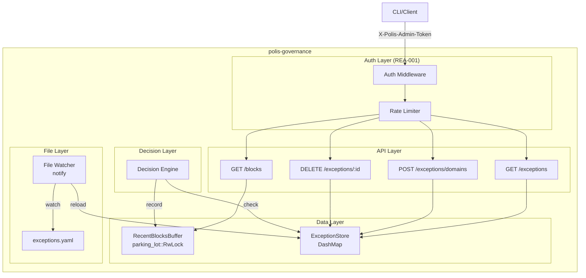
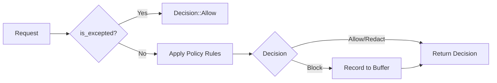

# Design Document: REA Governance API

## Overview

This design document describes the Governance API (Phase 1) for the Runtime Exception API. The implementation adds core data structures and API endpoints to polis-governance for managing blocked requests and domain exceptions.

Key components:
- **RecentBlocksBuffer**: Thread-safe ring buffer using parking_lot::RwLock for storing recent blocked requests
- **ExceptionStore**: Dual-storage exception store using DashMap for O(1) domain lookup
- **File Watcher**: notify-based watcher for hot reload of permanent exceptions from ~/.polis/state/
- **API Endpoints**: REST endpoints for blocks and exceptions management
- **Decision Engine Integration**: Exception checking before policy rules

This phase depends on REA-001 (Security Foundation) which provides authentication middleware and rate limiting.

**Design Reference:** RUNTIME-EXCEPTION-API-DESIGN-V2.md (v2.3)

## Architecture



### Request Flow

1. Client sends request with `X-Polis-Admin-Token` header
2. Auth middleware validates token (from REA-001)
3. Rate limiter checks limits (from REA-001)
4. Request proceeds to appropriate endpoint handler
5. Handler interacts with RecentBlocksBuffer or ExceptionStore

### Decision Engine Flow



## Components and Interfaces

### RecentBlocksBuffer (src/blocks_buffer.rs)

```rust
use chrono::{DateTime, Duration, Utc};
use parking_lot::RwLock;
use serde::Serialize;
use std::collections::VecDeque;

/// Ring buffer for recent blocked requests.
/// Thread-safe using parking_lot::RwLock.
pub struct RecentBlocksBuffer {
    blocks: RwLock<VecDeque<BlockEvent>>,
    capacity: usize,
    max_age: Duration,
}

/// A blocked request event.
#[derive(Debug, Clone, Serialize)]
pub struct BlockEvent {
    pub id: String,
    pub timestamp: DateTime<Utc>,
    pub block_type: BlockType,
    pub value: String,
    pub reason: String,
    pub can_exception: bool,
}

/// Type of block.
#[derive(Debug, Clone, Serialize)]
#[serde(tag = "type", rename_all = "snake_case")]
pub enum BlockType {
    Domain { host: String },
    Secret { pattern: String },
    Pii { category: String },
}

impl RecentBlocksBuffer {
    /// Creates a new buffer with capacity 100 and max age 10 minutes.
    pub fn new() -> Self;
    
    /// Creates a buffer with custom capacity and max age.
    pub fn with_config(capacity: usize, max_age: Duration) -> Self;
    
    /// Adds a block event, evicting oldest if at capacity.
    pub fn add(&self, event: BlockEvent);
    
    /// Gets recent blocks, filtered by age and optional since timestamp.
    pub fn get_recent(&self, since: Option<DateTime<Utc>>) -> Vec<BlockEvent>;
    
    /// Gets a block by ID.
    pub fn get_by_id(&self, id: &str) -> Option<BlockEvent>;
    
    /// Returns buffer capacity.
    pub fn capacity(&self) -> usize;
    
    /// Returns max age duration.
    pub fn max_age(&self) -> Duration;
}

/// Generates a unique block ID with "blk-" prefix.
pub fn generate_block_id() -> String;
```

### ExceptionStore (src/exception_store.rs)

```rust
use chrono::{DateTime, Utc};
use dashmap::DashMap;
use serde::{Deserialize, Serialize};
use std::path::PathBuf;

/// Dual-storage exception store with O(1) lookup.
pub struct ExceptionStore {
    session_exceptions: DashMap<String, Exception>,
    permanent_exceptions: DashMap<String, Exception>,
    state_file_path: PathBuf,
}

/// A domain exception.
#[derive(Debug, Clone, Serialize, Deserialize, PartialEq)]
pub struct Exception {
    pub id: String,
    #[serde(rename = "type")]
    pub exception_type: ExceptionType,
    pub value: String,
    pub scope: ExceptionScope,
    pub expires_at: Option<DateTime<Utc>>,
    pub created_at: DateTime<Utc>,
    pub created_by: String,
    pub reason: Option<String>,
}

/// Type of exception.
#[derive(Debug, Clone, Serialize, Deserialize, PartialEq)]
#[serde(rename_all = "snake_case")]
pub enum ExceptionType {
    Domain,
    Pattern,
}

/// Scope/duration of exception.
#[derive(Debug, Clone, Serialize, Deserialize, PartialEq)]
#[serde(rename_all = "snake_case")]
pub enum ExceptionScope {
    Session,
    Duration { hours: u32 },
    Permanent,
}

/// Exception store errors.
#[derive(Debug, thiserror::Error)]
pub enum ExceptionError {
    #[error("Exception already exists for domain: {domain}, id: {existing_id}")]
    AlreadyExists { domain: String, existing_id: String },
    
    #[error("Exception not found: {id}")]
    NotFound { id: String },
    
    #[error("Invalid domain: {reason}")]
    InvalidDomain { reason: String },
    
    #[error("IO error: {0}")]
    Io(#[from] std::io::Error),
    
    #[error("YAML error: {0}")]
    Yaml(#[from] serde_yaml::Error),
}

impl ExceptionStore {
    /// Creates a new store with the given state file path.
    pub fn new(state_file_path: PathBuf) -> Self;
    
    /// Loads permanent exceptions from ~/.polis/state/exceptions.yaml.
    pub async fn load_permanent(&self) -> Result<(), ExceptionError>;
    
    /// Reloads permanent exceptions from ~/.polis/state/exceptions.yaml.
    pub async fn reload_permanent(&self) -> Result<(), ExceptionError>;
    
    /// Checks if a domain is excepted (O(1) lookup).
    pub fn is_excepted(&self, domain: &str) -> bool;
    
    /// Adds an exception.
    pub fn add(&self, exception: Exception) -> Result<Exception, ExceptionError>;
    
    /// Removes an exception by ID.
    pub fn remove(&self, id: &str) -> Result<(), ExceptionError>;
    
    /// Gets all active exceptions.
    pub fn get_all(&self) -> Vec<Exception>;
    
    /// Gets an exception by ID.
    pub fn get_by_id(&self, id: &str) -> Option<Exception>;
    
    /// Normalizes a domain for consistent lookup.
    pub fn normalize_domain(domain: &str) -> String;
}

/// Generates a unique exception ID with "exc-" prefix.
pub fn generate_exception_id() -> String;
```

### File Watcher (src/exception_file_watcher.rs)

```rust
use notify::{RecommendedWatcher, RecursiveMode, Watcher, Config};
use std::path::PathBuf;
use tokio::sync::mpsc;

/// File watcher for ~/.polis/state/exceptions.yaml hot reload.
pub struct ExceptionFileWatcher {
    _watcher: RecommendedWatcher,
    rx: mpsc::Receiver<PathBuf>,
}

impl ExceptionFileWatcher {
    /// Creates a new watcher for the state directory.
    pub fn new(state_dir: PathBuf) -> Result<Self, notify::Error>;
    
    /// Waits for the next file change event.
    pub async fn next_change(&mut self) -> Option<PathBuf>;
}

/// Spawns a background task that watches for file changes and reloads the store.
pub async fn spawn_file_watcher(
    store: Arc<ExceptionStore>,
    state_dir: PathBuf,
) -> Result<(), notify::Error>;
```

### API Module (src/api/mod.rs)

```rust
pub mod blocks;
pub mod exceptions;

use axum::Router;
use std::sync::Arc;

/// Shared state for exception API endpoints.
pub struct ExceptionAppState {
    pub blocks_buffer: Arc<RecentBlocksBuffer>,
    pub exception_store: Arc<ExceptionStore>,
}

/// Creates the exception API router with all endpoints.
/// All endpoints require authentication via X-Polis-Admin-Token.
pub fn create_exception_router(state: Arc<ExceptionAppState>) -> Router;
```

### Blocks API (src/api/blocks.rs)

```rust
use axum::{extract::{Query, State}, Json};
use serde::{Deserialize, Serialize};

#[derive(Debug, Deserialize)]
pub struct GetBlocksQuery {
    pub since: Option<DateTime<Utc>>,
}

#[derive(Debug, Serialize)]
pub struct BlocksResponse {
    pub blocks: Vec<BlockEvent>,
    pub total: usize,
    pub buffer_size: usize,
    pub buffer_age_limit: String,
}

/// GET /blocks - Returns recent blocked requests.
pub async fn get_blocks(
    State(state): State<Arc<ExceptionAppState>>,
    Query(query): Query<GetBlocksQuery>,
) -> Json<BlocksResponse>;
```

### Exceptions API (src/api/exceptions.rs)

```rust
use axum::{extract::{Path, State}, http::StatusCode, Json};
use serde::{Deserialize, Serialize};

#[derive(Debug, Deserialize)]
pub struct AddExceptionRequest {
    pub domain: String,
    pub scope: ExceptionScope,
    pub reason: Option<String>,
}

#[derive(Debug, Serialize)]
pub struct ExceptionsListResponse {
    pub exceptions: Vec<Exception>,
    pub total: usize,
}

#[derive(Debug, Serialize)]
pub struct ExceptionErrorResponse {
    pub error: String,
    pub message: String,
    #[serde(skip_serializing_if = "Option::is_none")]
    pub existing_id: Option<String>,
    #[serde(skip_serializing_if = "Option::is_none")]
    pub reset_in_seconds: Option<u32>,
}

/// GET /exceptions - Returns all active exceptions.
pub async fn get_exceptions(
    State(state): State<Arc<ExceptionAppState>>,
) -> Json<ExceptionsListResponse>;

/// POST /exceptions/domains - Creates a domain exception.
pub async fn add_domain_exception(
    State(state): State<Arc<ExceptionAppState>>,
    Json(request): Json<AddExceptionRequest>,
) -> Result<(StatusCode, Json<Exception>), (StatusCode, Json<ExceptionErrorResponse>)>;

/// DELETE /exceptions/:id - Removes an exception.
pub async fn remove_exception(
    State(state): State<Arc<ExceptionAppState>>,
    Path(id): Path<String>,
) -> StatusCode;
```


## Data Models

### BlockEvent

| Field | Type | Description |
|-------|------|-------------|
| id | String | Unique identifier with "blk-" prefix |
| timestamp | DateTime<Utc> | When the block occurred |
| block_type | BlockType | Type of block (Domain, Secret, Pii) |
| value | String | The blocked value (e.g., domain name) |
| reason | String | Reason for blocking |
| can_exception | bool | Whether this block can be excepted |

### BlockType

| Variant | Fields | Description |
|---------|--------|-------------|
| Domain | host: String | Domain block |
| Secret | pattern: String | Secret pattern block |
| Pii | category: String | PII category block |

### Exception

| Field | Type | Description |
|-------|------|-------------|
| id | String | Unique identifier with "exc-" prefix |
| exception_type | ExceptionType | Type of exception (Domain, Pattern) |
| value | String | The excepted value (normalized domain) |
| scope | ExceptionScope | Duration/scope of exception |
| expires_at | Option<DateTime<Utc>> | When exception expires (None = never) |
| created_at | DateTime<Utc> | When exception was created |
| created_by | String | Who created the exception (e.g., "cli") |
| reason | Option<String> | Optional reason for audit trail |

### ExceptionScope

| Variant | Fields | Description |
|---------|--------|-------------|
| Session | - | Lost on restart |
| Duration | hours: u32 | Expires after N hours |
| Permanent | - | Persisted to file |

### API Response Types

#### BlocksResponse

```json
{
  "blocks": [
    {
      "id": "blk-abc123",
      "timestamp": "2026-01-29T14:30:00Z",
      "type": "domain",
      "value": "api.anthropic.com",
      "reason": "Domain not in allowlist",
      "can_exception": true
    }
  ],
  "total": 1,
  "buffer_size": 100,
  "buffer_age_limit": "10 minutes"
}
```

#### ExceptionsListResponse

```json
{
  "exceptions": [
    {
      "id": "exc-xyz789",
      "type": "domain",
      "value": "api.anthropic.com",
      "scope": "session",
      "expires_at": null,
      "created_at": "2026-01-29T14:31:00Z",
      "created_by": "cli",
      "reason": "Needed for Claude API"
    }
  ],
  "total": 1
}
```

#### ExceptionErrorResponse

```json
{
  "error": "already_exists",
  "message": "Exception already exists for domain",
  "existing_id": "exc-abc123"
}
```

### exceptions.yaml File Format

```yaml
version: 1
last_updated: "2026-01-29T14:30:00Z"
exceptions:
  - id: exc-abc123
    type: domain
    value: api.anthropic.com
    scope: permanent
    expires_at: null
    created_at: "2026-01-29T14:30:00Z"
    created_by: cli
    reason: "User requested via polis allow --permanent"
```


## Correctness Properties

*A property is a characteristic or behavior that should hold true across all valid executions of a system—essentially, a formal statement about what the system should do. Properties serve as the bridge between human-readable specifications and machine-verifiable correctness guarantees.*

### Property 1: Buffer Capacity and FIFO Eviction

*For any* sequence of N block events added to a RecentBlocksBuffer with capacity C, the buffer size should never exceed C, and when N > C, only the most recent C events should remain in FIFO order.

**Validates: Requirements 1.1, 1.3**

### Property 2: Block ID Uniqueness and Prefix

*For any* set of generated block IDs, all IDs should start with "blk-" prefix and no two IDs should be equal.

**Validates: Requirements 1.5**

### Property 3: Exception ID Uniqueness and Prefix

*For any* set of generated exception IDs, all IDs should start with "exc-" prefix and no two IDs should be equal.

**Validates: Requirements 3.4**

### Property 4: Domain Normalization Round-Trip

*For any* domain string, normalizing it should produce a canonical form such that:
- normalize("EXAMPLE.COM") == normalize("example.com")
- normalize("example.com.") == normalize("example.com")
- normalize("example.com:8080") == normalize("example.com")

And for any excepted domain, is_excepted should return true for all equivalent unnormalized forms.

**Validates: Requirements 4.1, 4.2, 4.3, 4.4**

### Property 5: Exception Expiry Handling

*For any* exception with expires_at set to a time T:
- is_excepted should return true when current time < T
- is_excepted should return false when current time >= T

*For any* exception with expires_at as None, is_excepted should always return true (until removed).

**Validates: Requirements 5.2, 5.3, 5.4**

### Property 6: Add/Remove Exception Round-Trip

*For any* valid exception added to the store, the exception should be retrievable via get_all and is_excepted should return true for its domain. After removing the exception, is_excepted should return false for that domain.

**Validates: Requirements 6.1, 6.5, 6.7**

### Property 7: Duplicate Domain Detection

*For any* domain that already has an exception, attempting to add another exception for the same domain (including normalized variants) should return an AlreadyExists error containing the existing exception's ID.

**Validates: Requirements 6.4**

### Property 8: API Authentication Requirement

*For any* request to /blocks, /exceptions, /exceptions/domains, or /exceptions/:id without a valid X-Polis-Admin-Token header, the endpoint should return HTTP 401 Unauthorized.

**Validates: Requirements 8.1, 9.1, 10.1, 11.1**

### Property 9: Wildcard Domain Rejection

*For any* domain string starting with "*.", the POST /exceptions/domains endpoint should return HTTP 400 Bad Request.

**Validates: Requirements 10.5**

### Property 10: Exception Allows Policy Bypass

*For any* domain with an active exception, when the decision engine evaluates a request to that domain, it should return Decision::Allow without applying policy rules.

**Validates: Requirements 12.1, 12.2**

### Property 11: Block Recording Completeness

*For any* blocked request, the recorded BlockEvent should contain:
- A unique ID with "blk-" prefix
- A timestamp within 1 second of the current time
- The correct BlockType matching the block reason
- The blocked value (domain name)
- The block reason
- can_exception set to true for Domain blocks, false for Secret/Pii blocks

**Validates: Requirements 12.3, 12.4, 13.1, 13.2, 13.3, 13.4, 13.5, 13.6**

### Property 12: get_recent Filtering by Time

*For any* RecentBlocksBuffer with blocks of various ages:
- get_recent(None) should return only blocks from the last 10 minutes
- get_recent(Some(T)) should return only blocks newer than T AND newer than 10 minutes ago
- Blocks older than 10 minutes should never be returned regardless of the since parameter

**Validates: Requirements 2.1, 2.2, 2.3**

### Property 13: get_by_id Correctness

*For any* block added to the buffer, get_by_id with that block's ID should return the exact same BlockEvent. For any ID not in the buffer, get_by_id should return None.

**Validates: Requirements 2.4**

### Property 14: YAML Loading Round-Trip

*For any* valid exceptions.yaml file, loading it into the ExceptionStore should make all exceptions available via get_all and is_excepted. The loaded exceptions should match the file contents exactly.

**Validates: Requirements 7.3**


## Error Handling

### ExceptionStore Errors

| Error | Cause | HTTP Response |
|-------|-------|---------------|
| AlreadyExists | Domain already has an exception | 409 Conflict |
| NotFound | Exception ID doesn't exist | 404 Not Found |
| InvalidDomain | Domain starts with "*." (wildcard) | 400 Bad Request |
| Io | File system error | 500 Internal Server Error |
| Yaml | Invalid YAML in exceptions.yaml | Log warning, skip reload |

### API Error Responses

| Status | Condition | Response Body |
|--------|-----------|---------------|
| 400 | Wildcard domain | `{"error": "invalid_domain", "message": "Wildcard domains not allowed"}` |
| 401 | Missing/invalid token | `{"error": "unauthorized", "message": "Invalid or missing admin token"}` |
| 404 | Exception not found | `{"error": "not_found", "message": "Exception not found"}` |
| 409 | Duplicate domain | `{"error": "already_exists", "message": "...", "existing_id": "exc-..."}` |
| 429 | Rate limited | `{"error": "rate_limited", "message": "...", "reset_in_seconds": N}` |
| 500 | Internal error | `{"error": "internal_error", "message": "..."}` |

### File Watcher Error Handling

- If exceptions.yaml contains invalid YAML, log a warning and preserve existing state
- If file watcher fails to initialize, log error and continue without hot reload
- If file read fails during reload, log warning and preserve existing state

### Decision Engine Error Handling

- If ExceptionStore is unavailable, fail closed (treat as not excepted)
- If RecentBlocksBuffer is full, evict oldest entry (never fail to record)

## Testing Strategy

### Unit Tests

Unit tests should cover specific examples and edge cases:

**RecentBlocksBuffer:**
- Empty buffer returns empty list
- Single block added and retrieved
- Buffer at capacity evicts oldest
- get_recent with various since values
- get_by_id with existing and non-existing IDs
- Blocks older than 10 minutes excluded

**ExceptionStore:**
- Add and retrieve exception
- Duplicate domain detection
- Remove existing exception
- Remove non-existing exception returns error
- Domain normalization (case, trailing dot, port)
- Expired exception not returned by is_excepted
- Non-expiring exception always returned

**API Endpoints:**
- GET /blocks returns correct format
- GET /exceptions returns all active exceptions
- POST /exceptions/domains creates exception
- POST with duplicate returns 409
- POST with wildcard returns 400
- DELETE existing returns 204
- DELETE non-existing returns 404
- All endpoints return 401 without token

### Property-Based Tests

Property-based tests should verify universal properties across many generated inputs.

**Testing Framework:** Use `proptest` crate for Rust property-based testing.

**Configuration:**
- Minimum 100 iterations per property test
- Tag format: `Feature: rea-governance-api, Property N: {property_text}`

**Properties to Test:**

1. **Buffer Capacity** - Generate random sequences of blocks, verify capacity never exceeded
2. **Block ID Uniqueness** - Generate many block IDs, verify all unique with correct prefix
3. **Exception ID Uniqueness** - Generate many exception IDs, verify all unique with correct prefix
4. **Domain Normalization** - Generate random domains with variations, verify normalization consistency
5. **Exception Expiry** - Generate exceptions with various expiry times, verify is_excepted correctness
6. **Add/Remove Round-Trip** - Generate random exceptions, verify add then remove works correctly
7. **Duplicate Detection** - Generate exceptions, verify duplicates detected with correct existing ID
8. **Wildcard Rejection** - Generate wildcard domains, verify all rejected
9. **Exception Bypass** - Generate excepted domains, verify decision engine allows them
10. **Block Recording** - Generate blocked requests, verify all fields recorded correctly
11. **Time Filtering** - Generate blocks with various timestamps, verify filtering correctness
12. **get_by_id** - Generate blocks, verify get_by_id returns correct results

### Integration Tests

Integration tests should verify end-to-end flows:

1. **Block → Exception → Allow Flow:**
   - Block a domain
   - Verify block appears in GET /blocks
   - Create exception for domain
   - Verify subsequent requests are allowed

2. **File Watcher Reload:**
   - Start with empty exceptions
   - Write exceptions.yaml
   - Verify exceptions loaded within 2 seconds

3. **Auth Integration:**
   - Verify all endpoints require valid token from REA-001

## Dependencies

### New Dependencies (polis-governance/Cargo.toml)

```toml
# Already present
dashmap = "5.5"        # For O(1) exception lookup
parking_lot = "0.12"   # For RwLock on blocks buffer
notify = "6.1"         # For file watching (already present)
serde_yaml = "0.9"     # For exceptions.yaml parsing (already present)
chrono = "0.4"         # For timestamps (already present)
```

### Existing Dependencies Used

- `axum` - HTTP routing and handlers
- `tokio` - Async runtime
- `serde` / `serde_json` - Serialization
- `tracing` - Logging
- `uuid` - ID generation
- `thiserror` - Error types

## Security Considerations

1. **Authentication:** All endpoints require X-Polis-Admin-Token (from REA-001)
2. **Rate Limiting:** Write operations rate limited (from REA-001)
3. **Wildcard Rejection:** Prevents overly broad exceptions
4. **Read-Only Mount:** .polis/ mounted read-only to containers, CLI writes exceptions.yaml
5. **Domain Normalization:** Prevents bypass via case/format variations
6. **Audit Trail:** All exception operations logged with structured JSON

## Implementation Notes

- Split file edits into chunks of maximum 50 lines each
- Follow existing code patterns in polis-governance
- Integrate with existing correlation ID middleware
- Use structured logging with tracing
- Reuse existing error response patterns from http.rs

