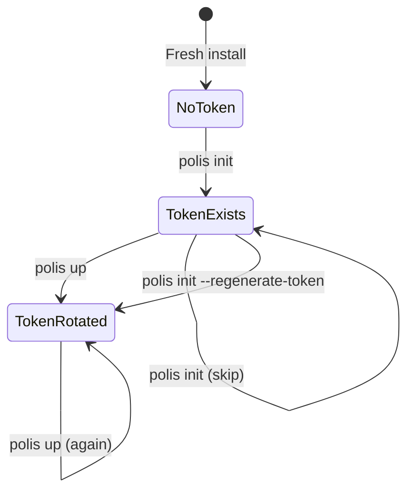

# Design Document: REA Security Foundation

## Overview

This design document describes the Security Foundation (Phase 0) for the Runtime Exception API. The implementation establishes secure authentication, authorization, and rate limiting infrastructure across two Rust repositories:

- **polis-cli**: Token generation, storage, and lifecycle management
- **polis-governance**: Authentication middleware and rate limiting

The design prioritizes security through cryptographically secure token generation, constant-time comparison, secret file mounts (avoiding environment variables), and localhost-only port binding.

## Architecture

```mermaid
flowchart TB
    subgraph "polis-cli"
        INIT[polis init] --> TG[Token Generator]
        UP[polis up] --> TG
        TG --> TF[Token File<br/>~/.polis/session/admin-token]
    end
    
    subgraph "Docker"
        TF -->|secret mount| SM[/run/secrets/admin_token]
        SM --> AUTH[Auth Middleware]
    end
    
    subgraph "polis-governance"
        AUTH --> RL[Rate Limiter]
        RL --> API[Exception API]
    end
    
    CLIENT[Client] -->|X-Polis-Admin-Token| AUTH
```

### Request Flow

1. Client sends request with `X-Polis-Admin-Token` header
2. Auth middleware reads expected token from `/run/secrets/admin_token`
3. Constant-time comparison validates the provided token
4. Rate limiter checks session/hourly/minute limits
5. Request proceeds to API handler or returns 401/429

### Token Lifecycle



## Components and Interfaces


### Token Generator (polis-cli/src/token.rs)

```rust
/// Generate admin token for Exception API authentication.
/// 
/// 48 bytes (384 bits entropy) using OsRng, encoded as 64-char URL-safe base64.
/// SECURITY: Do NOT use thread_rng() - not cryptographically secure.
pub fn generate_admin_token() -> String;

/// Read admin token from ~/.polis/session/admin-token.
pub fn read_admin_token() -> Result<String, PolisError>;

/// Write admin token to ~/.polis/session/admin-token with mode 0600.
pub fn write_admin_token(token: &str) -> Result<(), PolisError>;

/// Check if admin token file exists.
pub fn token_exists() -> bool;
```

### Auth Middleware (polis-governance/src/api/auth.rs)

```rust
/// Auth middleware - requires X-Polis-Admin-Token header on ALL endpoints.
/// Returns 401 for missing/invalid token, 500 if token file unreadable.
pub async fn require_admin_token<B>(
    req: Request<B>,
    next: Next<B>,
) -> Result<Response, StatusCode>;

/// Read token from secret file mount (not env var).
fn read_admin_token() -> Result<String, std::io::Error>;

/// Constant-time token comparison to prevent timing attacks.
fn validate_token(provided: &str, expected: &str) -> bool;
```

### Rate Limiter (polis-governance/src/rate_limiter.rs)

```rust
/// Timestamp-based rate limiter with session and hourly limits.
pub struct WriteRateLimiter {
    hourly_timestamps: DashMap<u64, DateTime<Utc>>,
    session_count: AtomicU32,
    max_per_session: u32,  // 20
    max_per_hour: u32,     // 50
    next_id: AtomicU64,
}

impl WriteRateLimiter {
    pub fn new(max_per_session: u32, max_per_hour: u32) -> Self;
    pub fn check(&self) -> Result<(), RateLimitError>;
    pub fn record(&self);
}

/// Timestamp-based rate limiter for read operations.
pub struct ReadRateLimiter {
    minute_timestamps: DashMap<u64, DateTime<Utc>>,
    max_per_minute: u32,  // 100
    next_id: AtomicU64,
}

impl ReadRateLimiter {
    pub fn new(max_per_minute: u32) -> Self;
    pub fn check(&self) -> Result<(), RateLimitError>;
    pub fn record(&self);
}
```


### CLI Integration

**init.rs modifications:**
```rust
// In execute() function, after existing initialization:
if args.regenerate_token || !token::token_exists() {
    let token = token::generate_admin_token();
    token::write_admin_token(&token)?;
    info!("Generated new admin token");
}
```

**up.rs modifications:**
```rust
// In execute() function, before starting containers:
let token = token::generate_admin_token();
token::write_admin_token(&token)?;
info!("Rotated admin token");
```

### Docker Compose Configuration

```yaml
governance:
  image: polis-governance:local
  container_name: polis-governance
  runtime: runsc
  networks:
    - polis-internal
  
  # SECURITY: Localhost only - prevents external access
  ports:
    - "127.0.0.1:8082:8082"
  
  # SECURITY: Token as secret file, not env var
  volumes:
    - ${HOME}/.polis/certs:/polis-certs:ro
    - ${HOME}/.polis/session/admin-token:/run/secrets/admin_token:ro
    - ${PWD}/.polis:/polis-config:ro
```

## Data Models

### Token Format

| Field | Type | Description |
|-------|------|-------------|
| Raw bytes | [u8; 48] | 48 bytes from OsRng (384 bits entropy) |
| Encoded | String | URL-safe base64 without padding (64 chars) |

### Rate Limit Error

```rust
#[derive(Debug, thiserror::Error)]
pub enum RateLimitError {
    #[error("Session limit exceeded: {current}/{max}")]
    SessionLimitExceeded { current: u32, max: u32 },
    
    #[error("Hourly limit exceeded: {current}/{max}, resets in {reset_in_seconds}s")]
    HourlyLimitExceeded { current: u32, max: u32, reset_in_seconds: u32 },
    
    #[error("Minute limit exceeded: {current}/{max}, resets in {reset_in_seconds}s")]
    MinuteLimitExceeded { current: u32, max: u32, reset_in_seconds: u32 },
}
```

### HTTP Error Responses

| Status | Condition | Body |
|--------|-----------|------|
| 401 | Missing X-Polis-Admin-Token header | Unauthorized |
| 401 | Invalid token | Unauthorized |
| 429 | Rate limit exceeded | Too Many Requests |
| 500 | Token file unreadable | Internal Server Error |

### Rate Limit Headers

| Header | Value | Condition |
|--------|-------|-----------|
| Retry-After | seconds until reset | 429 response |


## Correctness Properties

*A property is a characteristic or behavior that should hold true across all valid executions of a system—essentially, a formal statement about what the system should do. Properties serve as the bridge between human-readable specifications and machine-verifiable correctness guarantees.*

### Property 1: Token Format Validity

*For any* generated admin token, decoding it as URL-safe base64 should produce exactly 48 bytes, and the encoded string should be exactly 64 characters.

**Validates: Requirements 1.1, 1.2, 1.4**

### Property 2: Token Storage Round-Trip

*For any* valid admin token string, writing it to the token file and then reading it back should produce the identical string.

**Validates: Requirements 2.1**

### Property 3: Token File Permissions

*For any* token written to the token file on Unix systems, the file permissions should be exactly mode 0600 (owner read/write only).

**Validates: Requirements 2.3**

### Property 4: Whitespace Trimming

*For any* token string with leading or trailing whitespace stored in the token file, reading the token should return the trimmed version without whitespace.

**Validates: Requirements 2.4**

### Property 5: Init Preserves Existing Token

*For any* existing token file, running the init operation (without regenerate flag) should preserve the original token unchanged.

**Validates: Requirements 3.2**

### Property 6: Regenerate Creates New Token

*For any* existing token file, running the init operation with regenerate flag should produce a different token than the original.

**Validates: Requirements 3.3**

### Property 7: Up Rotates Token

*For any* existing token file, running the up operation should produce a different token than the original.

**Validates: Requirements 3.4**

### Property 8: Missing Header Returns 401

*For any* HTTP request to any endpoint without the X-Polis-Admin-Token header, the auth middleware should return HTTP 401 Unauthorized.

**Validates: Requirements 5.2, 5.3**

### Property 9: Invalid Token Returns 401

*For any* HTTP request with an X-Polis-Admin-Token header containing a value different from the expected token, the auth middleware should return HTTP 401 Unauthorized.

**Validates: Requirements 5.4**

### Property 10: Session Limit Enforced

*For any* sequence of write operations, the rate limiter should allow exactly 20 operations and reject the 21st with HTTP 429.

**Validates: Requirements 6.1, 6.3**

### Property 11: Hourly Limit Enforced

*For any* sequence of write operations within a one-hour window, the rate limiter should allow exactly 50 operations and reject the 51st with HTTP 429 and a Retry-After header.

**Validates: Requirements 6.2, 6.4**

### Property 12: Retry-After Calculation

*For any* rate limit exceeded response, the Retry-After header value should equal the number of seconds until the oldest timestamp in the window expires.

**Validates: Requirements 6.5**

### Property 13: Expired Timestamps Evicted

*For any* rate limiter with timestamps older than the window period, checking the limit should not count those expired timestamps toward the limit.

**Validates: Requirements 6.6, 7.3, 8.2**

### Property 14: Read Limit Enforced

*For any* sequence of read operations within a one-minute window, the rate limiter should allow exactly 100 operations and reject the 101st with HTTP 429 and a Retry-After header.

**Validates: Requirements 7.1, 7.2**


## Error Handling

### Token Generation Errors

| Error | Cause | Response |
|-------|-------|----------|
| NoHomeDir | `dirs::home_dir()` returns None | Return PolisError::NoHomeDir |
| IoError | File system operation fails | Return PolisError::SecurityError with message |

### Auth Middleware Errors

| Error | Cause | HTTP Response |
|-------|-------|---------------|
| Missing Header | No X-Polis-Admin-Token header | 401 Unauthorized |
| Invalid Token | Token doesn't match expected | 401 Unauthorized |
| Token File Missing | /run/secrets/admin_token not found | 500 Internal Server Error |
| Token File Unreadable | Permission denied or I/O error | 500 Internal Server Error |

### Rate Limiter Errors

| Error | Cause | HTTP Response |
|-------|-------|---------------|
| SessionLimitExceeded | 20 writes in current session | 429 Too Many Requests |
| HourlyLimitExceeded | 50 writes in last hour | 429 Too Many Requests + Retry-After |
| MinuteLimitExceeded | 100 reads in last minute | 429 Too Many Requests + Retry-After |

## Testing Strategy

### Unit Tests

Unit tests should cover specific examples and edge cases:

**Token Module (polis-cli):**
- Token generation produces valid base64
- Token file created with correct permissions
- Token read/write round-trip
- Missing home directory error handling
- Directory creation when missing

**Auth Middleware (polis-governance):**
- Missing header returns 401
- Invalid token returns 401
- Valid token passes through
- Missing token file returns 500

**Rate Limiter (polis-governance):**
- Session limit at boundary (20th allowed, 21st rejected)
- Hourly limit at boundary (50th allowed, 51st rejected)
- Read limit at boundary (100th allowed, 101st rejected)
- Retry-After header calculation
- Timestamp eviction after window expires

### Property-Based Tests

Property-based tests should verify universal properties across many generated inputs:

**Testing Framework:** Use `proptest` crate for Rust property-based testing.

**Configuration:**
- Minimum 100 iterations per property test
- Tag format: `Feature: rea-security-foundation, Property N: {property_text}`

**Properties to Test:**

1. **Token Format Validity** - Generate many tokens, verify all decode to 48 bytes
2. **Token Storage Round-Trip** - Generate random tokens, verify write/read identity
3. **Whitespace Trimming** - Generate tokens with random whitespace, verify trimming
4. **Invalid Token Rejection** - Generate random invalid tokens, verify 401 response
5. **Session Limit Enforcement** - Verify exactly 20 operations allowed
6. **Hourly Limit Enforcement** - Verify exactly 50 operations allowed per hour
7. **Read Limit Enforcement** - Verify exactly 100 operations allowed per minute
8. **Timestamp Eviction** - Verify old timestamps don't count toward limits

### Integration Tests

Integration tests should verify end-to-end flows:

1. **Auth Flow:** Start governance with token, verify authenticated requests succeed
2. **Rate Limiting Flow:** Send requests until rate limited, verify 429 response
3. **Token Rotation:** Run `polis up`, verify new token works and old token rejected

## Dependencies

### polis-cli/Cargo.toml

```toml
rand = "0.8"
base64 = "0.21"
dirs = "5.0"
```

### polis-governance/Cargo.toml

```toml
subtle = "2.5"
dashmap = "5.5"
chrono = { version = "0.4", features = ["serde"] }
thiserror = "1.0"
```

## Security Considerations

1. **Token Entropy:** 384 bits (48 bytes) provides sufficient entropy against brute force
2. **Constant-Time Comparison:** Prevents timing attacks on token validation
3. **Secret File Mount:** Prevents token exposure via `docker inspect`
4. **Localhost Binding:** Prevents external network access to API
5. **File Permissions:** Mode 0600 prevents other users from reading token
6. **No Environment Variables:** Prevents token leakage through process inspection
