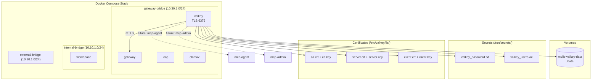

# Design Document: Valkey State Management

## Overview

This design adds a production-hardened Valkey 8 service to the Molis OSS Docker Compose stack for state management. The implementation consists of five deliverables:

1. **Valkey Docker service** in `polis/deploy/docker-compose.yml` — TLS-only, ACL-authenticated, resource-limited, security-hardened container
2. **Valkey configuration** at `polis/config/valkey.conf` — TLS, memory, persistence, dangerous command restrictions, multi-threading
3. **TLS certificate generator** at `polis/scripts/generate-valkey-certs.sh` — CA, server, and client certificate creation
4. **Secrets generator** at `polis/scripts/generate-valkey-secrets.sh` — password generation, ACL file creation, SHA-256 hashing
5. **Health check script** at `polis/scripts/valkey-health.sh` — connectivity, memory pressure, AOF persistence verification

Valkey connects only to the `gateway-bridge` network (`10.30.1.0/24`) and is not externally accessible. All connections require mutual TLS. Per-service ACL users (mcp-agent, mcp-admin, log-writer, healthcheck) enforce least-privilege access to key namespaces.

## Architecture



### Network Isolation

Valkey connects exclusively to `gateway-bridge`. It has no access to `internal-bridge` (workspace tier) or `external-bridge` (internet tier). Future services (mcp-agent, mcp-admin) will also reside on `gateway-bridge` and connect to Valkey via mTLS.

### Security Layers

1. **Network**: Only `gateway-bridge` access, no host port exposure
2. **Transport**: Mutual TLS with client certificate verification (`tls-auth-clients yes`), non-TLS port disabled (`port 0`)
3. **Authentication**: ACL file with per-service users, default user disabled
4. **Authorization**: Per-user key pattern restrictions and command whitelists
5. **Container**: Read-only filesystem, all capabilities dropped, no-new-privileges, resource limits
6. **Secrets**: Docker secrets mounted at `/run/secrets/`, never in environment variables or CLI args

## Components and Interfaces

### Component 1: Docker Compose Service Definition

**File**: `polis/deploy/docker-compose.yml`

The Valkey service block is appended to the existing `services:` section. It also adds `secrets:` and `volumes:` top-level entries.

**Service configuration**:
- Image: `valkey/valkey:8-alpine`
- Container name: `polis-v2-valkey`
- Command: `sh -c "valkey-server /etc/valkey/valkey.conf"`
- Network: `gateway-bridge` only
- Secrets: `valkey_password`, `valkey_acl`
- Volumes: config (ro), certs (ro), data (rw)
- Health check: TLS ping via `valkey-cli` using `REDISCLI_AUTH` from secrets file
- Security: `no-new-privileges`, `cap_drop: ALL`, `read_only: true`, tmpfs at `/tmp`
- Resources: 512MB limit / 256MB reservation, 1.0 CPU
- Logging: json-file, 50MB max, 5 files
- Restart: `unless-stopped`

**Volume mounts**:
| Host Path | Container Path | Mode |
|---|---|---|
| `../config/valkey.conf` | `/etc/valkey/valkey.conf` | ro |
| `../certs/valkey` | `/etc/valkey/tls` | ro |
| `valkey-data` (named) | `/data` | rw |

**Secrets definitions** (top-level):
| Secret Name | Source File |
|---|---|
| `valkey_password` | `./secrets/valkey_password.txt` |
| `valkey_acl` | `./secrets/valkey_users.acl` |

**Volume definition** (top-level):
| Volume Name | Docker Name |
|---|---|
| `valkey-data` | `molis-valkey-data` |

### Component 2: Valkey Configuration File

**File**: `polis/config/valkey.conf`

Static configuration file mounted read-only into the container.

**Sections**:
1. **TLS**: `tls-port 6379`, `port 0`, cert/key/CA paths, `tls-auth-clients yes`
2. **Network**: `bind valkey 127.0.0.1`, `protected-mode yes`
3. **ACL**: `aclfile /run/secrets/valkey_acl`
4. **Dangerous commands**: 11 commands renamed to `""` (FLUSHALL, FLUSHDB, DEBUG, CONFIG, SHUTDOWN, SLAVEOF, REPLICAOF, MODULE, BGSAVE, BGREWRITEAOF, KEYS)
5. **Memory**: `maxmemory 256mb`, `maxmemory-policy volatile-lru`
6. **Persistence**: AOF with `everysec` fsync, RDB snapshots at 900/1, 300/10, 60/10000
7. **Limits**: `maxclients 100`, `timeout 300`, `tcp-keepalive 300`
8. **Multi-threading**: `io-threads 4`, `io-threads-do-reads yes`

### Component 3: TLS Certificate Generator

**File**: `polis/scripts/generate-valkey-certs.sh`

Bash script that generates a self-signed CA and issues server/client certificates for Valkey mTLS.

**Interface**:
```bash
./scripts/generate-valkey-certs.sh [output_directory]
# Default output: ./certs/valkey
```

**Generated files**:
| File | Type | Key Size | Permissions |
|---|---|---|---|
| `ca.key` | CA private key | 4096-bit RSA | 600 |
| `ca.crt` | CA certificate | — | 644 |
| `server.key` | Server private key | 2048-bit RSA | 600 |
| `server.crt` | Server certificate | — | 644 |
| `client.key` | Client private key | 2048-bit RSA | 600 |
| `client.crt` | Client certificate | — | 644 |

**Behavior**:
- Creates output directory if it doesn't exist
- Signs all certs with SHA-256
- Removes CSR files after generation
- CA subject: `/CN=Molis-Valkey-CA/O=OdraLabs`
- Server subject: `/CN=valkey/O=OdraLabs`
- Client subject: `/CN=valkey-client/O=OdraLabs`
- Validity: 365 days

### Component 4: Secrets Generator

**File**: `polis/scripts/generate-valkey-secrets.sh`

Bash script that generates passwords and ACL configuration for all Valkey users.

**Interface**:
```bash
./scripts/generate-valkey-secrets.sh [output_directory]
# Default output: ./secrets
```

**Generated files**:
| File | Contents | Permissions |
|---|---|---|
| `valkey_password.txt` | Healthcheck user password (plaintext) | 600 |
| `valkey_users.acl` | ACL rules with SHA-256 hashed passwords | 600 |
| `credentials.env.example` | Plaintext credentials for reference | 600 |

**ACL users**:
| User | Key Patterns | Permissions |
|---|---|---|
| `default` | — | Disabled (`off`) |
| `mcp-agent` | `molis:blocked:*`, `molis:approved:*`, `molis:config:*` | `+@read +@write +@connection -@admin -@dangerous -DEL -UNLINK` |
| `mcp-admin` | `molis:*` | `+@all -@dangerous -FLUSHALL -FLUSHDB -DEBUG -CONFIG -SHUTDOWN` |
| `log-writer` | `molis:log:events` | `+ZADD +ZRANGEBYSCORE +ZCARD +PING -@all` |
| `healthcheck` | None | `+PING +INFO -@all` |

**Password generation**: `openssl rand -base64 32 | tr -d '/+=' | head -c 32` (32 alphanumeric characters per user).

### Component 5: Health Check Script

**File**: `polis/scripts/valkey-health.sh`

Bash script that verifies Valkey service health via TLS connection.

**Interface**:
```bash
# Environment variables (all have defaults):
VALKEY_HOST=valkey          # Hostname
VALKEY_PORT=6379            # Port
VALKEY_PASSWORD_FILE=/run/secrets/valkey_password
VALKEY_TLS_CERT=/etc/valkey/tls/client.crt
VALKEY_TLS_KEY=/etc/valkey/tls/client.key
VALKEY_TLS_CA=/etc/valkey/tls/ca.crt
MEMORY_WARN_PERCENT=80      # Warning threshold
```

**Checks performed** (in order):
1. **Input validation**: Validate `VALKEY_HOST` matches `^[a-zA-Z0-9._-]+$` and `VALKEY_PORT` is 1–65535
2. **Password loading**: Read from file, export as `REDISCLI_AUTH` (not visible in `ps aux`)
3. **Connectivity**: `valkey-cli --tls ... ping` must return `PONG`
4. **Memory pressure**: Parse `info memory`, calculate `used_memory / maxmemory * 100`, warn if ≥ threshold
5. **AOF status**: Parse `info persistence`, verify `aof_enabled:1`

**Exit codes**:
| Code | Meaning |
|---|---|
| 0 | All checks pass, outputs "OK" |
| 1 | Any check fails, outputs "CRITICAL: ..." or "WARNING: ..." |

### Component 6: Bats Test Suite

**File**: `polis/tests/unit/valkey.bats`

Unit tests for the Valkey service following the existing bats test patterns in the project.

**Test categories**:
- Container state (exists, running, healthy)
- Security hardening (no-new-privileges, cap_drop, read-only fs)
- Network isolation (gateway-bridge only, no host ports)
- TLS configuration (certs mounted, non-TLS rejected)
- Secrets (mounted at /run/secrets/)
- Resource limits (memory, CPU)
- Persistence (volume mounted, AOF enabled)

## Data Models

### Key Schema (from foundation types)

```
molis:blocked:{request_id}     → String (JSON BlockedRequest)  TTL: None
molis:blocked:_count           → String (integer)              TTL: None
molis:approved:{request_id}    → String ("approved")           TTL: 300s
molis:config:auto_approve:{p}  → String (AutoApproveAction)    TTL: None
molis:config:security_level    → String (SecurityLevel)        TTL: None
molis:log:events               → Sorted Set (score=timestamp)  TTL: App-level 24h
```

### Eviction Behavior

The `volatile-lru` policy only evicts keys with a TTL set. This means:
- `molis:blocked:*` keys (no TTL) are **never evicted** by memory pressure
- `molis:approved:*` keys (5-min TTL) **can be evicted** under pressure
- `molis:log:events` (no TTL on the set itself) is **never evicted**

### Persistence Model

- **AOF** (`appendonly yes`, `appendfsync everysec`): Primary durability mechanism. All writes persisted within 1 second.
- **RDB** (snapshots at 900/1, 300/10, 60/10000): Backup mechanism for point-in-time recovery.
- **Volume** (`molis-valkey-data`): Named Docker volume at `/data` survives container restarts.

### File Layout

```
polis/
├── config/
│   └── valkey.conf                    # NEW: Valkey configuration
├── certs/
│   └── valkey/                        # NEW: TLS certificates (gitignored keys)
│       ├── ca.crt, ca.key
│       ├── server.crt, server.key
│       └── client.crt, client.key
├── secrets/                           # NEW: Docker secrets (gitignored)
│   ├── valkey_password.txt
│   ├── valkey_users.acl
│   └── credentials.env.example
├── scripts/
│   ├── generate-valkey-certs.sh       # NEW: TLS cert generator
│   ├── generate-valkey-secrets.sh     # NEW: Secrets generator
│   └── valkey-health.sh              # NEW: Health check
├── deploy/
│   └── docker-compose.yml            # MODIFIED: Add valkey service
└── tests/
    └── unit/
        └── valkey.bats               # NEW: Valkey unit tests
```

## Correctness Properties

*A property is a characteristic or behavior that should hold true across all valid executions of a system — essentially, a formal statement about what the system should do. Properties serve as the bridge between human-readable specifications and machine-verifiable correctness guarantees.*

### Property 1: Dangerous commands are disabled

*For any* command in the set {FLUSHALL, FLUSHDB, DEBUG, CONFIG, SHUTDOWN, SLAVEOF, REPLICAOF, MODULE, BGSAVE, BGREWRITEAOF, KEYS}, executing that command against the Valkey instance should return an error indicating the command is not recognized.

**Validates: Requirements 2.6**

### Property 2: mcp-agent ACL enforcement

*For any* key pattern outside `molis:blocked:*`, `molis:approved:*`, and `molis:config:*`, the mcp-agent user should be denied access. Additionally, *for any* attempt to execute DEL or UNLINK on allowed keys, the mcp-agent user should be denied.

**Validates: Requirements 3.2**

### Property 3: mcp-admin ACL enforcement

*For any* command in the dangerous set {FLUSHALL, FLUSHDB, DEBUG, CONFIG, SHUTDOWN}, the mcp-admin user should be denied execution, even though mcp-admin has full access to the `molis:*` namespace.

**Validates: Requirements 3.3**

### Property 4: log-writer ACL enforcement

*For any* command not in {ZADD, ZRANGEBYSCORE, ZCARD, PING}, the log-writer user should be denied execution. *For any* key other than `molis:log:events`, the log-writer user should be denied access.

**Validates: Requirements 3.4**

### Property 5: healthcheck ACL enforcement

*For any* command not in {PING, INFO}, the healthcheck user should be denied execution. *For any* key access attempt, the healthcheck user should be denied.

**Validates: Requirements 3.5**

### Property 6: Certificate file permissions

*For all* files generated by the cert generator, private key files (`.key`) should have permission 600 and certificate files (`.crt`) should have permission 644.

**Validates: Requirements 4.3**

### Property 7: Password uniqueness and length

*For any* execution of the secrets generator, all four generated passwords should be exactly 32 characters long and mutually unique.

**Validates: Requirements 5.1**

### Property 8: ACL password hash consistency

*For any* user in {mcp-agent, mcp-admin, log-writer, healthcheck}, the SHA-256 hash stored in `valkey_users.acl` should match the SHA-256 of the corresponding plaintext password in `credentials.env.example`.

**Validates: Requirements 5.3**

### Property 9: Secret file permissions

*For all* files generated by the secrets generator, file permissions should be 600.

**Validates: Requirements 5.5**

### Property 10: Health check input validation

*For any* `VALKEY_HOST` value containing characters outside `[a-zA-Z0-9._-]` or *for any* `VALKEY_PORT` value that is non-numeric or outside the range 1–65535, the health check script should exit with code 1 and output a message starting with "CRITICAL".

**Validates: Requirements 6.6**

## Error Handling

### Container Startup Failures

| Condition | Behavior |
|---|---|
| Missing TLS certificates | Valkey refuses to start, container enters restart loop |
| Missing ACL file | Valkey refuses to start, container enters restart loop |
| Invalid valkey.conf syntax | Valkey logs error and exits |
| Corrupted AOF file | Valkey refuses to start, requires `valkey-check-aof --fix` |

### Runtime Errors

| Condition | Behavior |
|---|---|
| Memory limit reached | `volatile-lru` evicts TTL keys only; blocked requests preserved |
| ACL authentication failure | Connection rejected with `NOPERM` error |
| Unauthorized command | Command rejected with `NOPERM` error |
| TLS handshake failure | Connection rejected |
| Non-TLS connection attempt | Connection rejected (port 0 disables plaintext) |

### Script Errors

| Script | Condition | Behavior |
|---|---|---|
| `generate-valkey-certs.sh` | `openssl` not installed | Script fails with `set -euo pipefail` |
| `generate-valkey-secrets.sh` | `openssl` not installed | Script fails with `set -euo pipefail` |
| `valkey-health.sh` | Invalid host/port | Exit 1 with "CRITICAL" message |
| `valkey-health.sh` | Password file missing | Exit 1 with "CRITICAL: Password file not found" |
| `valkey-health.sh` | Valkey not responding | Exit 1 with "CRITICAL: Valkey not responding" |
| `valkey-health.sh` | AOF disabled | Exit 1 with "CRITICAL: AOF persistence disabled" |

## Testing Strategy

### Testing Framework

All tests use the **bats** (Bash Automated Testing System) framework, consistent with the existing test suite in `polis/tests/`. Tests use `bats-support` and `bats-assert` libraries for assertions.

### Dual Testing Approach

**Unit tests** (`polis/tests/unit/valkey.bats`):
- Container state verification (exists, running, healthy)
- Security hardening checks (no-new-privileges, cap_drop, read-only fs)
- Network isolation (gateway-bridge only, no host ports)
- Configuration verification (TLS, ACL, memory, persistence)
- Secret mounting verification
- Resource limit verification

**Property tests** (`polis/tests/unit/valkey-properties.bats`):
- ACL enforcement across user/command/key combinations (Properties 2–5)
- Dangerous command blocking (Property 1)
- Script output validation (Properties 6–10)

Since bats does not have a native property-based testing library, property tests are implemented as parameterized loops over input sets. Each test iterates over the relevant domain (commands, keys, users) and asserts the property holds for each element. This provides the "for all" coverage required by the correctness properties.

### Property-Based Test Configuration

- Each property test iterates over the full domain of relevant inputs
- Each test is tagged with a comment referencing the design property
- Tag format: `# Feature: valkey-state-management, Property N: <title>`
- ACL tests require a running Valkey container with TLS and secrets configured

### Test Organization

```
polis/tests/
├── unit/
│   ├── valkey.bats              # Unit tests: container, config, security
│   └── valkey-properties.bats   # Property tests: ACL, commands, scripts
└── helpers/
    └── common.bash              # Existing shared helpers
```
