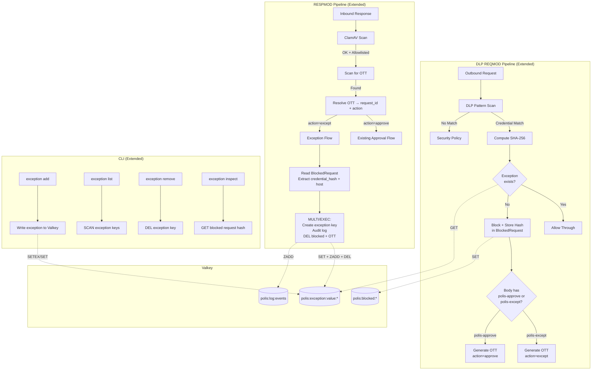

# Design: Value-Based Exceptions for HITL Approval System

## Overview

This design extends the polis HITL approval system with persistent value-based exceptions. When a credential is blocked by the DLP module, the user can create a persistent exception that allows that specific credential (identified by SHA-256 hash) to reach a specific destination without future blocking. This eliminates repeated approval prompts for known-good credential→destination pairs.

## Architecture



## Data Models

### Extended BlockedRequest (types.rs)

```rust
/// A blocked request awaiting approval
#[derive(Debug, Clone, Serialize, Deserialize)]
pub struct BlockedRequest {
    pub request_id: String,
    pub reason: BlockReason,
    pub destination: String,
    pub pattern: Option<String>,
    pub blocked_at: DateTime<Utc>,
    pub status: RequestStatus,
    /// SHA-256 hash of the matched credential value (hex, 64 chars)
    /// None for non-credential blocks (e.g., new_domain_prompt)
    pub credential_hash: Option<String>,
    /// First 4 chars of the credential for display (e.g., "sk-a")
    /// None for non-credential blocks
    pub credential_prefix: Option<String>,
}
```

### New ValueException Struct (types.rs)

```rust
/// Source channel for exception creation
#[derive(Debug, Clone, Serialize, Deserialize, PartialEq, Eq)]
#[serde(rename_all = "snake_case")]
pub enum ExceptionSource {
    ProxyInterception,
    Cli,
}

/// A persistent value-based exception allowing a specific
/// credential hash to reach a specific destination
#[derive(Debug, Clone, Serialize, Deserialize)]
pub struct ValueException {
    /// Full SHA-256 hash of the credential (64 hex chars)
    pub credential_hash: String,
    /// First 4 chars of credential for display
    pub credential_prefix: String,
    /// Destination host (or "*" for wildcard, CLI only)
    pub destination: String,
    /// DLP pattern name that originally matched
    pub pattern_name: String,
    /// When this exception was created
    pub created_at: DateTime<Utc>,
    /// How this exception was created
    pub source: ExceptionSource,
    /// TTL in seconds (None = permanent, CLI only)
    pub ttl_secs: Option<u64>,
}
```

### Extended OttMapping (types.rs)

```rust
/// Action type for OTT — distinguishes approve from except
#[derive(Debug, Clone, Serialize, Deserialize, PartialEq, Eq)]
#[serde(rename_all = "snake_case")]
pub enum OttAction {
    Approve,
    Except,
}

/// One-Time Token mapping
#[derive(Debug, Clone, Serialize, Deserialize)]
pub struct OttMapping {
    pub ott_code: String,
    pub request_id: String,
    pub armed_after: DateTime<Utc>,
    pub origin_host: String,
    pub created_at: DateTime<Utc>,
    /// NEW: What action this OTT triggers
    pub action: OttAction,
}
```

### Valkey Key Schema (redis_keys.rs)

```rust
pub mod keys {
    // ... existing keys ...

    /// Value-based exceptions
    /// Format: polis:exception:value:{sha256_hex_prefix_16}:{host}
    /// Value: JSON-serialized ValueException
    /// TTL: 2592000 seconds (30 days) default, or permanent
    pub const EXCEPTION_VALUE: &str = "polis:exception:value";
}

pub mod ttl {
    // ... existing TTLs ...

    /// Default exception TTL (30 days)
    pub const EXCEPTION_DEFAULT_SECS: u64 = 2592000;
}

pub mod approval {
    // ... existing constants ...

    /// Prefix for the exception command
    pub const EXCEPT_PREFIX: &str = "/polis-except";
}

/// Build exception key from hash prefix and host
pub fn exception_value_key(hash_prefix_16: &str, host: &str) -> String {
    format!("{}:{}:{}", keys::EXCEPTION_VALUE, hash_prefix_16, host)
}

/// Build wildcard exception key (CLI only)
pub fn exception_value_wildcard_key(hash_prefix_16: &str) -> String {
    format!("{}:{}:*", keys::EXCEPTION_VALUE, hash_prefix_16)
}

/// Validate SHA-256 hash format (64 lowercase hex chars)
pub fn validate_credential_hash(hash: &str) -> Result<(), &'static str> {
    if hash.len() != 64 {
        return Err("credential hash must be exactly 64 hex characters");
    }
    if !hash.chars().all(|c| c.is_ascii_hexdigit() && !c.is_ascii_uppercase()) {
        return Err("credential hash must be lowercase hex [a-f0-9]");
    }
    Ok(())
}
```

## DLP Module Exception Check Integration

The exception check is inserted into `check_patterns()` in `srv_polis_dlp.c`, after a credential match is found and before the block decision:

```
Pattern matched → always_block? → YES → BLOCK (no exception check for private keys)
                                → NO  → allow_domain matches? → YES → continue
                                                               → NO  → compute SHA-256
                                                                      → check exception store
                                                                      → exception found? → YES → allow
                                                                                        → NO  → BLOCK
```

The DLP module needs:
1. A SHA-256 computation function (using OpenSSL `EVP_Digest`)
2. A Valkey GET call to check `polis:exception:value:{prefix}:{host}` and `polis:exception:value:{prefix}:*`
3. Full hash comparison against the stored record
4. Storage of the hash in the per-request data for inclusion in BlockedRequest

The existing `dlp-reader` Valkey connection is reused for exception lookups. The ACL is updated to allow `GET` on `polis:exception:value:*`.

## REQMOD OTT Rewrite Extension

The existing approve pattern regex is extended to match both commands:

```c
/* Old: /polis-approve[[:space:]]+(req-[a-f0-9]{8}) */
/* New: /polis-(approve|except)[[:space:]]+(req-[a-f0-9]{8}) */
static regex_t approve_pattern;
```

When the match is `/polis-except`, the OTT mapping stored in Valkey includes `"action":"except"` instead of `"action":"approve"`. Everything else (OTT generation, time-gate, context binding) is identical.

## RESPMOD Exception Processing

When the RESPMOD module resolves an OTT and finds `action: "except"`:

1. Read the `BlockedRequest` from Valkey — extract `credential_hash` and `destination` (host)
2. If `credential_hash` is None → fail closed, log error, do not create exception
3. Compute the 16-char hex prefix from the hash
4. Build the exception key: `polis:exception:value:{prefix}:{host}`
5. Execute MULTI/EXEC:
   - SETEX exception key with 30-day TTL
   - ZADD audit log entry
   - DEL blocked key
   - DEL OTT key
6. Strip OTT from response body

## CLI Extension

New subcommand group `exception` under the existing `polis-approve` CLI:

```
polis-approve exception add <request_id>           # From blocked request
polis-approve exception add --hash <sha256> --dest <host|*> [--ttl <days>] [--permanent]
polis-approve exception list                        # Show all active
polis-approve exception remove <exception_id>       # Delete specific
polis-approve exception inspect <request_id>        # Show hash for blocked req
```

The CLI connects as `mcp-admin` which has full `polis:*` access.

## Valkey ACL Changes

```
# Updated: add exception read access
user dlp-reader on #<hash> ~polis:config:security_level ~polis:exception:value:* -@all +GET +PING

# Updated: add exception write access
user governance-respmod on #<hash> ~polis:ott:* ~polis:blocked:* ~polis:approved:* ~polis:log:* ~polis:exception:value:* -@all +get +del +setex +set +exists +zadd +multi +exec
```

## Security Invariants

1. **Full hash comparison**: The DLP module MUST compare the full 64-char SHA-256, not just the 16-char key prefix
2. **Fail closed**: If exception lookup fails (timeout, Valkey down), treat as "no exception" and block normally
3. **No agent access**: The MCP agent has no read or write access to exception keys
4. **Atomic creation**: Exception creation via RESPMOD uses MULTI/EXEC
5. **Audit trail**: All exception create/delete operations are logged to `polis:log:events`
6. **No proxy wildcards**: Wildcard destinations (`*`) are CLI-only
7. **No proxy permanent**: Permanent exceptions (no TTL) are CLI-only
8. **Backward compatible**: BlockedRequests without `credential_hash` (pre-upgrade) work normally — exception creation fails gracefully, approval flow unchanged

## Implementation Constraints

- File edits SHALL be split into chunks of maximum 50 lines each
- The DLP module links against OpenSSL for SHA-256 (`-lssl -lcrypto`)
- The RESPMOD module already links against OpenSSL (from TLS)
- Exception count limit (1000) enforced by checking SCAN count before creation
