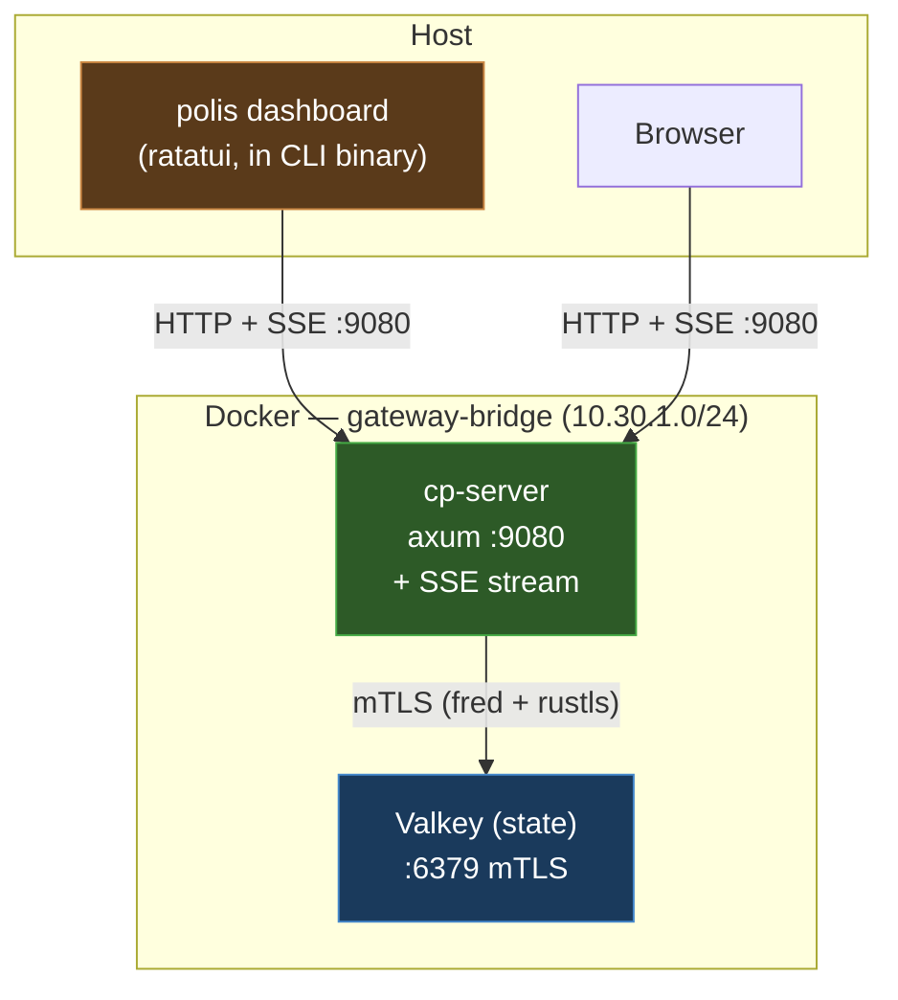

# Control Plane — Architecture Overview

## Problem Statement

Polis manages blocked requests, security events, and domain rules through CLI commands that shell out via `docker exec` into the toolbox container (`polis-approve`). There is no live dashboard, no web interface, and no way to monitor security state without running individual commands. The current flow:

```
polis security pending
  → docker exec polis-toolbox cat /run/secrets/valkey_mcp_admin_password
  → docker exec -e POLIS_VALKEY_PASS=... polis-toolbox polis-approve list-pending
```

This is slow (~500ms per command), provides no live view, and cannot be accessed from a browser.

## Goals

1. **REST API** — centralized HTTP interface to all Valkey security state
2. **TUI dashboard** — live terminal UI for monitoring and managing blocked requests
3. **Web UI** — browser-based dashboard served from the same backend
4. **Future-proof** — designed for extensibility: agent management, audit export, WebSocket live updates

## Architecture



The cp-server runs inside Docker on `gateway-bridge` with direct mTLS access to Valkey. It exposes a REST API plus an SSE stream for real-time updates. The TUI lives inside the existing `polis` CLI binary as `polis dashboard` — no separate binary to distribute. Both the TUI and browser connect via the exposed port 9080.

## Crate Layout

```
services/control-plane/
├── Cargo.toml                    # workspace
├── Cargo.lock
├── Dockerfile
├── config/
│   └── seccomp.json
├── crates/
│   ├── cp-api-types/             # shared request/response types
│   │   ├── Cargo.toml
│   │   └── src/lib.rs
│   └── cp-server/                # axum REST API + SSE + embedded web UI
│       ├── Cargo.toml
│       ├── src/
│       │   ├── main.rs
│       │   ├── state.rs          # Valkey connection (fred + rustls mTLS)
│       │   ├── api.rs            # REST handlers
│       │   └── sse.rs            # SSE event stream
│       └── web/
│           └── index.html        # embedded SPA
└── README.md
```

The TUI code lives in the main CLI crate:

```
cli/src/commands/
└── dashboard.rs                  # polis dashboard subcommand (ratatui)
```

**Why this layout:**
- `cp-api-types` — shared Serialize/Deserialize structs used by both cp-server and the CLI dashboard command, preventing type drift
- `cp-server` — runs in Docker, owns Valkey connection, serves REST API + SSE stream + web UI
- `polis dashboard` — subcommand in the existing CLI binary, consumes REST API + SSE, renders terminal dashboard. No separate binary to build, distribute, or install.

## Data Flow

```
Mutation (TUI keypress / Web button click):
  → HTTP POST/PUT/DELETE to cp-server
    → cp-server validates input (reuses polis_common::validate_request_id)
    → cp-server reads/writes Valkey via fred mTLS client
    → cp-server writes audit log entry (ZADD polis:log:events)
    → cp-server broadcasts SSE event to all connected clients
    → cp-server returns JSON response
  → TUI/Web updates display

Live updates (SSE):
  → TUI/Browser opens GET /api/v1/stream (SSE connection)
  → cp-server polls Valkey on a background interval (1s)
  → On state change → pushes event to all SSE subscribers
  → TUI/Browser updates display instantly
```

## Valkey Key Patterns

All keys are defined in `polis-common::redis_keys`. The control plane reads and writes:

| Key Pattern | Type | Operations | TTL |
|---|---|---|---|
| `polis:blocked:{req-id}` | String (JSON `BlockedRequest`) | GET, DEL, SCAN | 1 hour |
| `polis:approved:{req-id}` | String (`"approved"`) | SETEX | 300s |
| `polis:config:security_level` | String | GET, SET | none |
| `polis:config:auto_approve:{pattern}` | String (action) | GET, SET, DEL, SCAN | none |
| `polis:log:events` | Sorted Set (score=timestamp) | ZADD, ZREVRANGE | entries trimmed to 1000 |

## Security Model

**Valkey authentication:** A dedicated `cp-server` ACL user is created in `generate-secrets.sh` with permissions scoped to exactly what the control plane needs:

```
user cp-server on #<hash> ~polis:blocked:* ~polis:approved:* ~polis:config:* ~polis:log:events -@all +GET +SET +SETEX +DEL +MGET +EXISTS +SCAN +ZADD +ZREVRANGE +ZCARD +ZREMRANGEBYRANK +PING
```

This follows the principle of least privilege — unlike `mcp-admin` which has `~polis:* +@all -@dangerous`, the `cp-server` user cannot access OTT mappings or execute any commands beyond what the API requires.

**mTLS:** The server connects to Valkey using the same client certificates mounted at `/etc/valkey/tls/` — identical to the toolbox service pattern.

**API network binding:** The Docker port mapping binds to loopback only (`127.0.0.1:9080:9080`), ensuring the API is never exposed to the local network. The gateway-bridge is also `internal: true`, providing defense-in-depth.

**CORS:** Strict origin allowlist limited to `http://localhost:9080` and `http://127.0.0.1:9080` to prevent CSRF from malicious websites open in the user's browser.

**API authentication:** None in v1 — the loopback binding ensures only the local machine can reach the API. Future: token-based auth header for multi-user scenarios.

**Input validation:** All request IDs validated via `polis_common::validate_request_id()`. Security levels and auto-approve actions validated against known enum values.

## Future Roadmap

| Feature | Priority | Notes |
|---|---|---|
| WebSocket live updates | P1 | Replace polling with push notifications for blocked requests |
| Agent management | P2 | Start/stop/restart agents, view agent health |
| Audit log export | P2 | CSV/JSON download of security events |
| Configuration editor | P3 | Edit polis.yaml, security level, bypass lists from UI |
| Multi-user auth | P3 | Token-based API auth, role-based access |
| WASM frontend | P3 | Replace vanilla JS with Leptos/Yew when complexity warrants |

## Integration Points

**Justfile** — add to `lint-rust`, `test-rust`, `fmt` targets:
```
cargo fmt --all --check --manifest-path services/control-plane/Cargo.toml
cargo clippy --workspace --all-targets --manifest-path services/control-plane/Cargo.toml -- -D warnings
cargo test --workspace --manifest-path services/control-plane/Cargo.toml
```

**CI** — add `control-plane` to the Docker build matrix in `.github/workflows/ci.yml`. No separate cross-compilation needed for the TUI — it ships as part of the existing `polis` CLI binary which is already cross-compiled for Linux and Windows.

**Container structure test** — `tests/container-structure/control-plane.yaml` verifying binary exists, user is 65532, port 9080.

**Docker Compose** — new `control-plane` service on `gateway-bridge`, port bound to loopback only (`127.0.0.1:9080:9080`).

## Port Configuration

The default port `9080` is configurable via:
- Docker Compose: change the host-side port mapping (e.g., `127.0.0.1:9081:9080`)
- TUI: `--api-url http://localhost:9081` flag
- Future: `polis config set control_plane.port 9081` in `polis.yaml`

If port 9080 is already in use, Docker Compose will fail to start with a clear bind error. The user can override the port in a `docker-compose.override.yml` without modifying the main file.
