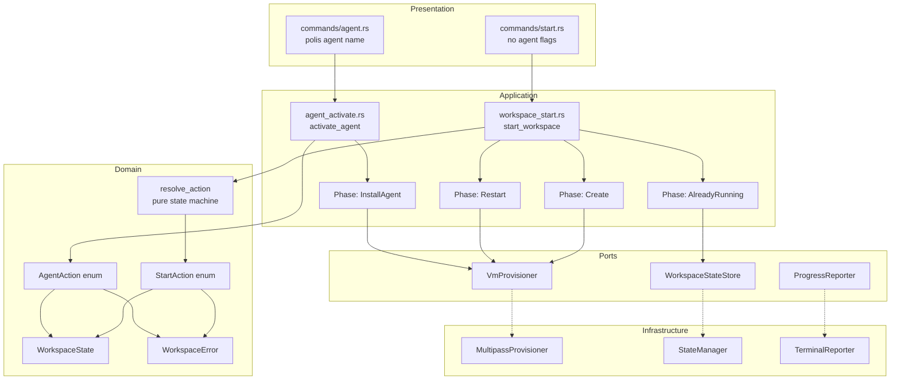
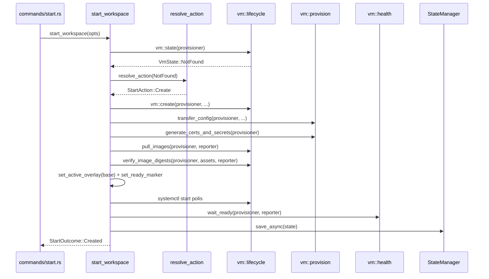
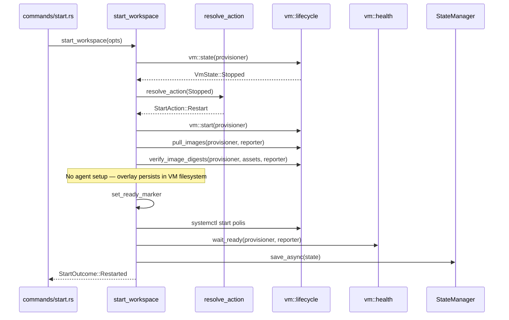
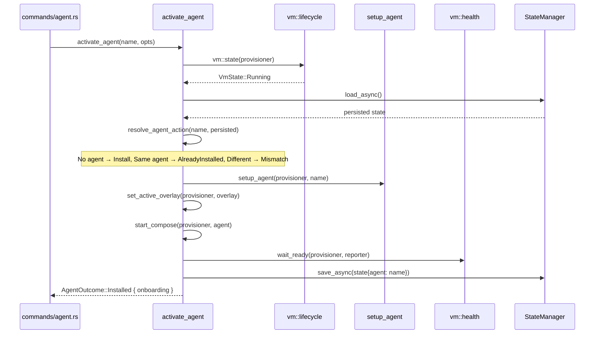
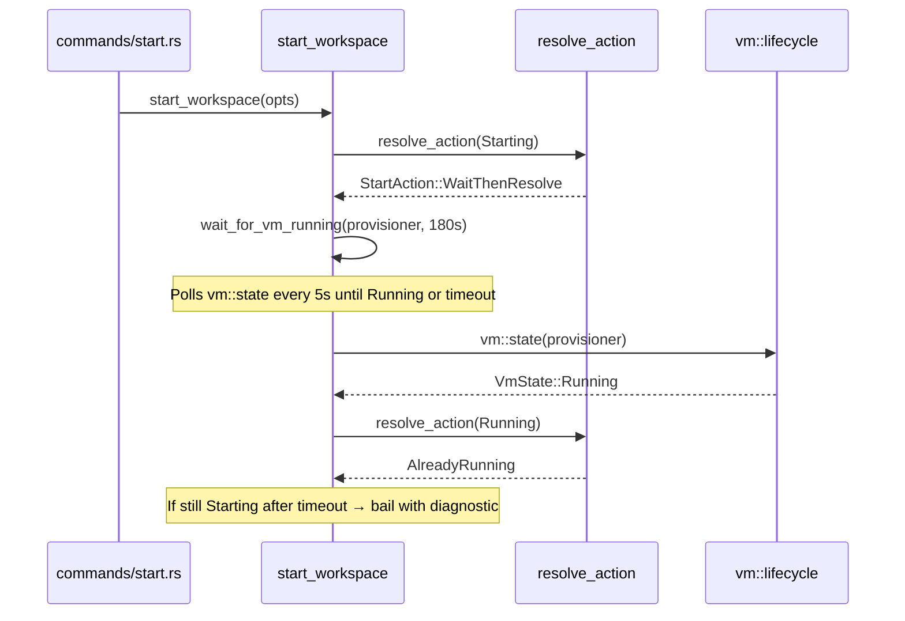

# Design Document: Refactoring `polis start` Command

## Overview

The `polis start` command is the primary entry point for workspace lifecycle management. A comprehensive audit identified 9 critical bugs, 3 race conditions, 7 failure modes without recovery, and 7 design issues in the current implementation.

This refactoring introduces a clean separation of concerns:

1. `polis start` is responsible ONLY for creating and/or starting the workspace (VM + containers). It has no knowledge of agents.
2. `polis agent {name}` is responsible for installing/activating an agent on a running workspace.
3. A pure domain state machine (`resolve_action`) encodes all valid workspace transitions exhaustively.
4. Security parity between create and restart paths (image digest verification).
5. Consistent state persistence timing (always after health check).

The two-step workflow: user runs `polis start` to get the workspace running, then `polis agent {name}` to install an agent. Agent state persists across stop/start cycles — the VM filesystem retains the overlay symlink, and `systemctl start polis` picks it up on restart.

The design does NOT attempt to solve: full saga/rollback (out of scope for this iteration), concurrent CLI invocation locking (RACE-2, future work), or in-place agent switching (D7, future work).

## Audit Findings Addressed

| ID | Finding | Resolution |
|----|---------|------------|
| BUG-1 | VmState::Starting treated as Stopped | WaitThenResolve with bounded retry |
| BUG-3 | State persisted after health wait in create | Consistent: always after health |
| BUG-4 | handle_running_vm returns Restarted | N/A — handle_running_vm removed; Running → AlreadyRunning always |
| BUG-6 | restart_vm skips image digest verification | Added verify_image_digests to restart |
| BUG-7 | restart_vm ignores assets/ssh params | Remove unused params |
| BUG-9 | handle_running_vm persists state before health | N/A — agent install moved to `polis agent` command |
| D1 | Monolithic functions | Dramatically simpler: start is workspace-only, agent is separate |
| D3 | Inconsistent service startup | Documented: systemctl for cold start, compose for hot add (in agent command) |
| D4 | No state machine formalization | Pure resolve_action with exhaustive match (4 transitions, not 10) |
| D6 | Two compose startup mechanisms | Intentional: systemctl for boot, compose for in-place (in agent command) |
| CRITICAL-1 | Stop clearing active_agent breaks restart | Don't clear; agent persists across stop/start |
| CRITICAL-2 | WaitThenResolve can loop | Bounded: wait for VM state, re-evaluate once |
| CRITICAL-3 | State persistence timing inconsistent | Always after health check |
| CRITICAL-4 | polis start (no flag) errors on running workspace | FIXED — no agent in start means Running → AlreadyRunning always |
| CRITICAL-5 | Restart skips security verification | Added verify_image_digests |
| CRITICAL-6 | No failure recovery | Phase checkpoints + idempotent retry |

### Deferred to Future Work

| ID | Finding | Reason |
|----|---------|--------|
| BUG-2 | No rollback on partial failure | Idempotent retry is sufficient for CLI |
| BUG-5 | restart_vm skips cloud-init | Cloud-init runs once at creation; state persists across stop/start |
| BUG-8 | Ready marker before systemctl | By design: marker is prerequisite for service start |
| RACE-1 | State file vs actual VM state | Acceptable: CLI is source of truth for its own state |
| RACE-2 | No concurrency protection | Future: file lock on ~/.polis/lock |
| RACE-3 | Agent comparison uses state file | Moved to agent command; acceptable there |
| D5 | Health check only monitors workspace | Separate concern: health.rs improvement |
| D7 | Agent switching requires stop/start | Future: in-place switch via compose down/up |
| F1-F7 | Failure modes without recovery | Partially addressed by idempotent retry |

## Architecture



## Key Design Decision: Separation of Concerns

The single most important change. Previously, `polis start` handled both workspace lifecycle AND agent installation, leading to a complex 10-transition state machine with agent mismatch logic, effective agent resolution, and in-place install paths.

The new design splits this cleanly:

- `polis start` → workspace lifecycle only (create, restart, wait, already-running)
- `polis agent {name}` → agent installation on a running workspace

This eliminates:
- The `--agent` and `--no-agent` flags from `polis start`
- The `effective_agent()` resolution function (no longer needed in start context)
- The `InstallAgent` and `AgentMismatch` variants from `StartAction`
- The `handle_running_vm()` function entirely
- The `AgentInstalled` variant from `StartOutcome`
- Agent setup logic from `create_and_start_vm()` and `restart_vm()`

Consequence: `stop_workspace` does NOT clear `active_agent`. The agent config persists across stop/start cycles. On restart, the VM filesystem retains the overlay symlink, and `systemctl start polis` picks it up automatically. No agent re-setup needed.

## Sequence Diagrams

### Fresh Creation Flow (VmState::NotFound)



### Restart Flow (VmState::Stopped)



### Agent Activation Flow (polis agent {name})



### VmState::Starting Flow (bounded wait + re-evaluate)



## Complete State Machine: `polis start` (4 Transitions)

The state machine simplifies dramatically because agent is no longer a concern of `polis start`:

| # | VmState | Action | Outcome |
|---|---------|--------|---------|
| 1 | NotFound | Create | Created |
| 2 | Stopped | Restart | Restarted |
| 3 | Starting | WaitThenResolve | (re-evaluate) |
| 4 | Running | AlreadyRunning | AlreadyRunning |

Key simplifications vs the previous 10-transition table:
- `resolve_action` no longer takes `effective_agent` parameter
- `StartAction::Create` and `Restart` no longer carry `agent: Option<String>`
- No `InstallAgent` or `AgentMismatch` variants
- Running always maps to AlreadyRunning — unconditionally, no agent comparison needed
- CRITICAL-4 is fixed by construction: `polis start` on a running workspace always succeeds

## Agent Action Resolution: `polis agent {name}`

The agent mismatch logic moves here. When the user runs `polis agent {name}` on a running workspace:

| # | Current Agent | Requested | Action | Outcome |
|---|--------------|-----------|--------|---------|
| 1 | None | "X" | Install | Installed |
| 2 | Some("X") | "X" | AlreadyInstalled | AlreadyInstalled |
| 3 | Some("X") | "Y" | AgentMismatch | Error |

## Components and Interfaces

### Component 1: Domain State Machine (`domain::start::resolve_action`)

Pure function. Determines the correct action given VM state only. No agent logic, no I/O, no async. Single source of truth for start command logic.

```rust
#[derive(Debug, Clone, PartialEq, Eq)]
pub enum StartAction {
    /// VM doesn't exist — full provisioning required.
    Create,
    /// VM is stopped — restart and reconfigure.
    Restart,
    /// VM is starting — wait for it to finish, then re-evaluate.
    WaitThenResolve,
    /// VM is running — nothing to do.
    AlreadyRunning,
}

/// Determine the action to take based on current VM state.
///
/// Pure function — no I/O, no async, no side effects.
/// No agent parameter — agent management is a separate concern.
pub fn resolve_action(vm_state: VmState) -> StartAction {
    match vm_state {
        VmState::NotFound => StartAction::Create,
        VmState::Stopped  => StartAction::Restart,
        VmState::Starting => StartAction::WaitThenResolve,
        VmState::Running  => StartAction::AlreadyRunning,
    }
}
```

Note: This is now a trivial 1:1 mapping. The value of keeping it as a named function is:
1. It remains the single source of truth for the state machine
2. It's exhaustively testable and documented
3. It can grow if new VmState variants are added later

### Component 2: Agent Action Resolution (`domain::agent::resolve_agent_action`)

Pure function. Determines the correct action when the user runs `polis agent {name}`.

```rust
#[derive(Debug, Clone, PartialEq, Eq)]
pub enum AgentAction {
    /// No agent installed — install the requested one.
    Install { agent: String },
    /// Same agent already installed — nothing to do.
    AlreadyInstalled { agent: String },
    /// Different agent installed — user must remove first.
    Mismatch { active: String, requested: String },
}

/// Determine the agent action based on current and requested agent.
///
/// Pure function — no I/O, no async, no side effects.
pub fn resolve_agent_action(
    requested: &str,
    persisted: Option<&WorkspaceState>,
) -> AgentAction {
    let current = persisted.and_then(|s| s.active_agent.as_deref());
    match current {
        None => AgentAction::Install { agent: requested.to_owned() },
        Some(active) if active == requested => AgentAction::AlreadyInstalled { agent: requested.to_owned() },
        Some(active) => AgentAction::Mismatch {
            active: active.to_owned(),
            requested: requested.to_owned(),
        },
    }
}
```

### Component 3: Application Service — Start (`workspace_start::start_workspace`)

Orchestrates the start workflow. Calls `resolve_action`, dispatches to phase functions. No agent logic.

```rust
pub struct StartOptions<'a, R: ProgressReporter> {
    pub reporter: &'a R,
    pub envs: Vec<String>,
    pub assets_dir: &'a std::path::Path,
    pub version: &'a str,
    // NOTE: no agent or no_agent fields
}

pub enum StartOutcome {
    AlreadyRunning {
        onboarding: Vec<OnboardingStep>,
    },
    Created {
        onboarding: Vec<OnboardingStep>,
    },
    Restarted {
        onboarding: Vec<OnboardingStep>,
    },
    // NOTE: no AgentInstalled variant
}
```

### Component 4: Application Service — Agent (`agent_activate::activate_agent`)

New service. Handles agent installation on a running workspace. This is where `setup_agent()`, `set_active_overlay()`, `start_compose()` are called.

```rust
pub struct AgentActivateOptions<'a, R: ProgressReporter> {
    pub reporter: &'a R,
    pub agent_name: &'a str,
    pub envs: Vec<String>,
}

pub enum AgentOutcome {
    Installed {
        agent: String,
        onboarding: Vec<OnboardingStep>,
    },
    AlreadyInstalled {
        agent: String,
        onboarding: Vec<OnboardingStep>,
    },
}
```

### Component 5: Presentation Layer — Start (`commands/start.rs`)

Removes `--agent` and `--no-agent` flags. Simplified args.

```rust
#[derive(Args, Default)]
pub struct StartArgs {
    #[arg(short = 'e', long = "env")]
    pub envs: Vec<String>,
    // NOTE: --agent and --no-agent removed
}
```

### Component 6: Presentation Layer — Agent (`commands/agent.rs`)

Adds a new positional subcommand for agent activation. Existing List/Create/Delete subcommands remain.

```rust
#[derive(Subcommand)]
pub enum AgentCommands {
    /// Activate/install an agent on the running workspace
    #[command(name = "@activate")]  // or just positional
    Activate(ActivateArgs),
    /// List available agents
    List,
    /// Create a new agent (hidden)
    #[command(hide = true)]
    Create(CreateArgs),
    /// Delete an agent
    Delete(DeleteArgs),
}

#[derive(Args)]
pub struct ActivateArgs {
    /// Name of the agent to activate
    pub name: String,
    #[arg(short = 'e', long = "env")]
    pub envs: Vec<String>,
}
```

Note: The exact CLI surface (`polis agent {name}` vs `polis agent activate {name}`) is a UX decision. The design uses `activate` as a subcommand for clarity, but the user's intent is `polis agent {name}` — this can be implemented as a default subcommand or positional argument.

### Component 7: Stop Service (NO CHANGE to active_agent)

`stop_workspace` does NOT clear `active_agent`. The agent config persists across stop/start cycles. This is the correct behavior because:

- `polis stop` + `polis start` should resume with the same agent
- The overlay symlink in the VM is preserved across stop/start (VM filesystem persists)
- `systemctl start polis` on restart picks up the existing overlay
- Only `polis agent` (future: remove/switch) or `polis delete` should clear the agent

## Data Models

### StartAction (simplified — domain layer)

```rust
#[derive(Debug, Clone, PartialEq, Eq)]
pub enum StartAction {
    Create,
    Restart,
    WaitThenResolve,
    AlreadyRunning,
}
```

No agent fields. No InstallAgent. No AgentMismatch.

### AgentAction (new — domain layer)

```rust
#[derive(Debug, Clone, PartialEq, Eq)]
pub enum AgentAction {
    Install { agent: String },
    AlreadyInstalled { agent: String },
    Mismatch { active: String, requested: String },
}
```

### WorkspaceState (unchanged)

```rust
#[derive(Debug, Clone, Serialize, Deserialize)]
pub struct WorkspaceState {
    #[serde(alias = "started_at")]
    pub created_at: DateTime<Utc>,
    pub image_sha256: Option<String>,
    pub image_source: Option<String>,
    pub active_agent: Option<String>,
}
```

Validation: `active_agent` is preserved across stop/start. Only cleared by agent removal or `polis delete`.

### VmState (unchanged)

```rust
#[derive(Debug, Clone, Copy, PartialEq, Eq)]
pub enum VmState { NotFound, Stopped, Starting, Running }
```

## Key Functions with Formal Specifications

### Function 1: `resolve_action`

```rust
pub fn resolve_action(vm_state: VmState) -> StartAction
```

Preconditions: None (total function over all VmState variants).

Postconditions:

- `NotFound` → `Create`
- `Stopped` → `Restart`
- `Starting` → `WaitThenResolve`
- `Running` → `AlreadyRunning`
- Pure function, no side effects
- Total: never panics, always returns exactly one variant
- Deterministic: same input → same output

### Function 2: `resolve_agent_action`

```rust
pub fn resolve_agent_action(
    requested: &str,
    persisted: Option<&WorkspaceState>,
) -> AgentAction
```

Preconditions: `requested` is non-empty.

Postconditions:

- If `persisted.active_agent.is_none()` → `Install { agent: requested }`
- If `persisted.active_agent == Some(requested)` → `AlreadyInstalled { agent: requested }`
- If `persisted.active_agent == Some(other)` where `other != requested` → `Mismatch { active: other, requested }`
- Pure function, no side effects
- Total: never panics
- Deterministic: same inputs → same output

### Function 3: `start_workspace`

```rust
pub async fn start_workspace(
    provisioner: &impl VmProvisioner,
    state_mgr: &impl WorkspaceStateStore,
    assets: &impl AssetExtractor,
    ssh: &(impl SshConfigurator + HostKeyExtractor),
    hasher: &impl FileHasher,
    opts: StartOptions<'_, impl ProgressReporter>,
) -> Result<StartOutcome>
```

Postconditions:

- State persisted AFTER health check succeeds (all paths)
- Health wait happens exactly once per start path
- `WaitThenResolve` re-evaluates at most once (bounded)
- On `AlreadyRunning`: onboarding steps loaded from VM manifest (best-effort)
- No agent logic executed — no setup_agent, no set_active_overlay for agent, no start_compose

### Function 4: `restart_vm` (security parity fix)

Postconditions (additions vs current):

- `verify_image_digests` called after `pull_images` (BUG-6 fix)
- Unused `_assets` and `_ssh` params removed (BUG-7 fix)
- `assets` param added back (needed for `verify_image_digests`)
- No agent setup — overlay persists in VM filesystem from previous agent install

### Function 5: `activate_agent` (new — agent command)

```rust
pub async fn activate_agent(
    provisioner: &impl VmProvisioner,
    state_mgr: &impl WorkspaceStateStore,
    local_fs: &impl LocalFs,
    opts: AgentActivateOptions<'_, impl ProgressReporter>,
) -> Result<AgentOutcome>
```

Preconditions: VM must be in Running state.

Postconditions:

- If VM not running → error with "run polis start first"
- On `Install`: setup_agent → set_active_overlay → start_compose → wait_ready → persist state
- On `AlreadyInstalled`: return onboarding from VM manifest (no re-install)
- On `Mismatch`: error with instructions to remove current agent first
- State persisted AFTER health check (CRITICAL-3 fix)
- Uses `start_compose` (not systemctl) — intentional for hot-add on running VM

### Function 6: `wait_for_vm_running` (new helper)

```rust
async fn wait_for_vm_running(
    provisioner: &impl InstanceInspector,
    timeout: Duration,
) -> Result<VmState>
```

Polls `vm::state()` every 5 seconds until the VM is no longer in `Starting` state, or timeout expires. Returns the final `VmState`. This is separate from `wait_ready` (which checks docker compose health).

Postconditions:

- Returns `VmState::Running` or `VmState::Stopped` on success
- Returns error if timeout expires while still `Starting`
- Never returns `VmState::Starting` on success

## Algorithmic Pseudocode

### Main Start Algorithm

```pascal
ALGORITHM start_workspace(provisioner, state_mgr, ..., opts)

    check_architecture()?
    persisted ← state_mgr.load_async().await?
    vm_state ← vm::state(provisioner).await?
    action ← resolve_action(vm_state)

    MATCH action {
        Create => {
            onboarding ← create_and_start_vm(provisioner, ...).await?
            RETURN Ok(Created { onboarding })
        }

        Restart => {
            onboarding ← restart_vm(provisioner, assets, ...).await?
            wait_ready(provisioner, reporter, false, msg).await?
            persist_state(state_mgr, persisted).await?
            RETURN Ok(Restarted { onboarding })
        }

        WaitThenResolve => {
            reporter.begin_stage("waiting for workspace to start...")
            final_state ← wait_for_vm_running(provisioner, 180s).await?
            reporter.complete_stage()

            IF final_state == Starting THEN
                bail!("VM still starting after timeout. Run: polis doctor")
            END IF

            // Re-evaluate once. WaitThenResolve cannot recur.
            action ← resolve_action(final_state)

            MATCH action {
                WaitThenResolve => bail!("unexpected Starting state after wait")
                other => dispatch(other)  // same as outer match
            }
        }

        AlreadyRunning => {
            onboarding ← load_onboarding_from_vm(provisioner, persisted).await
            RETURN Ok(AlreadyRunning { onboarding })
        }
    }
```

### State Machine Resolution

```pascal
ALGORITHM resolve_action(vm_state)

    MATCH vm_state {
        NotFound => Create
        Stopped  => Restart
        Starting => WaitThenResolve
        Running  => AlreadyRunning
    }
```

### Agent Activation Algorithm

```pascal
ALGORITHM activate_agent(provisioner, state_mgr, local_fs, opts)

    // Step 1: Verify VM is running
    vm_state ← vm::state(provisioner).await?
    IF vm_state != Running THEN
        bail!("Workspace is not running. Run: polis start")
    END IF

    // Step 2: Load persisted state and resolve action
    persisted ← state_mgr.load_async().await?
    action ← resolve_agent_action(opts.agent_name, persisted.as_ref())

    MATCH action {
        Install { agent } => {
            // Step 3: Generate artifacts and transfer to VM
            reporter.begin_stage("installing agent...")
            setup_agent(provisioner, local_fs, &agent, &opts.envs).await?

            // Step 4: Set compose overlay symlink
            set_active_overlay(provisioner, overlay_for(&agent)).await?

            // Step 5: Start agent containers via docker compose
            start_compose(provisioner, &agent).await?
            reporter.complete_stage()

            // Step 6: Health check
            reporter.begin_stage("waiting for agent to be ready...")
            wait_ready(provisioner, reporter, false, msg).await?
            reporter.complete_stage()

            // Step 7: Persist state (AFTER health check — CRITICAL-3)
            state ← update_state(persisted, active_agent: Some(agent))
            state_mgr.save_async(state).await?

            // Step 8: Return onboarding steps
            onboarding ← load_onboarding_from_agent_manifest(provisioner, &agent).await
            RETURN Ok(Installed { agent, onboarding })
        }

        AlreadyInstalled { agent } => {
            onboarding ← load_onboarding_from_vm(provisioner, persisted).await
            RETURN Ok(AlreadyInstalled { agent, onboarding })
        }

        Mismatch { active, requested } => {
            bail!(WorkspaceError::AgentMismatch { active, requested })
        }
    }
```

### Agent Action Resolution

```pascal
ALGORITHM resolve_agent_action(requested, persisted)

    current ← persisted.and_then(|s| s.active_agent.as_deref())

    MATCH current {
        None => Install { agent: requested.to_owned() }
        Some(name) IF name == requested => AlreadyInstalled { agent: requested.to_owned() }
        Some(name) => Mismatch { active: name.to_owned(), requested: requested.to_owned() }
    }
```

### Restart VM (with security parity, no agent logic)

```pascal
ALGORITHM restart_vm(provisioner, assets, reporter)

    reporter.begin_stage("starting workspace...")
    vm::start(provisioner).await?
    reporter.complete_stage()

    reporter.begin_stage("verifying components...")
    pull_images(provisioner, reporter).await?
    verify_image_digests(provisioner, assets, reporter).await?   // BUG-6 FIX
    reporter.complete_stage()

    // No agent setup — overlay persists in VM filesystem
    // If an agent was previously installed, the symlink is still there
    // systemctl start polis will pick up the existing overlay

    set_ready_marker(provisioner, true).await?

    reporter.begin_stage("starting services...")
    systemctl start polis
    reporter.complete_stage()

    RETURN onboarding
    // NOTE: health wait + state persist happen in CALLER (start_workspace)
```

### Create and Start VM (no agent logic)

```pascal
ALGORITHM create_and_start_vm(provisioner, assets, ssh, hasher, reporter, envs)

    // Step 1: Launch VM
    reporter.begin_stage("creating workspace...")
    vm::create(provisioner, ...).await?
    reporter.complete_stage()

    // Step 2: Transfer config
    reporter.begin_stage("configuring workspace...")
    transfer_config(provisioner, ...).await?
    reporter.complete_stage()

    // Step 3: Generate certs and secrets
    generate_certs_and_secrets(provisioner).await?

    // Step 4: Pull images
    reporter.begin_stage("pulling images...")
    pull_images(provisioner, reporter).await?
    reporter.complete_stage()

    // Step 5: Verify image digests
    verify_image_digests(provisioner, assets, reporter).await?

    // Step 6: Set base overlay (no agent) + ready marker
    set_active_overlay(provisioner, base_overlay).await?
    set_ready_marker(provisioner, true).await?

    // Step 7: Start services
    reporter.begin_stage("starting services...")
    systemctl start polis
    reporter.complete_stage()

    // Step 8: Health check
    wait_ready(provisioner, reporter, false, msg).await?

    // Step 9: Persist state (AFTER health — CRITICAL-3)
    persist_state(state_mgr, None).await?  // active_agent: None

    RETURN onboarding
```

### Wait For VM Running (unchanged)

```pascal
ALGORITHM wait_for_vm_running(provisioner, timeout)

    deadline ← now() + timeout
    LOOP
        state ← vm::state(provisioner).await?
        IF state != Starting THEN
            RETURN Ok(state)
        END IF
        IF now() > deadline THEN
            bail!("VM still in Starting state after {timeout}s. Run: polis doctor")
        END IF
        sleep(5s)
    END LOOP
```

### Load Onboarding From VM (for AlreadyRunning path)

```pascal
ALGORITHM load_onboarding_from_vm(provisioner, persisted)

    agent_name ← persisted.and_then(|s| s.active_agent.as_deref())
    IF agent_name.is_none() THEN
        RETURN vec![]
    END IF

    manifest_path ← format!("{VM_ROOT}/agents/{agent_name}/agent.yaml")
    cat_out ← provisioner.exec(&["cat", manifest_path]).await
    IF cat_out fails THEN
        RETURN vec![]   // best-effort, don't fail the command
    END IF

    manifest ← parse(cat_out.stdout)
    RETURN manifest.spec.onboarding
```

## Restart Behavior with Existing Agent

On restart, the VM filesystem persists. If an agent was previously installed:

1. The overlay symlink (`docker-compose.override.yml` → agent overlay) is still in the VM
2. `systemctl start polis` picks up the overlay and starts all services including agent containers
3. No agent re-setup needed in the restart path
4. `active_agent` in `WorkspaceState` persists across stop/start (stop does NOT clear it)

This means the restart path is identical whether or not an agent was previously installed — `polis start` doesn't need to know or care. The agent's containers come up automatically via the persisted overlay.

## Phase Checkpoints and Failure Recovery

Each phase has implicit checkpoints. On failure at step N, the next `polis start` invocation detects the current state and resumes appropriately.

### Create Path Failure Recovery

| Step | Fails At | State Left | Next `polis start` Behavior |
|------|----------|------------|----------------------------|
| 1 | VM launch | VM may/may not exist | NotFound → retry create, or Running → AlreadyRunning |
| 2 | Config transfer | VM running, no config | Running → AlreadyRunning (user: `polis delete && polis start` for broken state) |
| 3 | Cert generation | VM running, config present | Same as above |
| 4 | Image pull | VM running, certs done | Same as above |
| 5 | Image verify | VM running, images pulled | Same as above |
| 6 | systemctl start | VM running, overlay set | Running → AlreadyRunning (services may need manual start) |
| 7 | Health timeout | Everything done, no state | Running → AlreadyRunning (may still be starting) |
| 8 | State persist | Everything healthy | Running → AlreadyRunning (idempotent) |

Key insight: because `resolve_action` checks actual VM state, a partially-created VM that's Running will be handled by the AlreadyRunning path on retry. The user may need `polis delete && polis start` for truly broken states, but the CLI won't corrupt state further.

### Restart Path Failure Recovery

| Step | Fails At | Next `polis start` Behavior |
|------|----------|----------------------------|
| vm::start | VM still stopped | Stopped → retry restart |
| pull_images | VM running, old images | Running → AlreadyRunning (stale but functional) |
| verify_digests | VM running, images pulled | Running → AlreadyRunning |
| systemctl start | VM running, ready marker set | Running → AlreadyRunning (services may need manual start) |
| health timeout | Services starting | Running → AlreadyRunning (may still be starting) |

### Agent Activation Failure Recovery

| Step | Fails At | State Left | Next `polis agent {name}` Behavior |
|------|----------|------------|-------------------------------------|
| setup_agent | Artifact generation | VM running, no overlay | No agent in state → Install (retry) |
| set_active_overlay | Symlink creation | VM running, artifacts present | Same as above |
| start_compose | Docker compose up | VM running, overlay set | No agent in state → Install (idempotent: `ln -sf` overwrites, compose up is idempotent) |
| wait_ready | Health timeout | VM running, compose started | No agent in state → Install retries (compose already up, health may pass on retry) |
| save_async | State persist | VM running, agent healthy | No agent in state → Install again. Overlay already set, `start_compose` is idempotent, health passes, state persists. Safe. |

The last row is the critical edge case: the VM has the agent overlay and services running, but `state.json` still says `active_agent: None`. On retry with `polis agent X`, `resolve_agent_action` sees current=None → Install. The phase is idempotent: `setup_agent` regenerates artifacts (overwrites), `ln -sf` overwrites the symlink, `docker compose up -d` is a no-op if already running, health passes, state persists. No corruption.

### Idempotent Retry Property

Property: ∀ failure at step N of any path: running the same command again with the same arguments must either succeed or fail with a clear diagnostic. It must never corrupt state further (no double-create, no orphaned overlays, no inconsistent state file).

This is achieved by:

1. `resolve_action` always checks actual VM state first (not cached)
2. State is persisted only after health check (no partial state)
3. Each phase function is designed to be safe to re-enter (overlay symlink is `ln -sf`, ready marker is `touch`, etc.)

## Correctness Properties

### `polis start` Properties

#### Property 1: State Machine Completeness

∀ vm_state ∈ VmState:
`resolve_action(vm_state)` returns exactly one `StartAction` variant (total function, no panics).

#### Property 2: State Machine Determinism

∀ vm_state ∈ VmState:
Calling `resolve_action` twice with identical input produces identical output.

#### Property 3: NotFound Always Creates

∀ vm_state = NotFound:
`resolve_action(NotFound) == Create`

#### Property 4: Stopped Always Restarts

∀ vm_state = Stopped:
`resolve_action(Stopped) == Restart`

#### Property 5: Starting Always Waits

∀ vm_state = Starting:
`resolve_action(Starting) == WaitThenResolve`

#### Property 6: Running Always AlreadyRunning

∀ vm_state = Running:
`resolve_action(Running) == AlreadyRunning`

This is the critical UX fix. Previously, Running could map to AlreadyRunning, InstallAgent, or AgentMismatch depending on agent state. Now it's unconditional.

#### Property 7: WaitThenResolve Bounded

The WaitThenResolve path re-evaluates at most once. After the wait, if `resolve_action` returns `WaitThenResolve` again, the function bails with an error (never infinite loop).

#### Property 8: State Persistence After Health

∀ successful start paths: `state_mgr.save_async()` is called only after `wait_ready()` succeeds.

#### Property 9: Idempotent Retry

∀ failure at step N: running `polis start` again with same args must not corrupt state further.

#### Property 10: No Agent Logic in Start

∀ invocations of `start_workspace`: no calls to `setup_agent`, `set_active_overlay` (for agent overlays), `start_compose`, or `resolve_agent_action` are made. Agent management is exclusively in the agent command.

### `polis agent` Properties

#### Property 11: Agent Action Completeness

∀ requested (non-empty string), ∀ persisted ∈ Option(WorkspaceState):
`resolve_agent_action(requested, persisted)` returns exactly one `AgentAction` variant (total function, no panics).

#### Property 12: Agent Action Determinism

∀ inputs (requested, persisted):
Calling `resolve_agent_action` twice with identical inputs produces identical output.

#### Property 13: No Agent → Install

∀ requested, ∀ persisted where persisted.active_agent.is_none():
`resolve_agent_action(requested, persisted) == Install { agent: requested }`

#### Property 14: Same Agent → AlreadyInstalled

∀ name, ∀ persisted where persisted.active_agent == Some(name):
`resolve_agent_action(name, persisted) == AlreadyInstalled { agent: name }`

#### Property 15: Different Agent → Mismatch

∀ active, ∀ requested where active != requested, ∀ persisted where persisted.active_agent == Some(active):
`resolve_agent_action(requested, persisted) == Mismatch { active, requested }`

#### Property 16: VM Must Be Running for Agent

`activate_agent` returns error if VM state is not Running.

#### Property 17: Agent State Persistence After Health

∀ successful agent activations: `state_mgr.save_async()` with `active_agent: Some(name)` is called only after `wait_ready()` succeeds.

#### Property 18: Agent Activation Idempotent

∀ failure at step N of agent activation: running `polis agent {name}` again must not corrupt state further.

## Error Handling

### Error Scenario 1: Agent Mismatch (in `polis agent` command)

Condition: VM running with agent A, user runs `polis agent B`.
Response: `WorkspaceError::AgentMismatch` with both names and recovery instructions.
Message: `Workspace is running with agent 'A'. Remove it first:\n  polis agent delete A\n  polis agent B`

### Error Scenario 2: VM Not Running (in `polis agent` command)

Condition: User runs `polis agent {name}` but VM is not in Running state.
Response: Error with instructions to start the workspace first.
Message: `Workspace is not running. Start it first:\n  polis start`

### Error Scenario 3: VM Starting Timeout

Condition: `wait_for_vm_running` times out (VM stuck in Starting).
Response: Error with diagnostic suggestion.
Message: `VM still starting after 180s.\n  Diagnose: polis doctor\n  Recover: polis delete && polis start`

### Error Scenario 4: Health Check Timeout

Condition: Services don't become healthy within POLIS_HEALTH_TIMEOUT.
Response: Error with polis doctor and polis logs suggestions.
Recovery: `polis doctor` for diagnosis.

### Error Scenario 5: Agent Not Found

Condition: Requested agent directory doesn't exist in VM.
Response: `anyhow::bail!("unknown agent '{name}'")`

### Error Scenario 6: Cloud-Init Failure (Create only)

Condition: Cloud-init reports critical failure during VM creation.
Response: Error with log path and recovery command.
Recovery: `polis delete && polis start`

### Error Scenario 7: Image Digest Mismatch (Create + Restart)

Condition: `verify_image_digests` detects tampered images.
Response: Error with details of which image failed verification.
Recovery: `polis delete && polis start` (forces fresh pull)

### Error Scenario 8: WaitThenResolve Still Starting

Condition: After waiting for VM, `resolve_action` returns `WaitThenResolve` again.
Response: `bail!("unexpected Starting state after wait")`
This prevents infinite loops. Should never happen in practice.

## Security Considerations

### Image Digest Verification on Restart (BUG-6 fix)

The create path calls `verify_image_digests()` after pulling images. The restart path currently skips this. The fix adds `verify_image_digests()` to the restart path after `pull_images()`.

This ensures that even if images were tampered with while the VM was stopped (e.g., a compromised registry served a different image on pull), the CLI detects it before starting services.

The `assets` parameter (previously unused `_assets` in `restart_vm`) is now used to access the embedded `image-digests.json` for verification.

### No Changes to Existing Security

- Tarball path traversal validation (V-013) — unchanged
- Certificate generation — unchanged
- State file permissions (mode 600 on Unix) — unchanged
- Shell metacharacter validation in agent manifests — unchanged

## Testing Strategy

### Unit Tests: Domain Layer

The `resolve_action` and `resolve_agent_action` functions are pure — exhaustively testable:

**`resolve_action`:**
- All 4 state machine transitions from the table
- Totality: arbitrary VmState input never panics

**`resolve_agent_action`:**
- All 3 agent action transitions from the table
- Edge cases: None persisted state, empty strings
- Totality: arbitrary inputs never panic

### Property-Based Tests (proptest)

**Start properties (1-10):**
- Properties 1-6 expressed as proptest properties over VmState
- Property 7 (bounded WaitThenResolve) tested via integration
- Properties 8-10 tested via integration/mock tests

**Agent properties (11-18):**
- Properties 11-15 expressed as proptest properties
- Key generators:
  - `Option(WorkspaceState)`: None or Some with arbitrary active_agent
  - `String`: non-empty alphanumeric string for agent names
- Properties 16-18 tested via integration/mock tests

### Integration Tests

**`polis start`:**
- Create flow: verify all steps execute, state persisted after health, no agent logic called
- Restart flow: verify `verify_image_digests` is called (BUG-6 fix), no agent setup
- Restart flow: verify no double health wait
- AlreadyRunning flow: verify onboarding loaded from VM
- WaitThenResolve flow: verify bounded retry, no infinite loop
- Restart with existing agent: verify overlay persists, agent containers start via systemctl

**`polis agent {name}`:**
- Install flow: verify setup_agent → set_active_overlay → start_compose → wait_ready → persist state
- AlreadyInstalled flow: verify no re-install, onboarding returned
- Mismatch flow: verify error with correct agent names
- VM not running: verify error with "polis start" suggestion
- Failure recovery: verify idempotent retry after partial failure

## Performance Considerations

- `wait_for_vm_running` adds up to 180s of polling for the Starting path. This is bounded and only triggered when the VM is actively starting (rare).
- `verify_image_digests` on restart adds one exec call per image. Acceptable for security.
- `load_onboarding_from_vm` on AlreadyRunning adds one exec call (cat agent.yaml). Best-effort, doesn't block on failure.
- Agent activation is a separate command invocation — no performance impact on `polis start`.

## What Stays the Same

- WaitThenResolve bounded retry (BUG-1 fix)
- Image digest verification on restart (BUG-6 fix)
- State persistence after health check (BUG-3, CRITICAL-3)
- Stop preserves active_agent (CRITICAL-1)
- Remove unused params from restart_vm (BUG-7)
- Phase checkpoints and idempotent retry design
- All existing security measures

## What Moves to Agent Command

- `setup_agent()` function — called from `activate_agent` instead of `start_workspace`
- `set_active_overlay()` for agent overlays — called from `activate_agent`
- `start_compose()` — called from `activate_agent` for hot-add
- Agent mismatch detection and error handling
- `effective_agent()` resolution — no longer needed; agent name is a direct argument to `polis agent`
- `InstallAgent` and `AgentMismatch` StartAction variants → replaced by `AgentAction` enum
- `AgentInstalled` StartOutcome variant → replaced by `AgentOutcome::Installed`
- `handle_running_vm()` function — removed entirely

## What Gets Removed

- `--agent` flag from `StartArgs`
- `--no-agent` flag from `StartArgs`
- `agent` field from `StartOptions`
- `no_agent` field from `StartOptions`
- `effective_agent()` function
- `handle_running_vm()` function
- Agent setup steps from `create_and_start_vm()` (steps 7-8 in current code)
- Agent setup block from `restart_vm()`
- `StartAction::InstallAgent` variant
- `StartAction::AgentMismatch` variant
- `StartOutcome::AgentInstalled` variant
- `agent` field from `StartOutcome::Created`, `Restarted`, `AlreadyRunning`
- `agent` field from `StartAction::Create`, `Restart`

## Dependencies

No new dependencies. All existing: `proptest`, `anyhow`, `thiserror`, `chrono`, `serde`, `serde_json`, `owo_colors`, `clap`.
