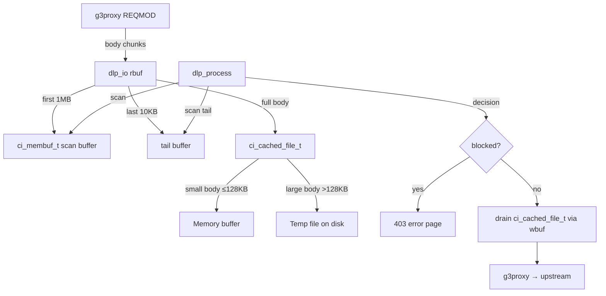

# DLP Ring Buffer Overflow — Architectural Research & Remediation

**Date:** 2026-02-13
**Severity:** High (causes 500 errors on legitimate AI agent traffic)
**Component:** `services/sentinel/modules/dlp/srv_polis_dlp.c`

---

## 1. Executive Summary

- **Architecture Style:** Store-and-forward ICAP REQMOD with in-memory buffering
- **Overall Risk Score:** 7/10 — Unbounded memory allocation per request, hard failure on overflow
- **Root Cause:** Anti-pattern — using `ci_ring_buf_t` (fixed-size circular buffer) for store-and-forward body pass-through where the entire body must be held simultaneously
- **Recommended Fix:** Replace `ci_ring_buf_t` with `ci_cached_file_t` (c-ICAP's built-in hybrid memory/disk buffer) — ~10 lines of code change

---

## 2. Problem Analysis

### 2.1 How the DLP Module Works

The DLP module (`srv_polis_dlp.c`) is a c-ICAP REQMOD service that scans outbound HTTP request bodies for credential patterns (API keys, tokens, private keys) before they leave the secure workspace.

The data flow through `dlp_io()` is:

```
g3proxy → [rbuf] → dlp_io() → [ring buffer] → [wbuf] → g3proxy → upstream
                  ↓
            [body membuf] (first 1MB for scanning)
            [tail buffer] (last 10KB for padding bypass)
```

### 2.2 The Store-and-Forward Anti-Pattern

The module uses a **store-and-forward** pattern:

1. **Accumulation phase** (`dlp_io` while `!data->eof`):
   - All incoming body data is written to `data->ring` (ring buffer)
   - `*wlen = 0` — no data is sent back to g3proxy
   - Body is also accumulated into scan buffers (membuf + tail)

2. **Scan phase** (`dlp_process`):
   - Called after ALL body data received
   - Scans accumulated body against credential patterns
   - Sets `data->eof = 1` and `data->blocked` flag

3. **Drain phase** (`dlp_io` while `data->eof`):
   - Reads from ring buffer and sends to g3proxy via `wbuf`

**The critical problem:** During the accumulation phase, data is only written to the ring buffer — never read. The ring buffer must hold the ENTIRE request body simultaneously. This defeats the purpose of a "ring" buffer (which is designed for concurrent read/write streaming).

### 2.3 Failure Mechanism

```
Body size > ring buffer size
  → ci_ring_buf_write() returns -1 (buffer full, no space to write)
  → dlp_io() returns CI_ERROR
  → c-ICAP reports error to g3proxy
  → g3proxy returns 500 Internal Server Error to client
  → AI agent request fails completely
```

Current ring buffer: 2MB (`ci_ring_buf_new(2097152)`)
Typical OpenClaw request: 24KB–200KB (system prompt + conversation history)
Long conversation: 500KB–5MB+
Theoretical max: Unbounded (conversation grows over time)

### 2.4 Memory Pressure

With c-ICAP's MPMT (multi-process, multi-threaded) model:
- Each concurrent request allocates a 2MB ring buffer
- 50 concurrent requests = 100MB just for ring buffers
- Increasing the ring buffer to handle larger bodies makes this worse
- No upper bound on memory consumption per request

---

## 3. c-ICAP Body Storage API Analysis

Research into the [c-ICAP server source](https://github.com/c-icap/c-icap-server) (`include/body.h`) reveals four body storage primitives:

| Type | Storage | Max Size | Disk Fallback | Use Case |
|------|---------|----------|---------------|----------|
| `ci_membuf_t` | Memory only | Fixed | No | Small bodies, error pages |
| `ci_ring_buf_t` | Memory only | Fixed | No | Streaming pass-through |
| `ci_cached_file_t` | Memory → Disk | Unlimited | Yes | **Store-and-forward** |
| `ci_simple_file_t` | Disk only | Configurable | N/A (always disk) | Large file handling |

### 3.1 ci_cached_file_t — The Correct Primitive

`ci_cached_file_t` is c-ICAP's idiomatic solution for store-and-forward body handling:

- Starts buffering in memory (up to `CI_BODY_MAX_MEM`, typically 128KB)
- Automatically spills to a temp file in `CI_TMPDIR` when memory is exhausted
- Supports lock/unlock semantics for flow control
- Used by c-ICAP's own `url_check` module for body scanning
- Handles arbitrarily large bodies (limited only by disk space)
- `ci_cached_file_ismem()` — check if body is still in memory (fast path)

### 3.2 ci_simple_file_t — Alternative for Very Large Bodies

- Always writes to disk (no memory phase)
- Has `ci_simple_file_to_const_string()` for mmap-based scanning
- `max_store_size` parameter for DoS protection
- Higher latency for small bodies

### 3.3 Evidence from Other Modules

The c-ICAP `url_check` module ([url_check_body.c](https://github.com/c-icap/c-icap-modules)) uses:
- `ci_cached_file_t` for CACHED mode (store-and-forward scanning)
- `ci_ring_buf_t` for RING mode (simple streaming pass-through)

This confirms: ring buffers are for streaming, cached files are for store-and-forward.

---

## 4. Remediation Options

### Option A: Replace ring buffer with ci_cached_file_t (RECOMMENDED)

**Complexity:** Low (~10 lines changed)
**Risk:** Low (proven c-ICAP pattern)
**Memory:** Bounded (spills to disk for large bodies)
**Max body size:** Unlimited (disk-backed)

Changes:
1. `dlp_req_data_t.ring`: `ci_ring_buf_t *` → `ci_cached_file_t *`
2. `dlp_init_request_data`: `ci_ring_buf_new(2097152)` → `ci_cached_file_new(CI_BODY_MAX_MEM)`
3. `dlp_io` write: `ci_ring_buf_write(ring, rbuf, *rlen)` → `ci_cached_file_write(ring, rbuf, *rlen, iseof)`
4. `dlp_io` read: `ci_ring_buf_read(ring, wbuf, *wlen)` → `ci_cached_file_read(ring, wbuf, *wlen)`
5. `dlp_release_request_data`: `ci_ring_buf_destroy` → `ci_cached_file_destroy`

**Security considerations:**
- Fail-closed: disk write failure → CI_ERROR → 500 (correct DLP posture)
- Temp files cleaned up by `ci_cached_file_destroy`
- Consider using tmpfs mount for `/var/tmp/c-icap` to avoid credential persistence on disk

### Option B: Stream-while-scanning (architectural redesign)

**Complexity:** Very High
**Risk:** High (changes ICAP semantics)

Start forwarding body data immediately while scanning in parallel. Only block if a credential is detected mid-stream.

**Problems:**
- ICAP REQMOD requires the service to decide before body is forwarded to upstream
- Once data is sent via `wbuf`, it cannot be recalled
- Would require ICAP 206 (partial content) support in g3proxy for mid-stream abort
- g3proxy v1.12 does not support ICAP 206 for REQMOD
- Fundamentally incompatible with store-and-forward DLP scanning

**Verdict:** Not viable for MVP. Requires g3proxy changes.

### Option C: Bypass DLP for known-good hosts

**Complexity:** Medium
**Risk:** Medium (reduces security coverage)

For hosts matching allow rules (e.g., `api.openai.com`), skip body scanning entirely and return `CI_MOD_ALLOW204` in `dlp_check_preview`.

**Problems:**
- Reduces defense-in-depth (credential could be sent to correct host but in wrong context)
- Doesn't solve the problem for new/unknown domains
- Violates fail-closed principle

**Verdict:** Useful as an optimization layer on top of Option A, not a standalone fix.

---

## 5. Recommended Architecture



### 5.1 Memory Profile Comparison

| Scenario | Current (ring_buf 2MB) | Proposed (cached_file) |
|----------|----------------------|----------------------|
| 50KB body | 2MB allocated | 50KB in memory |
| 500KB body | 2MB allocated | 128KB mem + 372KB disk |
| 2MB body | 2MB allocated (barely fits) | 128KB mem + 1.9MB disk |
| 5MB body | **FAILS with 500** | 128KB mem + 4.9MB disk |
| 50 concurrent 500KB | 100MB total | 6.4MB mem + 18.6MB disk |

### 5.2 Security Hardening

1. **tmpfs mount:** Mount `/var/tmp/c-icap` as tmpfs in the sentinel container to prevent credential persistence on disk
2. **Size limit:** Set `CI_BODY_MAX_MEM` appropriately (128KB default is fine)
3. **Disk quota:** Limit tmpfs size to prevent disk exhaustion DoS (e.g., 256MB)
4. **File permissions:** Ensure temp directory is 0700, owned by c-icap user

---

## 6. Implementation Plan

### Phase 1: Immediate Fix (MVP)
1. Replace `ci_ring_buf_t` with `ci_cached_file_t` in `srv_polis_dlp.c`
2. Add tmpfs mount for c-ICAP temp files in sentinel Dockerfile/compose
3. Test with bodies of 100KB, 1MB, 5MB, 10MB
4. Verify credential detection still works across disk-spilled bodies

### Phase 2: Optimization (Post-MVP)
1. Add Content-Length-based fast path: if body < 128KB, use membuf directly
2. Add host-based bypass for known-good domains (Option C) as optimization
3. Add metrics: body size histogram, disk spill rate, scan latency

### Phase 3: Architecture Migration (Long-term)
1. Migrate DLP scanning from c-ICAP (C) to Rust-based polis-governance
2. Use Tokio async I/O for streaming body handling
3. Integrate with ML pipeline for intelligent credential detection
4. Support ICAP 206 for mid-stream abort when g3proxy adds support

---

## 7. References

- [c-ICAP body.h API](https://github.com/c-icap/c-icap-server/blob/master/include/body.h) — Body storage primitives
- [c-ICAP url_check_body.c](https://github.com/c-icap/c-icap-modules/blob/master/services/url_check/url_check_body.c) — Reference implementation using cached_file
- [Large file download failures with squidclamav](https://serverfault.com/questions/336976) — Similar ring buffer overflow issue in RESPMOD
- g3proxy ICAP configuration: `services/gate/config/g3proxy.yaml`
- DLP module source: `services/sentinel/modules/dlp/srv_polis_dlp.c`
