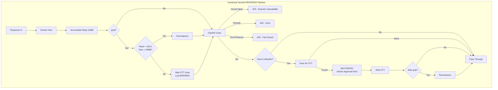

# Unified Review: ICAP Module Merge

**Reviewer:** Unified Review Agent
**Date:** February 14, 2026
**Design Document:** `polis/.kiro/specs/icap-module-merge/design.md`

---

## 1. Executive Summary

- **Architecture Style:** Pipeline (sequential REQMOD/RESPMOD processing within c-ICAP callback model)
- **Security Posture Score:** 7/10
- **Overall Risk Score:** 4/10 (moderate)
- **Threat Profile:** Internal Control Plane Service (ICAP modules processing proxied traffic)
- **OWASP ASI Coverage:** ASI01, ASI02, ASI03, ASI08, ASI09
- **MITRE ATLAS Tactics:** AML.TA0005 (Execution), AML.TA0011 (Impact), AML.TA0012 (Privilege Escalation)
- **Compliance Risks:** None identified (internal control plane, no direct user data storage)
- **Verdict:** APPROVED WITH CONDITIONS

The design is architecturally sound. Merging OTT rewriting into the existing DLP REQMOD module is the correct approach given g3proxy v1.12's single-ICAP-service-per-direction constraint. The DLP module already accumulates the full body, has Valkey connectivity, and makes block/pass decisions — OTT rewriting as a second pass on the same data is a natural fit. The new Sentinel RESPMOD module correctly orders ClamAV scanning before OTT processing, maintaining fail-closed behavior for malware.

However, six conditions must be addressed before implementation proceeds.

---

## 2. Critical Findings (MUST FIX)

### Finding 1: Gzip Decompression Bomb — No Max Decompressed Size Limit

**Severity:** CRITICAL
**Category:** CWE-409 (Improper Handling of Highly Compressed Data) / OWASP ASI08 (Cascading Failures)
**Location:** Sentinel RESPMOD — `sentinel_resp_process()` gzip decompression path

**Issue:** The design specifies "decompress before scan and recompress after modification" for gzip-compressed response bodies but does not define a maximum decompressed size. A crafted gzip payload of ~1KB can decompress to multiple gigabytes (zip bomb), causing OOM in the sentinel container and crashing all ICAP processing.

**Attack Scenario:**
1. Attacker hosts a gzip-compressed response on an allowlisted domain (e.g., via a compromised Telegram bot response)
2. Response body is a gzip bomb: ~1KB compressed → 4GB decompressed
3. Sentinel RESPMOD calls `inflateInit2()` / `inflate()` without size checks
4. Sentinel container exhausts memory, crashes
5. All ICAP processing stops → g3proxy cannot scan any traffic → cascading failure across the entire proxy pipeline (AML.T0029 — Denial of AI Service)

**Evidence:**
- Design doc Section "sentinel_resp_process()": "If `is_gzip` → decompress body with zlib" — no size limit mentioned
- `MAX_BODY_SIZE` is defined as 2MB for the membuf accumulation, but decompression happens after accumulation
- ClamAV's `StreamMaxLength` is 200MB (from `clamd.conf`), creating a 100x amplification window
- c-ICAP's own `decode.c` ([source](https://github.com/c-icap/c-icap-server/blob/master/decode.c)) implements ratio-based decompression limits — the design should leverage this

**Remediation:**
Implement a three-layer decompression bomb defense in `decompress_gzip()`:
1. **Absolute size cap**: Abort decompression if output exceeds `MAX_DECOMPRESSED_SIZE` (e.g., 10MB). This should be configurable via `POLIS_MAX_DECOMPRESS_SIZE` env var.
2. **Ratio check**: Abort if `decompressed_size / compressed_size > MAX_DECOMPRESS_RATIO` (e.g., 100:1). This catches bombs that stay under the absolute cap.
3. **Incremental checking**: Check limits after each `inflate()` call, not just at the end. Use `Z_BUF_ERROR` / `Z_STREAM_END` to detect completion.

On decompression abort: skip OTT scanning, pass the original compressed body through unmodified, log a WARNING with the compression ratio. ClamAV still scans the compressed body via INSTREAM (clamd handles its own decompression internally).

---

### Finding 2: clamd Plaintext TCP — No Authentication or Integrity Protection

**Severity:** CRITICAL
**Category:** CWE-319 (Cleartext Transmission of Sensitive Information) / MITRE ATLAS AML.T0029
**Location:** Sentinel RESPMOD — `clamd_scan_buffer()` TCP connection to `scanner:3310`

**Issue:** The clamd INSTREAM protocol is plaintext TCP with no authentication. The design connects to `scanner:3310` over the Docker bridge network. While clamd does not support TLS natively, the design does not specify any compensating controls for the network path between sentinel and scanner containers.

**Attack Scenario:**
1. Attacker compromises the workspace container (Sysbox escape or application-level compromise)
2. Attacker performs ARP spoofing or DNS poisoning on the Docker bridge network to intercept traffic to `scanner:3310`
3. Attacker's MITM proxy receives the INSTREAM data, always responds with `stream: OK`
4. Malware-laden responses pass through undetected
5. Impact: Complete bypass of ClamAV scanning (AML.T0029)

**Evidence:**
- clamd documentation confirms no TLS support: "TCP sockets are plaintext by design" ([ClamAV docs](https://docs.clamav.net/manual/Usage/Scanning.html))
- Docker bridge networks allow container-to-container communication without encryption
- The sentinel and scanner containers are on the same `polis-net` bridge network (from `docker-compose.yml`)

**Remediation:**
Implement one of these compensating controls (in order of preference):
1. **Unix domain socket**: Mount a shared volume between sentinel and scanner, configure clamd to listen on a Unix socket (e.g., `/var/run/clamav/clamd.sock`). This eliminates network exposure entirely. Requires `LocalSocket` in `clamd.conf` instead of `TCPSocket`.
2. **Network namespace isolation**: Run scanner in the same network namespace as sentinel (like governance uses `container:gateway`). This restricts clamd to localhost-only access.
3. **Response validation**: Implement a secondary check — after clamd returns "OK", verify the response body against a known-clean hash or signature. This is defense-in-depth against MITM.

Option 1 (Unix socket) is strongly recommended. It matches the existing pattern where polis-governance uses localhost communication within the shared network namespace.

---

## 3. High Findings (SHOULD FIX)

### Finding 3: Fail-Open OTT Rewriting Leaks Internal Request IDs

**Severity:** HIGH
**Category:** CWE-209 (Generation of Error Message Containing Sensitive Information) / OWASP ASI03
**Location:** DLP REQMOD — OTT rewrite path when governance-reqmod Valkey is unavailable

**Issue:** When the governance-reqmod Valkey connection is unavailable, the design specifies "skip OTT rewriting and pass the request through." This means the raw `/polis-approve req-{hex8}` text is sent to Telegram unmodified, leaking internal Polis request identifiers to an external service.

**Attack Scenario:**
1. Attacker DoS-es the Valkey connection (e.g., by exhausting connections from within the workspace)
2. Agent sends `/polis-approve req-a1b2c3d4` to Telegram
3. OTT rewriting is skipped — raw request_id appears in Telegram chat
4. Attacker observes the request_id format and naming convention
5. Attacker can now enumerate blocked request IDs and potentially craft targeted attacks against the approval flow

**Remediation:**
When governance-reqmod Valkey is unavailable and the body contains `/polis-approve req-*`:
1. **Block the request** (return 403) instead of passing through. The error response should indicate "Approval service temporarily unavailable — please retry."
2. **Log the event** to `polis:log:events` via the existing dlp-reader connection (which may still be available) or to stderr as a CRITICAL log.
3. This changes the fail mode from fail-open (leaks data) to fail-closed (blocks approval attempts), which is consistent with the security posture of the rest of the system.

### Finding 4: Approval Flow Non-Atomic — Partial State on Crash

**Severity:** HIGH
**Category:** CWE-362 (Concurrent Execution Using Shared Resource with Improper Synchronization)
**Location:** Sentinel RESPMOD — `process_ott_approval()` steps 5-8

**Issue:** The 8-step approval flow executes multiple Valkey commands sequentially without a transaction (MULTI/EXEC). If the sentinel process crashes between steps, the state becomes inconsistent.

**Attack Scenario:**
1. OTT is validated, time-gate passed, context binding confirmed
2. Step 5: Audit data preserved ✓
3. Step 6: `DEL polis:blocked:{request_id}` succeeds ✓
4. Sentinel crashes (OOM, SIGKILL, etc.)
5. Step 6 (continued): `SETEX polis:approved:{request_id}` never executes ✗
6. Result: The blocked key is deleted but no approved key exists — the request is in limbo (neither blocked nor approved)
7. Agent retries the request → DLP module sees an unknown domain (no blocked key, no approved key) → blocks again with a new request_id → user must re-approve

**Evidence:**
- The existing `process_ott_approval()` in `srv_polis_approval.c` (line 537) also lacks transaction wrapping — this is a pre-existing issue being carried forward.

**Remediation:**
Wrap steps 5-8 in a Valkey MULTI/EXEC transaction:
```
MULTI
DEL polis:blocked:{request_id}
SETEX polis:approved:{request_id} {ttl} {approval_json}
ZADD polis:log:events {timestamp} {audit_json}
DEL polis:ott:{ott_code}
EXEC
```
This ensures all-or-nothing semantics. If EXEC fails, the blocked key remains and the user can retry. hiredis supports `redisCommand(ctx, "MULTI")` followed by queued commands and `redisCommand(ctx, "EXEC")`.

### Finding 5: OTT Collision Race Condition (TOCTOU)

**Severity:** HIGH
**Category:** CWE-367 (Time-of-Check Time-of-Use Race Condition) / Anti-Pattern: TOCTOU
**Location:** DLP REQMOD — OTT generation and storage in `dlp_process()`

**Issue:** The design specifies: check `polis:blocked:{request_id}` EXISTS → generate OTT → `SET NX EX`. Between the EXISTS check and the SET, another thread processing the same request_id could complete its own OTT generation, creating two OTT codes for the same request_id.

**Attack Scenario:**
1. Agent sends two simultaneous `/polis-approve req-a1b2c3d4` requests (e.g., via parallel HTTP connections)
2. Thread A: EXISTS polis:blocked:req-a1b2c3d4 → true
3. Thread B: EXISTS polis:blocked:req-a1b2c3d4 → true
4. Thread A: generates ott-XXXXXXXX, SET NX → success
5. Thread B: generates ott-YYYYYYYY, SET NX → success (different key)
6. Two valid OTT codes exist for the same request_id
7. Either OTT can be used to approve the request — doubles the attack surface

**Remediation:**
Use a Valkey-side atomic check-and-set pattern:
1. Before generating the OTT, attempt `SET polis:ott_lock:{request_id} 1 NX EX 30` (30-second lock)
2. If SETNX fails → another thread is already processing this request_id → skip OTT rewrite
3. If SETNX succeeds → proceed with OTT generation and storage
4. The lock key auto-expires after 30 seconds

Alternatively, use a Lua script in Valkey to atomically check the blocked key and set the OTT in a single round-trip.

### Finding 6: Content-Length Inconsistency After Length-Preserving Substitution

**Severity:** HIGH
**Category:** CWE-444 (Inconsistent Interpretation of HTTP Requests) / Anti-Pattern: Leaky Abstraction
**Location:** DLP REQMOD — membuf modification and `dlp_io()` streaming

**Issue:** The design assumes "length-preserving substitution" is sufficient because `req-{hex8}` and `ott-{alphanum8}` are both 12 characters. However, the design does not address:
1. What if the body is chunked transfer-encoded? The membuf contains the decoded body, but the cached file may contain the chunked encoding. Streaming from membuf instead of cached file changes the transfer encoding.
2. What if the original Content-Length header was set? After OTT rewriting, `dlp_io()` streams from membuf instead of cached file. If c-ICAP already sent the Content-Length header based on the cached file size, and the membuf size differs (even by 1 byte due to encoding), the response will be malformed.

**Evidence:**
- The existing `dlp_io()` in `srv_polis_dlp.c` (line 1052) streams from `data->ring` (cached file). The new OTT path streams from `data->body` (membuf). These may have different sizes if the body was chunked or if c-ICAP's body handling normalizes encoding differently between membuf and cached_file.

**Remediation:**
1. After OTT substitution, explicitly verify that `ci_membuf_size(data->body)` equals the original body size. If they differ, log a WARNING and fall back to the cached file (no OTT rewrite).
2. If c-ICAP sends Content-Length before `dlp_io()` is called, ensure the value matches the membuf size. Use `ci_http_response_remove_header()` and `ci_http_response_add_header()` to update Content-Length if needed.
3. Document the assumption that the substitution is byte-for-byte identical in length, and add a runtime assertion.

---

## 4. Research Findings

### clamd INSTREAM Protocol Implementation

- **Current Proposal:** Implement a TCP client that connects to `scanner:3310`, sends `zINSTREAM\0`, streams 16KB chunks, reads response.
- **Research Finding:** The clamd protocol is well-documented but has known operational pitfalls. The `z` prefix for NULL-delimited responses is correct. 16KB chunk size matches squidclamav's behavior. However, clamd's `StreamMaxLength` (200MB in current config) should be coordinated with the RESPMOD body accumulation limit (2MB). The 2MB limit means clamd will never see more than 2MB via INSTREAM from this module, but responses larger than 2MB that bypass OTT scanning still go through g3proxy's own RESPMOD path. Key recommendation from [clamd manpage](https://manpages.debian.org/testing/clamav-daemon/clamd.8.en.html): use non-blocking sockets with `poll()` to avoid deadlocks on large streams.
- **Recommendation:** Modify — use Unix domain socket instead of TCP, add non-blocking I/O with `poll()`.
- **References:** [ClamAV Scanning Docs](https://docs.clamav.net/manual/Usage/Scanning.html), [clamd.8 manpage](https://manpages.debian.org/testing/clamav-daemon/clamd.8.en.html)

### OTT Time-Gate as Echo Self-Approval Prevention

- **Current Proposal:** 15-second time-gate (configurable via `POLIS_APPROVAL_TIME_GATE_SECS`) prevents the Telegram sendMessage echo from triggering self-approval.
- **Research Finding:** This is a sound approach. The Telegram Bot API returns the sent message in the sendMessage response within milliseconds. A 15-second gate provides ample margin. However, the design should account for clock skew between the sentinel container and the system clock used by `time()`. If the container's clock drifts, the time-gate could be shorter or longer than intended. NTP synchronization should be verified.
- **Recommendation:** Keep — 15 seconds is appropriate. Add a note about NTP synchronization requirement.
- **References:** [Telegram Bot API sendMessage](https://core.telegram.org/bots/api#sendmessage)

### c-ICAP Callback Model for RESPMOD Body Accumulation

- **Current Proposal:** Accumulate body in `sentinel_resp_io()`, process in `sentinel_resp_process()`.
- **Research Finding:** The c-ICAP callback model calls `io()` repeatedly to transfer data, then calls `process()` when the body is complete. The design correctly uses `ci_membuf_t` for accumulation and `ci_cached_file_t` for pass-through. However, the existing approval module (`srv_polis_approval.c`) at line 1419 shows that `io()` handles both read (accumulation) and write (streaming) in the same callback. The new module should follow the same pattern. The 2MB limit for membuf accumulation is reasonable — it matches the existing approval module's approach.
- **Recommendation:** Keep — the callback model is correctly understood.

---

## 5. Threat Model (STRIDE)

| Component | S | T | R | I | D | E | Notes |
|-----------|---|---|---|---|---|---|-------|
| DLP REQMOD (OTT rewrite) | ✅ | ⚠️ | ⚠️ | ⚠️ | ✅ | ✅ | T: membuf modification integrity; R: no audit on skip; I: request_id leakage on Valkey failure |
| Sentinel RESPMOD (ClamAV) | ✅ | ❌ | ✅ | ✅ | ⚠️ | ✅ | T: plaintext clamd TCP (MITM); D: gzip bomb, clamd SPOF |
| Sentinel RESPMOD (OTT scan) | ⚠️ | ✅ | ✅ | ✅ | ✅ | ✅ | S: broad regex could match non-OTT strings |
| Valkey (governance-reqmod) | ✅ | ✅ | ✅ | ✅ | ⚠️ | ⚠️ | D: single connection bottleneck; E: TOCTOU in OTT generation |
| Valkey (governance-respmod) | ✅ | ✅ | ✅ | ✅ | ⚠️ | ⚠️ | D: single connection bottleneck; E: non-atomic approval flow |
| OTT codes (in transit) | ✅ | ✅ | ✅ | ✅ | ✅ | ✅ | Time-gate + context binding provide adequate protection |

Legend: ✅ Adequately mitigated | ⚠️ Partially mitigated (see findings) | ❌ Not mitigated (critical finding)

---

## 6. Defense-in-Depth Analysis

| Layer | Status | Gap |
|-------|--------|-----|
| L0: Process (polis-shell) | ✅ | No impact — approval flow is network-level, not shell-level |
| L1: Governance (DLP/OTT) | ⚠️ | OTT rewriting fail-open leaks request_id; approval flow non-atomic |
| L2: Container (Sysbox) | ✅ | Sentinel runs as runc (correct for control plane); zlib dependency adds minor attack surface |
| L3: Network (polis-gateway) | ✅ | REQMOD URL unchanged; RESPMOD URL change is minimal and correct |
| L4: MCP (polis-toolbox) | ✅ | Not affected by this change |

---

## 7. Failure Mode Analysis

### Single Points of Failure

- **clamd (scanner:3310):** If clamd is down, ALL HTTP responses are blocked (fail-closed). This is correct security behavior but means a clamd crash takes down all web access for the workspace. No health check or circuit breaker is specified.
- **Valkey:** If Valkey is completely down, DLP scanning continues (uses cached security level with exponential backoff), but the entire OTT approval flow is disabled. Users cannot approve blocked requests until Valkey recovers.

### Cascading Failure Risks

- **clamd timeout cascade:** clamd has a 30-second timeout. If clamd becomes slow (not down), each RESPMOD request blocks a c-ICAP thread for up to 30 seconds. With c-ICAP's default thread pool (typically 50-100 threads), 50-100 slow responses could exhaust the thread pool, blocking ALL ICAP processing (both REQMOD and RESPMOD). This cascades to g3proxy queue exhaustion, then workspace HTTP timeouts.
- **Valkey mutex contention:** The governance-reqmod connection uses a single `pthread_mutex_t`. Under high request volume, all threads contending for this mutex will serialize, creating a bottleneck. The existing dlp-reader connection has the same pattern, so this is a pre-existing architectural constraint, not a new risk.

### Missing Circuit Breakers

- **clamd connection:** No circuit breaker pattern. If clamd is intermittently failing, every request will attempt a TCP connection, wait for timeout, then return 403. Implement a circuit breaker with 5-failure threshold and 30-second recovery window. During open-circuit state, return 403 immediately without attempting connection (saves 30s per request).
- **Valkey governance-reqmod:** The design mentions "lazy reconnect" but no circuit breaker. If Valkey is intermittently failing, every OTT rewrite attempt will try to reconnect, adding latency. Implement exponential backoff matching the existing dlp-reader pattern.

---

## 8. Identified Gaps & Open Questions

### Gaps

1. **No decompression bomb protection** — Must add max decompressed size and ratio checks (see Finding 1)
2. **No audit trail for skipped OTT rewrites** — When governance-reqmod Valkey is down and OTT rewriting is skipped, no log entry is created. Add CRITICAL-level logging to stderr and, if possible, to the dlp-reader Valkey connection.
3. **OTT regex too broad in RESPMOD** — `ott-[a-zA-Z0-9]{8}` will match any string in this format, not just OTT codes generated by the system. Consider adding a Valkey existence check before processing (the design already does this in step 1 of the approval flow, so this is a minor concern — false matches will be filtered by the GET returning NIL).
4. **No health check for clamd** — Add a periodic `PING` command to clamd (clamd responds with `PONG`) to detect failures proactively rather than on first request.

### Open Questions Resolved

#### Q1: Should the OTT rewrite path be fail-open or fail-closed?
- **Answer:** Fail-closed (block the request) when the body contains `/polis-approve` and Valkey is unavailable.
- **Rationale:** Fail-open leaks internal request IDs to external services (Finding 3). The approval flow is a security-sensitive operation — it's better to temporarily block approval attempts than to leak identifiers. DLP scanning (the primary function) remains unaffected.

#### Q2: Is the 2MB body limit for RESPMOD OTT scanning appropriate?
- **Answer:** Yes, 2MB is appropriate for OTT scanning.
- **Rationale:** OTT codes appear in Telegram API responses, which are typically small JSON payloads (< 100KB). A 2MB limit provides generous headroom while preventing memory exhaustion. ClamAV scanning (via INSTREAM) handles the full body regardless of this limit, so malware detection is not affected.

#### Q3: Should the approval flow use Valkey transactions?
- **Answer:** Yes, wrap steps 5-8 in MULTI/EXEC.
- **Rationale:** The current non-atomic approach can leave the system in an inconsistent state on crash (Finding 4). The performance cost of MULTI/EXEC is negligible (single round-trip to Valkey), and the consistency guarantee is worth it.

---

## 9. Missing Controls

- **Decompression bomb defense** — No max decompressed size or ratio check in gzip handling
- **clamd circuit breaker** — No failure isolation for intermittent clamd failures
- **clamd health check** — No proactive detection of clamd unavailability
- **Audit logging for OTT skip** — No log entry when OTT rewriting is skipped due to Valkey failure
- **Rate limiting on OTT generation** — No throttle on `/polis-approve` pattern matching (low priority — Valkey SETNX provides natural deduplication)
- **NTP synchronization requirement** — Time-gate depends on accurate system clock but no NTP requirement is documented

---

## 10. Architectural Hardening

### Proposed Changes



### Specific Recommendations

1. **Switch clamd to Unix domain socket** — Eliminate network exposure by mounting a shared socket volume between sentinel and scanner containers. Configure `LocalSocket /var/run/clamav/clamd.sock` in `clamd.conf`.
2. **Add decompression bomb defense** — Implement `MAX_DECOMPRESS_SIZE` (10MB) and `MAX_DECOMPRESS_RATIO` (100:1) checks in `decompress_gzip()`. Configurable via environment variables.
3. **Wrap approval flow in MULTI/EXEC** — Ensure all-or-nothing semantics for the 4 Valkey commands in steps 5-8.
4. **Change OTT rewrite to fail-closed** — When governance-reqmod Valkey is down and body contains `/polis-approve`, return 403 instead of passing through.
5. **Add clamd circuit breaker** — 5-failure threshold, 30-second recovery, with periodic PING health check during open-circuit state.
6. **Add OTT generation lock** — Use `SET polis:ott_lock:{request_id} 1 NX EX 30` before generating OTT to prevent race conditions.

---

## 11. Security Checklist

- [x] No hardcoded secrets — Valkey passwords read from `/run/secrets/` at runtime
- [x] All inputs validated at trust boundaries — request_id format validated (CWE-116), OTT regex bounded
- [ ] Fail-closed behavior on errors — **PARTIAL**: ClamAV is fail-closed, but OTT rewriting is fail-open on Valkey failure (Finding 3)
- [x] Audit logging for all security decisions — OTT rewrites logged to `polis:log:events`; **GAP**: skipped rewrites not logged
- [ ] Rate limiting on all entry points — **MISSING**: No rate limit on `/polis-approve` pattern matching
- [x] mTLS between containers — Not applicable (ICAP is localhost; clamd should use Unix socket per Finding 2)
- [x] Credential rotation strategy defined — Valkey ACL users pre-configured; OTT codes have TTL (600s)
- [x] OWASP ASI risks addressed — ASI01 (time-gate), ASI02 (context binding), ASI03 (Valkey ACL), ASI08 (fail-closed ClamAV), ASI09 (time-gate + context binding)
- [ ] MITRE ATLAS mitigations applied — **PARTIAL**: AML.T0029 (DoS) not fully mitigated (no circuit breaker for clamd)
- [ ] Decompression bomb protection — **MISSING** (Finding 1)

---

## References

- [ClamAV INSTREAM Protocol Documentation](https://docs.clamav.net/manual/Usage/Scanning.html)
- [clamd.8 Manpage — Protocol Details](https://manpages.debian.org/testing/clamav-daemon/clamd.8.en.html)
- [c-ICAP Server decode.c — Decompression Handling](https://github.com/c-icap/c-icap-server/blob/master/decode.c)
- [OWASP ASI08 — Cascading Failures](https://genai.owasp.org/resource/owasp-top-10-for-agentic-applications-for-2026/)
- [CWE-409 — Improper Handling of Highly Compressed Data](https://cwe.mitre.org/data/definitions/409.html)
- [CWE-319 — Cleartext Transmission of Sensitive Information](https://cwe.mitre.org/data/definitions/319.html)
- [CWE-362 — Concurrent Execution Using Shared Resource](https://cwe.mitre.org/data/definitions/362.html)
- [CWE-367 — Time-of-Check Time-of-Use](https://cwe.mitre.org/data/definitions/367.html)
- [CWE-444 — Inconsistent Interpretation of HTTP Requests](https://cwe.mitre.org/data/definitions/444.html)
- [MITRE ATLAS AML.T0029 — Denial of AI Service](https://atlas.mitre.org/)
- Existing implementation: `polis/services/sentinel/modules/approval/srv_polis_approval.c` (line 537 — `process_ott_approval()`)
- Existing implementation: `polis/services/sentinel/modules/approval/srv_polis_approval_rewrite.c` (line 117 — `generate_ott()`)
- Existing implementation: `polis/services/sentinel/modules/dlp/srv_polis_dlp.c` (line 908 — `dlp_process()`)
